# DevGuard Vulnerability Database

DevGuard imports data from multiple sources to construct a robust and comprehensive database of vulnerabilities.
The database is refreshed every six hours, ensuring that data is up-to-date. This page provides an overview of the
primary sources that contribute to the DevGuard vulnerability database.

## Primary Sources

1. **GitHub Exploits**  
   DevGuard integrates exploit data shared publicly on GitHub. This source provides information on real-world exploit implementations, enabling developers to understand the practical impact of vulnerabilities.

2. **EPSS (Exploit Prediction Scoring System)**  
   EPSS offers data-driven predictions on the likelihood of vulnerabilities being exploited in the wild. This helps prioritize vulnerabilities based on their exploitability.

3. **CVE List (Common Vulnerabilities and Exposures)**  
   The CVE List is a centralized catalog of publicly known security vulnerabilities. DevGuard leverages this to maintain a standardized reference for vulnerabilities.

4. **NVD (National Vulnerability Database)**  
   NVD enriches CVE entries with additional metadata such as severity scores (CVSS), impact metrics, and fix information, providing more context for vulnerability assessment.

5. **Exploit DB (Exploit Database)**  
   A curated archive of publicly available exploits, including proof-of-concept code. This serves as a valuable resource for understanding practical exploitation techniques.

6. **OSV (Open Source Vulnerabilities)**  
   OSV consolidates vulnerability data from various open-source projects, ensuring comprehensive coverage of issues in open-source ecosystems.

## OSV Data Sources

The [Open Source Vulnerability Database](https://osv.dev/) aggregates data from multiple specialized databases to cover a wide range of ecosystems like:

- **GitHub Advisory Database**: Security advisories published on GitHub.
- **PyPI Advisory Database**: Vulnerabilities in Python packages.
- **Go Vulnerability Database**: Issues in Go libraries and applications.
- **Global Security Database**: General open-source vulnerabilities.
- **OSS-Fuzz**: Vulnerabilities found via Google's fuzzing project.
- **Rocky Linux and AlmaLinux**: Security advisories from these Linux distributions.
- **Python Software Foundation Database**: Security issues tracked by the Python Software Foundation.
- **Bitnami Vulnerability Database**: Vulnerabilities in Bitnami-packaged applications.
- **Ubuntu**: Security advisories from the Ubuntu ecosystem.

---

```mermaid

flowchart BT

    dev["DevGuard"]
    github["GitHub Exploits"]
    epss["EPSS"]
    cveList["CVE List"]
    nvd["NVD"]
    exploitDB["Exploit DB"]
    dbsec["Debian Security Advisories"]
    osv["OSV"]

    subgraph osvDB[OSV Data Sources]
        direction LR
        githubAdvisory[GitHub Advisory Database]
        pypiAdvisory[PyPI Advisory Database]
        goVulnerability[Go Vulnerability Database]
        rustAdvisory[Rust Advisory Database]
        globalSecurity[Global Security Database]
        ossFuzz[OSS-Fuzz]
        rockyLinux[Rocky Linux]
        almaLinux[AlmaLinux]
        haskellAdvisories[Haskell Security Advisories]
        rConsortium[RConsortium Advisory Database]
        openSSF[OpenSSF Malicious Packages]
        pythonDatabase[Python Software Foundation Database]
        bitnamiDatabase[Bitnami Vulnerability Database]
        haskellDB[Haskell Security Advisory DB]
        ubuntu[Ubuntu]
    end



    github --> dev
    epss --> dev
    cveList --> dev
    nvd --> dev
    exploitDB --> dev
    dbsec --> dev
    osv --> dev
  

    osvDB --> osv



classDef node fill:#161B23,color:yellow,stroke:#e5e7eb;
classDef subgraphOut fill:#111835;
classDef subgraphIn fill:#111827,stroke:#e5e7eb;

classDef dev stroke-width:2px;


class osvDB subgraphOut;


class dev dev;

linkStyle 0,1,2,3,4,5,6  stroke:#e5e7eb,stroke-width:2px;

```

