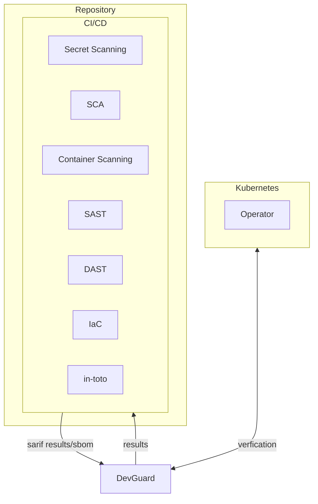

```mermaid
flowchart TB 

    subgraph repo[Repository]
        direction TB
        ciCd[CI/CD]
    end

    dev[DevGuard]

    subgraph kube[Kubernetes]
        direction LR
        operator[Operator]
    end


    subgraph ciCd[CI/CD]
        direction LR

        SC[Secret Scanning]
        SCA[SCA]
        CS[Container Scanning]
        SAST[SAST]
        DAST[DAST]
        IaC[IaC]   
        toto[in-toto]  

    end

    ciCd -- sarif results/sbom --> dev
    dev -- results --> ciCd

    kube <-- verfication --> dev


```

