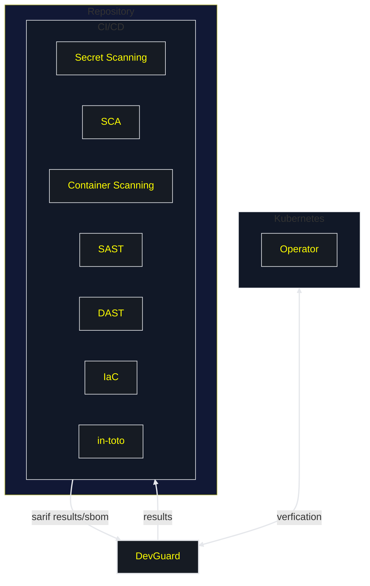

```mermaid
flowchart TB 

    subgraph repo[Repository]
        direction TB
        ciCd[CI/CD]
    end

    dev["DevGuard"]

    subgraph kube[Kubernetes]
        direction LR
        operator[Operator]
    end


    subgraph ciCd[CI/CD]
        direction LR

        SC[Secret Scanning]
        SCA[SCA]
        CS[Container Scanning]
        SAST[SAST]
        DAST[DAST]
        IaC[IaC]   
        toto[in-toto]  

    end

    ciCd -- sarif results/sbom --> dev
    dev -- results --> ciCd

    kube <-- verfication --> dev


classDef node fill:#161B23,color:yellow,stroke:#e5e7eb;
classDef subgraphOut fill:#111835;
classDef subgraphIn fill:#111827,stroke:#e5e7eb;

classDef dev stroke-width:2px;


class repo subgraphOut;
class ciCd subgraphIn;
class kube subgraphIn;

class dev dev;

linkStyle 0,1,2  stroke:#e5e7eb,stroke-width:2px;


```

