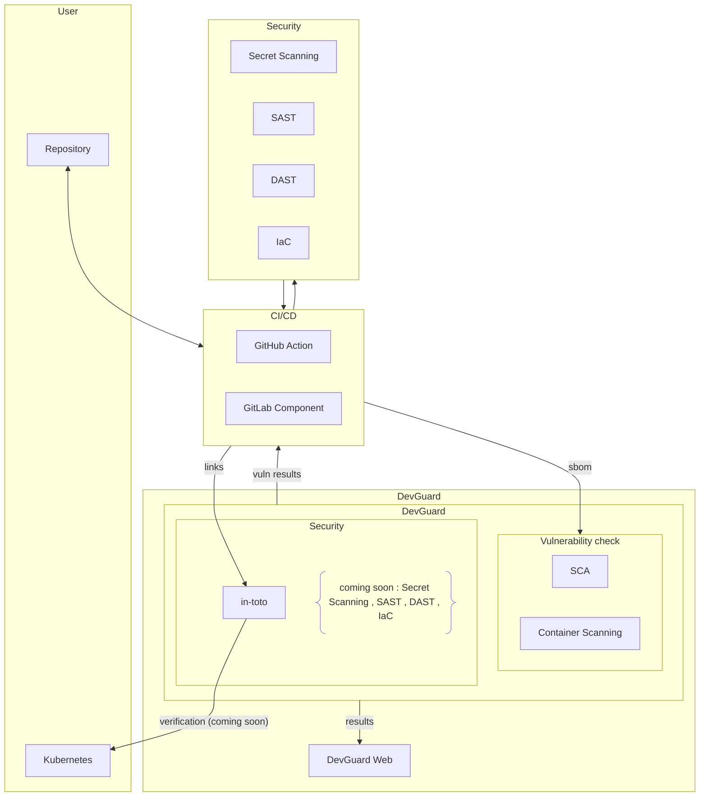

```mermaid
flowchart TB 

    subgraph user[User]
        direction LR
        repo[Repository]
        kube[Kubernetes]
    end

    subgraph git[CI/CD]
        direction LR
        GH[GitHub Action]
        GL[GitLab Component]
    end


    subgraph dev[DevGuard]
        direction TB
        devWeb[DevGuard Web] 
        devCli[DevGuard CLI]      
    end


    subgraph elSec[Security]
        direction LR
        SC[Secret Scanning]
        SAST[SAST]
        DAST[DAST]
        IaC[IaC]   
    end


    subgraph devCli[DevGuard ]
        direction LR

        subgraph vuln[Vulnerability check]
            SCA[SCA]
            CS[Container Scanning]
        end    

        subgraph sec[Security]
            toto[in-toto]  
            A@{ shape: braces, label: "coming soon : Secret Scanning , SAST , DAST , IaC" }
       
        end


    end


    repo <--> git

    git --> elSec
    elSec --> git

    git -- sbom --> vuln
    git -- links --> toto

    devCli -- vuln results --> git

    devCli -- results --> devWeb
    toto -- verification (coming soon) --> kube


```

        subgraph secCS[coming soon]
            devSC[Secret Scanning]
            devSAST[SAST]
            devDAST[DAST]
            devIaC[IaC]   
        end
         