# DevGuard Architecture

The DevGuard CI/CD components implement the OWASP DevSecOps pipeline in an optimal way, eliminating the need for extensive cybersecurity expertise. You can integrate the DevGuard CI/CD pipeline with your repository on GitHub or GitLab. For detailed setup instructions, refer to [Setup GitHub Integration](../gettingStarted/setup-github-integration) or [Setup GitLab Integration](../gettingStarted/setup-gitlab-integration).

Once integrated, the DevGuard CI/CD pipeline will scan your codebase for vulnerabilities and provide a comprehensive report. For more details on data storage, see [Which Data from Your Codebase is Stored in DevGuard](./index).

On DevGuard, you can manage, prioritize, and resolve vulnerabilities, achieve compliance, and access additional features. Learn more at [DevGuard Features](../).

```mermaid
flowchart BT 

    subgraph repo[Repository]
        direction TB
        ciCd[CI/CD components]
    end

    dev["DevGuard"]

    subgraph kube[Kubernetes]
        direction LR
        operator[Operator]
    end


    subgraph ciCd[CI/CD components]
        direction LR

        SC[Secret Scanning]
        SCA[SCA] 
        CS[Container Scanning]
        SAST[SAST]
        DAST[DAST]
        IaC[IaC]   

    end

    ciCd -- sarif results/sbom --> dev
    dev -- results --> ciCd

    kube <-- verfication --> dev




classDef node fill:#161B23,color:yellow,stroke:#e5e7eb;
classDef subgraphOut fill:#111835;
classDef subgraphIn fill:#111827,stroke:#e5e7eb;

classDef dev stroke-width:2px;


class repo subgraphOut;
class ciCd subgraphIn;
class kube subgraphIn;

class dev dev;

linkStyle 0,1,2  stroke:#e5e7eb,stroke-width:2px;




click SCA "../guides/devsecops/software-composition-analysis";
click SC "../guides/devsecops/secret-scanning";
click CS "../guides/devsecops/container-scanning";
click SAST "../guides/devsecops/sast";
click DAST "../guides/devsecops/dast";
click IaC "../guides/devsecops/iac";





```

