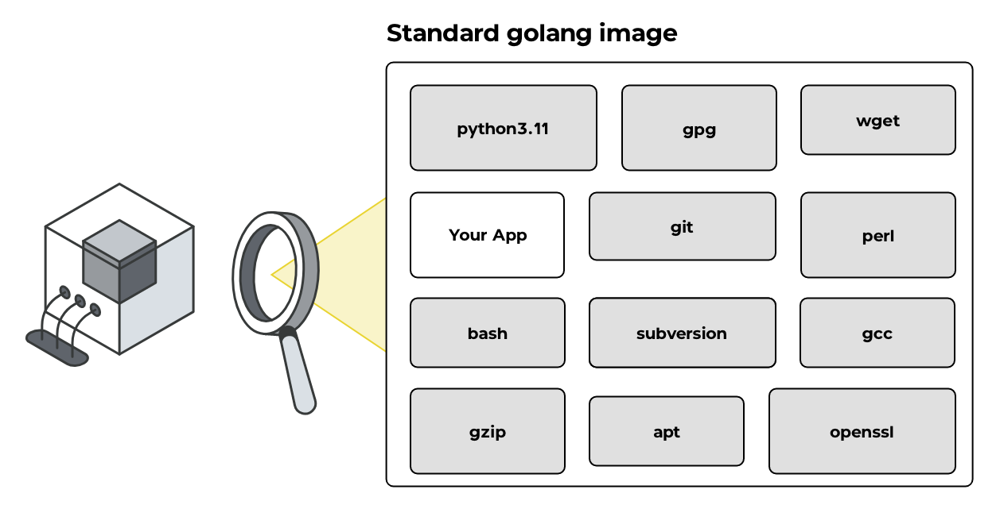

import { Steps, Tabs, Callout } from 'nextra/components'

# Container Scanning

<Callout type="info" emoji="ℹ️">
  DevGuard performs continous container scanning to identify vulnerabilities in your project's container images after your first scan (based on SBOM) - [Mitigation Guide](/risk-mitigation-guides/container-scanning)
</Callout>

## What is a Container?

A container is a lightweight, standalone, and executable software package that includes everything 
needed to run a piece of software: code, runtime, system tools, libraries, and settings. Containers 
are built on the concept of virtualization but are more resource-efficient because they share the 
host system’s operating system kernel (basically, they are an encapsulated “normal process”).

They are widely used in modern software development to ensure consistency across different environments, 
such as development, testing, and production, as they encapsulate the application and its dependencies. 
Popular containerization tools include Docker and Kubernetes for container management.

## What Happens During Container Scanning?

Container scanning is a crucial process in a security assessment, designed to uncover vulnerabilities 
and security risks within containerized applications. With tools like DevGuard, the scanning process 
involves the following key steps:

1. **Generating a Software Bill of Materials (SBOM)**

An SBOM is a detailed inventory of all components and dependencies within the container. During this phase:
- The container image is analysed to identify the software packages, libraries, and tools it contains.
- Version information for each component is extracted.

This SBOM provides a transparent view of the container’s contents, serving as the foundation for further 
security analysis.

2. **Checking for Known Vulnerabilities**

DevGuard leverages its vulnerability database to detect known security vulnerabilities in the components listed in the SBOM:
- The identified software packages are cross-referenced with vulnerability databases, such as CVE (Common Vulnerabilities and Exposures) lists, and DevGuard’s extended database.
- The scanning process flags outdated or insecure versions of software.
- Vulnerabilities are categorized by severity, enabling prioritization of remediation efforts.

By detecting known vulnerabilities, container scanning helps prevent the exploitation of weaknesses in production environments.