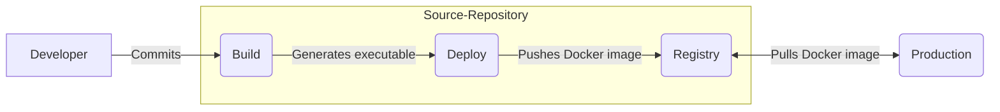
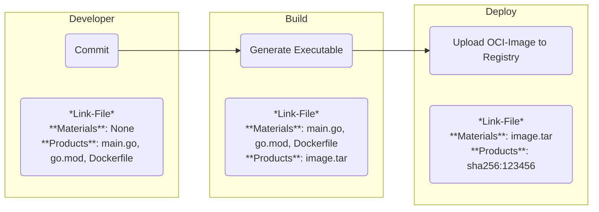

# Whitepaper: Integrating In-Toto in DevGuard for Secure Software Supply Chains


#### Abstract
> Securing the software development lifecycle (SDLC) is a critical part of the modern software development process. DevGuard aims to simplify this process for developers by integrating powerful security frameworks like In-Toto into their workflow with minimal configuration and knowledge barriers. This white paper explains how DevGuard seamlessly integrates In-Toto into the software supply chain, ensuring integrity and trust throughout the SDLC while maintaining an intuitive user experience.

## What is the software supply chain?

A software supply chain consists of all the steps and components involved in creating, building, and deploying software. It includes the tools, processes, and people responsible for transforming source code into a deployable application.

For example, consider a project with the following files:

```bash
example-project/
  ├── main.go # Some code
  ├── go.mod # Go module file
  ├── Dockerfile # Used to containerize the application
```

The software supply chain for this project would involve for example:

- A developer writing code in `main.go`.
- A CI/CD pipeline building the code into an executable.
- A deployment system packaging the executable into a Docker image.
- A container registry storing the Docker image for deployment.
- A production environment running the Docker image.



### Threat model

Understanding the potential threats to the software supply chain is crucial for ensuring its security. Leveraging the SLSA (Supply Chain Levels for Software Artifacts) framework, we can identify key risks, splitted into Source-Threats, Dependency-Threats and Build-Threats (A-H). This whitepaper explains how DevGuard mitigates Threats **A**, **B**, **C**, **F**, **G** and **H** by providing `SLSA Level 2` security and expanding `Provenance` information straight to the developer's machine.


## Introduction to In-Toto
In-Toto is an open-source framework designed to ensure the integrity of software supply chains by securely linking artifacts to the steps that created or transformed them. The system works by cryptographically signing metadata (referred to as links) for each step in the supply chain and then verifying the relationships between inputs (materials) and outputs (products) across those steps.

This sounds complicated at first, but let’s revisit the example supply chain and see how in-Toto ensures integrity:



Besides executing each step and generating the expected artifacts, In-Toto is used to create cryptographic links for each step. These links contain the **Materials** and **Products** of each step. Answering the questions: *What was the input of the step? What is the output of the step?* Those Link-Files are signed by the responsible party.

Here is an example link file for the commit step:
```json
{
  "_type": "link",
  "name": "commit",
  "materials": {},
  "products": {
    "go.mod": "sha256:e3b0c44298fc1c149afbf4c8996fb9242",
    "main.go": "sha256:5d41402abc4b2a76b9719d911017c592",
    "Dockerfile": "sha256:5d41402abc4b2a76b9719d911017c592"
  },
  "byproducts": {},
  "command": ["git", "commit", "-m", "Initial commit"],
  "environment": {},
}
```

The main.go, go.mod and Dockerfile concrete content is hashed and stored inside the file.

### Verifying the Supply Chain

To ensure supply chain integrity, In-Toto relies on its *root layout* and the verification process. The root layout defines the entire supply chain, specifying:

- Steps: The stages of the supply chain, e.g., commit, build, deploy.
- Materials and Products: Expected inputs and outputs for each step.
- Keys: Public keys authorized to sign metadata.
- Rules: Constraints such as matching materials and products between steps or enforcing the order of operations.

During verification, In-Toto checks each link against the root layout to confirm:
- Each step was executed by an authorized entity (signature verification).
- Materials and products match the expected hashes.
- The sequence of operations adheres to the defined rules.

Here is an example root.layout:
```json
{
  "_type": "layout",
  "keys": {
    "dev_key": {"keyid": "dev_key", "keyval": "public-key-value"},
    "ci_key": {"keyid": "ci_key", "keyval": "public-key-value"},
    "deploy_key": {"keyid": "deploy_key", "keyval": "public-key-value"}
  },
  "steps": [
    {
      "name": "commit",
      "expected_materials": [],
      "expected_products": [
        ["ALLOW", "*"]
      ],
      "pubkeys": ["dev_key"]
    },
    {
      "name": "build",
      "expected_materials": [
        ["MATCH", "*", "WITH", "commit"],
        ["DISALLOW", "*"]
      ],
      "expected_products": [
        ["ALLOW", "*"]
      ],
      "pubkeys": ["ci_key"]
    },
    {
      "name": "deploy",
      "expected_materials": [
        ["MATCH", "*", "WITH", "build"]     
        ["DISALLOW", "*"]
    ],
      "expected_products": [
        ["ALLOW", "*"]
      ],
      "pubkeys": ["deploy_key"]
    }
  ],
  "inspect": []
}
```

This root.layout does not contain concrete file hashes. But it defines the expected materials and products for each step.

After defining the root.layout, one can download the links and verify, if the created links match the constraints defined in the root.layout. In-Toto does **never** verify any content. It just does a `hash(content) == hash(content)` comparison.

Sticking to our example the following verification would be done:

1. The commit link is signed by the `dev_key`.
2. The build link is signed by the `ci_key`.
3. The build link materials exactly match the commit link products.

   ```json
    {
        "name": "commit",
        "materials": {},
        "products": {
             "main.go": "sha256:5d41402abc4b2a76b9719d911017c592",
             "go.mod": "sha256:e3b0c44298fc1c149afbf4c8996fb9242",
             "Dockerfile": "sha256:5d41402abc4b2a76b9719d911017c592"
        },
        ...
    }
    ---
    {
      "name": "build",
      "materials": {
         "main.go": "sha256:5d41402abc4b2a76b9719d911017c592", # needs to be the same as commit products main.go
         "go.mod": "sha256:e3b0c44298fc1c149afbf4c8996fb9242", # needs to be the same as commit products go.mod
         "Dockerfile": "sha256:5d41402abc4b2a76b9719d911017c592" # needs to be the same as commit products Dockerfile
      },
      ...
    }
    ```
4. The deploy link is signed by the `deploy_key`.
5. The deploy link materials exactly match the build link products.

By verifying the supply chain against this layout, In-Toto provides end-to-end assurance that only authorized actions were performed, protecting against threats like tampering, unauthorized modifications, or substitutions.


## Simplifying In-Toto with DevGuard

In-Toto is great but complex. It is necessary to think about the root layout, generate those link files, store them somewhere, download them somewhere else, gather all public keys, and verify the link files against the layout. These requirements introduce friction that may deter adoption.

DevGuard addresses these challenges by streamlining the integration and providing developers with a seamless way to benefit from In-Toto's robust security features. Key improvements include:

### Automated Root Layout Management

DevGuard provides the root.layout file automatically, defining the supply chain steps, materials, products, and rules. This eliminates the need for manual layout creation and ensures consistency across the supply chain.

### Simplified Key Management

DevGuard manages public and private keys transparently for users. Developers generate access tokens, which are private and public keypairs. Those tokens can be used for authentication and signing. Private keys always remain local, while public keys are securely stored in DevGuard for verification purposes.


### Integrated Link File Generation and Storage

DevGuard automatically generates and signs link files inside the reusable workflow definitions and CI/CD-GitLab-Components for each step in the supply chain. These files are securely transmitted to and stored within DevGuard, eliminating the need for manual handling.

### Continuous Verification

Whenever DevGuard receives the last link file of the supply chain, it automatically verifies the entire chain against the root layout. DevGuard provides a simple HTTP-Endpoint to get the state of the chain. This simplifies the verification process inside a production environment by magnitudes. 

```
GET /api/v1/verify-supply-chain?supplyChainId=XYZ&supplyChainOutputDigest=ab23cd
```

The call to this endpoint results either in a `200 OK` or a `400 Bad Request` response. 
Besides that, the verification can be done manually by downloading the links and verifying them against the root.layout. All those artifacts are stored and free to download by the developer.

