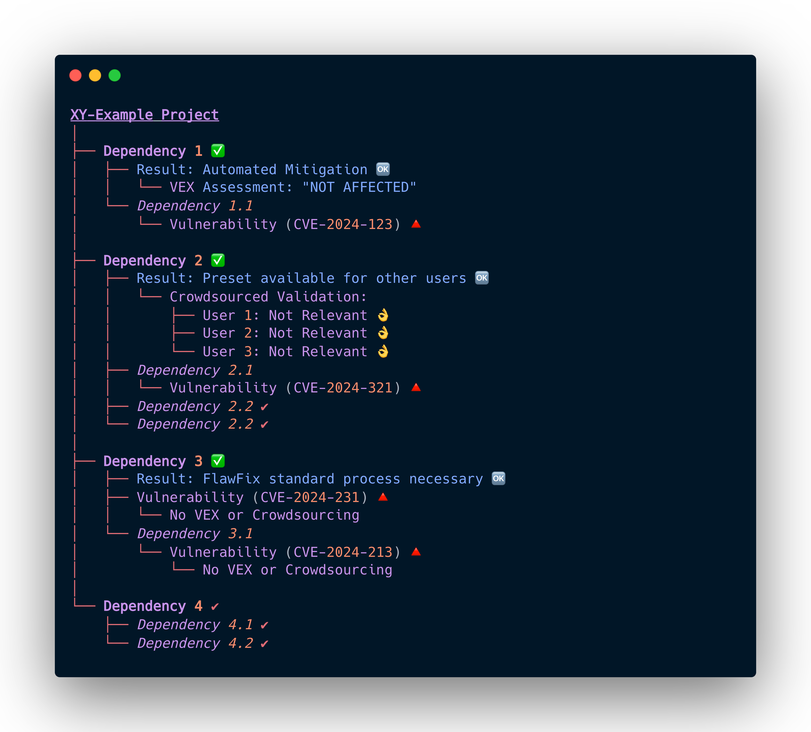

# Joint vulnerability management - the strength of exchange

Based on emerging standards such as the Vulnerability Exploitability eXchange (VEX) and our goal of increasing overall software security through the dissemination of DevGuard, we want to make expert information available from the source.  

## Vulnerability Exploitability eXchange (VEX) 

> “The goal of Vulnerability Exploitability eXchange (VEX) is to allow a software supplier or other parties to assert the status of specific vulnerabilities in a particular product.” ([CISA](https://www.cisa.gov/sites/default/files/publications/VEX_Use_Cases_Apr22.pdf))

VEX is an advanced form of security advisory that provides several key advantages over conventional methods:

1. Machine Readability
2. Enhanced SBOM Integration
3. Automation Support

For instance, consider an open-source project, “XY-Example,” which detects a vulnerability through a dependency. Upon closer inspection, the developers determine that the specific conditions required to exploit this vulnerability are not present in their software. This expert assessment can be recorded and disseminated through VEX, making it accessible and usable for all users of the “XY-Example” software. This exchange of vulnerability information drastically reduces the effort required for vulnerability management, as users can rely on expert evaluations to determine their exposure to potential threats.

## Crowdsourced

If the VEX is not available and in its addition, we can also use the knowledge of the crowd. If enough users confirm that a vulnerability in a software is not relevant, we can make this information available to others as a preset. In this way, we expand the foundation for joint vulnerability management and make it even easier.

