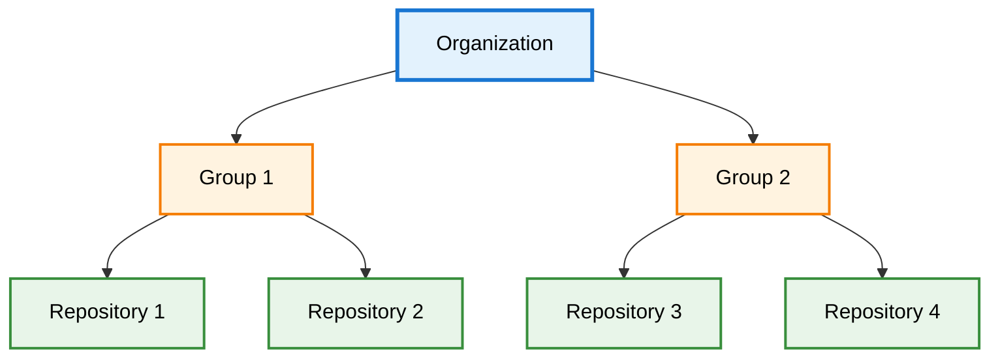

import Image from 'next/image';
import { Callout } from 'nextra/components';
import { Tooltip, TooltipTrigger, TooltipContent } from "@/components/ui/tooltip";

# DevGuard Hierarchy

DevGuard organizes security management through a three-level hierarchy inspired by GitLab: Organizations contain Groups, Groups contain Repositories. This structure enables organized vulnerability management across complex software portfolios with clear boundaries and access control.

## The Three Levels

### Organization (Top Level)

Your company or entity—the root containing all security management.

**What it is**: Your company, business unit, or organizational entity managing software products.

**Setup**: Created during initial DevGuard configuration.

**Example**: "Acme Corporation" organization containing all Acme's groups and repositories.

### Group (Middle Level)

Logical groupings of related repositories representing application systems or product lines.

**What it is**: Application systems where multiple repositories together deliver business functionality.

**Why group**: Related repositories share vulnerability context—a vulnerability in shared dependencies impacts the entire application.

**Examples**:
- **E-Commerce Platform**: `frontend-web`, `backend-api`, `mobile-app`, `payment-service`
- **Internal Tools**: `admin-dashboard`, `reporting-service`, `data-pipeline`
- **Marketing Website**: `website`, `cms-backend`, `analytics-service`

<Callout type="info" emoji="📦">
  Groups organize repositories comprising complete applications—not arbitrary collections. Think "application system" not "team" or "technology."
</Callout>

### Repository (Bottom Level)

Individual codebases—your actual Git repositories DevGuard scans for vulnerabilities.

**What it is**: Git repositories, container images, or deployable artifacts containing source code and dependencies.

**Scanning**: This is what DevGuard Scanner analyzes—identifying components, generating <Tooltip><TooltipTrigger asChild>SBOM</TooltipTrigger><TooltipContent>
Software Bill of Materials - Component inventory
</TooltipContent></Tooltip>, detecting vulnerabilities.

**Naming**: Typically mirrors Git repository structure for easy identification.

## Why This Structure?

**Clear Organization**: Structure prevents chaos in portfolios with hundreds of repositories. Instantly understand which repositories comprise each application.

**Contextual Security**: View vulnerability impact across entire application systems, not isolated repositories.

**Access Control**: Different teams see only relevant groups without overwhelming unrelated findings.

**Scalability**: Grows from small companies to enterprises with thousands of repositories without restructuring.

## Practical Example

**Organization**: `acme-corp`

**Group**: E-Commerce Platform (`ecommerce`)
- `frontend-web` - React website
- `backend-api` - Node.js API
- `mobile-app` - React Native app
- `payment-service` - Go microservice

**Group**: Internal Tools (`internal-tools`)
- `admin-dashboard` - Vue.js admin
- `reporting-service` - Python analytics
- `data-pipeline` - ETL workflows

## Setup Flow

1. **Create Organization**: Define during initial setup (usually company name)
2. **Create Groups**: One per major application system or product line
3. **Add Repositories**: Connect Git repositories within groups
4. **Configure Scanning**: Set up CI/CD integration for automatic scanning
5. **Manage Vulnerabilities**: View findings organized by organization → group → repository

---

## Related Documentation

- [What is DevGuard](what-is-devguard) - Core mission and capabilities
- [Vulnerability Lifecycle](vulnerability-lifecycle) - Managing vulnerabilities across hierarchy