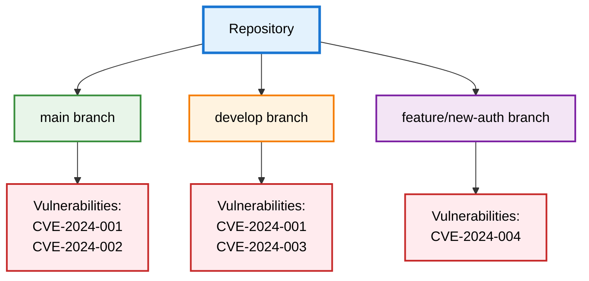

import Image from 'next/image';
import { Callout } from 'nextra/components';
import { Tooltip, TooltipTrigger, TooltipContent } from "@/components/ui/tooltip";

# Repository Versions (Branches)

DevGuard tracks vulnerabilities across multiple branches within each repository, mirroring your Git workflow. Just like GitLab's branch management, DevGuard scans and manages security findings independently per branch—enabling separate vulnerability tracking for production, development, and feature branches.

## How Branch Tracking Works

### Independent Vulnerability Management

Each branch maintains its own vulnerability findings, risk assessments, and remediation status. A vulnerability fixed in `main` doesn't automatically resolve in `develop`—branches are tracked independently.

**Why independent tracking**: Different branches contain different code and dependencies. A feature branch might introduce new dependencies with vulnerabilities not present in `main`. Production branches might use different dependency versions than development.

**Example**: Your `main` branch uses `express@4.18.2` (patched), while `develop` still uses `express@4.17.1` (vulnerable). DevGuard tracks the vulnerability in `develop` while showing `main` as fixed.

### Branch Selection

Configure which branches DevGuard tracks in repository settings:

**Default**: `main` branch is tracked automatically upon repository setup.

**Additional branches**: Enable tracking for `develop`, `staging`, release branches, or long-lived feature branches.

**Dynamic branches**: Feature branches can be scanned on-demand during CI/CD runs without permanent tracking.

<Callout type="info" emoji="🌿">
  Track only meaningful branches—typically `main`, `develop`, and active release branches. Tracking every feature branch creates noise without security value.
</Callout>

## Vulnerability Handling Per Branch

### State Management

Vulnerability states (<Tooltip><TooltipTrigger asChild>VEX</TooltipTrigger><TooltipContent>
Vulnerability Exploitability eXchange - Impact assessments
</TooltipContent></Tooltip> states) are managed per branch:

**Not Affected in main**: You've analyzed a vulnerability and determined it doesn't affect your production deployment. Mark it "Not Affected" in `main` with justification.

**Still Affected in develop**: The same vulnerability exists in `develop` branch where different code paths or configurations make it exploitable. It remains "Affected" there.

**Independent justifications**: Document different assessments per branch when code differences justify different states.

### Risk Scores Per Branch

DevGuard calculates risk scores independently for each branch based on that branch's specific context:

**Component versions**: Different branches may use different dependency versions with varying <Tooltip><TooltipTrigger asChild>CVSS</TooltipTrigger><TooltipContent>
Common Vulnerability Scoring System - Technical severity
</TooltipContent></Tooltip> scores.

**Component depth**: Dependency tree structure might differ between branches, affecting attack surface assessment.

**Security requirements**: Production branches (`main`) might have different CIA requirements than development branches.

### Remediation Workflow

Fix vulnerabilities in the appropriate branch order:

1. **Patch in feature branch**: Update vulnerable dependency in isolated branch
2. **Test and merge to develop**: Verify fix doesn't break functionality
3. **Merge to main**: Deploy fix to production
4. **DevGuard tracks progression**: Vulnerability status updates automatically as fixes merge through branches

<Callout type="info" emoji="🔄">
  DevGuard automatically detects when dependency updates flow through branches. When a patched version merges from `develop` to `main`, vulnerability status updates accordingly.
</Callout>

## Practical Use Cases

### Production vs Development Tracking

**Production (`main`)**: High security requirements, strict vulnerability acceptance criteria. Every finding requires justification or remediation.

**Development (`develop`)**: Lower security requirements, faster iteration. Some vulnerabilities acceptable temporarily during active development.

**Benefit**: Maintain strict production security without blocking development velocity.

### Release Branch Management

Track release branches separately from ongoing development:

**Release branch (`release/v2.0`)**: Locked dependency versions for stability. Only critical security patches allowed.

**Development (`main`)**: Active dependency updates including non-critical security improvements.

**Benefit**: Stable release security tracking without mixing with active development changes.

### Feature Branch Scanning

Scan feature branches during CI/CD without permanent tracking:

**On pull request**: DevGuard scans feature branch, reports new vulnerabilities introduced by changes.

**No permanent tracking**: Results inform merge decisions without cluttering branch list.

**Benefit**: Catch security issues before merge without tracking overhead.

## Branch Comparison

Compare vulnerability status across branches to understand security drift:

**Main vs Develop**: Identify vulnerabilities fixed in `main` but still present in `develop` requiring backport.

**Release branches**: Ensure security fixes applied to active release branches, not just `main`.

**Audit trail**: Document which branches received which security patches and when.

## Setup

1. **Configure tracked branches**: Repository settings → select branches for continuous tracking
2. **Set security requirements**: Configure CIA requirements per branch if needed
3. **CI/CD integration**: Add DevGuard scanning to pipeline for each tracked branch
4. **Branch policies**: Establish which vulnerability severities block merges per branch

---

## Related Documentation

- [DevGuard Hierarchy](devguard-hierarchy) - Understanding organization, groups, and repositories
- [Vulnerability Lifecycle](vulnerability-lifecycle) - Managing vulnerabilities through remediation
- [Vulnerability Risk Assessment](risk-assessment-methodology) - How risk scores are calculated