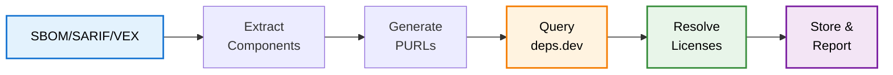

import Image from 'next/image';
import { Callout } from 'nextra/components';
import { Badge } from "@/components/ui/badge";

# License Detection

DevGuard automatically detects and tracks software licenses across your dependency tree, enabling compliance monitoring without manual audits. License detection combines component identification from security scans with external license intelligence.

## How It Works

### 1. Component Extraction

DevGuard extracts components from standardized formats:

**SBOM**: Primary source for component inventory with Package-URL identifiers and versions  
**SARIF**: First-party code analysis with component references  
**VEX**: Vulnerability assessments referencing affected components

From these, DevGuard builds complete component inventory across all artifacts and branches.

### 2. License Resolution via deps.dev

DevGuard queries [deps.dev](https://deps.dev)—Google's comprehensive open source dependency metadata service—to resolve licenses.

**Coverage**: Aggregates license data across npm, PyPI, Maven, Go, Cargo, and more.

**PURL-Based Lookup**: Uses Package URLs for queries. Example: `pkg:npm/express@4.18.2` retrieves license for that specific version.

**Version-Specific**: Different package versions may have different licenses. deps.dev provides version-accurate data.

**Multiple Licenses**: Detects dual-licensed packages and complex licensing.

<Callout type="info" emoji="🔍">
  deps.dev aggregates from package registries, repository metadata, and manual curation—more reliable than parsing individual files.
</Callout>

## Detection Workflow

## SBOM-Embedded Licenses <Badge variant="upcoming">Coming Soon 🎉</Badge>

Future: DevGuard will directly consume license information already in SBOM documents.

**Why**: Many SBOM generators (Syft, Trivy, cdxgen) already include license data. Leveraging embedded licenses reduces external API dependencies.

**Standards Support**: CycloneDX `licenses` array, SPDX `licenseConcluded` and `licenseDeclared` fields.

**Benefits**: Faster detection (no external queries), offline capability, vendor-provided assertions.

**Approach**: Use deps.dev as fallback when SBOM license data is missing or ambiguous.

<Callout type="info" emoji="🔄">
  SBOM-embedded detection will complement deps.dev, not replace it. DevGuard will validate embedded licenses against deps.dev for accuracy.
</Callout>

## Practical Usage

**Compliance Monitoring**: Continuously track as dependencies change—updates, additions, branch differences.

**Reporting**: Generate reports showing all licenses, components by type (permissive, copyleft), obligations, conflicts, unknowns.

**Integration**: Unified view with vulnerability risk—balance security and compliance concerns per component.

---

## Related Documentation

- [License Compliance](license-compliance) - License types and obligations
- [SBOM Standards](/explanation/compliance/sbom-standards) - Component inventory formats

## References

Google Open Source, *deps.dev*, https://deps.dev  
SPDX, *SPDX License List*, https://spdx.org/licenses/