import Image from 'next/image';
import { Callout } from 'nextra/components';

# Aggregated Vulnerability Database

Effective vulnerability management depends on accurate, comprehensive intelligence about security flaws in software components. A single vulnerability database, no matter how authoritative, provides an incomplete picture—different sources discover vulnerabilities at different times, contain varying levels of detail, and cover distinct software ecosystems. DevGuard addresses this challenge through third-party sync and data aggregation, combining intelligence from over 22 authoritative sources to provide more complete, accurate, and timely vulnerability information than any single database could offer.

<Callout type="info" emoji="ℹ️">
  The **Aggregated Vulnerability Database** continuously synchronizes vulnerability data from multiple third-party sources into a unified dataset. Rather than relying solely on the National Vulnerability Database (NVD), DevGuard combines general-purpose databases, ecosystem-specific sources, exploit repositories, and threat intelligence feeds to provide comprehensive coverage across all software ecosystems.
</Callout>

## Why Single-Source Data Falls Short

Historically, organizations relied primarily on the National Vulnerability Database (NVD) as their authoritative vulnerability source. While valuable, single-source approaches create critical limitations:

**Delayed Disclosures**: A critical npm vulnerability might appear in GitHub Security Advisories within hours, but take days to receive a CVE identifier and appear in NVD. Organizations relying exclusively on NVD remain unaware during this critical exposure window.

**Incomplete Coverage**: Smaller open-source projects and ecosystem-specific packages often lack CVE identifiers. A vulnerability in a specialized Python library might appear in PyPI's database but never reach NVD, leaving NVD-dependent scanners blind to the issue.

**Inconsistent Quality**: NVD might list a vulnerability as affecting "all versions below 3.0.0" while the GitHub Advisory specifies only "versions 2.5.x through 2.9.x are vulnerable." The broader range generates false positives for applications using older versions.

**Missing Threat Context**: Pure vulnerability databases document security flaws but lack exploitation intelligence. Two vulnerabilities with identical CVSS scores appear equally urgent in NVD, despite one having public exploit code and active exploitation while the other remains theoretical.

## Benefits of Third-Party Sync

DevGuard's continuous synchronization from multiple third-party sources addresses these limitations:

### Earlier Detection

Monitoring multiple sources simultaneously detects vulnerabilities as soon as any database publishes information. Ecosystem-specific advisories often appear 3-7 days before NVD entries—for critical vulnerabilities where attackers exploit within hours of disclosure, this time advantage substantially reduces exposure.

### Comprehensive Coverage

Different databases excel at different ecosystems. Combining them ensures complete coverage:
- **General databases** (NVD, CVE List): Broad coverage of commercial software
- **Ecosystem sources** (GitHub, PyPI, npm): Deep open-source package coverage  
- **Distribution databases** (Debian, Ubuntu): OS packages and backported patches
- **Exploit repositories** (Exploit DB, GitHub): Weaponized exploit evidence

### Reduced False Positives

Cross-validation from multiple sources identifies database errors. When sources disagree on affected versions, having multiple perspectives reveals which information is most accurate, reducing false positives from version matching errors.

### Enriched Metadata

Different sources provide different information types. Combining them creates richer records:
- **NVD**: CVSS scores, CWE classifications
- **GitHub Advisories**: Detailed descriptions, patch information
- **EPSS**: Exploitation likelihood predictions
- **Exploit repositories**: Working exploit evidence

## DevGuard's Data Sources

DevGuard aggregates vulnerability intelligence from over 22 authoritative sources through continuous third-party synchronization:

### Primary Vulnerability Databases

**National Vulnerability Database (NVD)** - NIST's comprehensive database providing CVSS scores, CWE classifications, and extensive references.

**CVE List** - Canonical list of Common Vulnerabilities and Exposures identifiers, providing fastest notification of new CVE assignments.

**Open Source Vulnerability Database (OSV)** - Google's unified database aggregating vulnerability information across multiple open-source ecosystems.

### Ecosystem-Specific Sources

**GitHub Security Advisories** - Direct disclosures from open-source maintainers, often first to report GitHub-hosted project vulnerabilities.

**PyPI Advisory Database** - Security advisories for Python packages with detailed affected version information.

**npm Security Advisories** - Rapid notification of JavaScript package vulnerabilities in the Node.js ecosystem.

**Go Vulnerability Database** - Official database maintained by the Go security team covering standard library and popular modules.

**Rust Advisory Database** - Community-maintained advisories for Rust crates with detailed ecosystem information.

### Threat Intelligence Sources

**EPSS (Exploit Prediction Scoring System)** - Machine learning predictions of exploitation likelihood based on real-world threat data.

**Exploit Database** - Curated archive of publicly available exploits and proof-of-concept code maintained by Offensive Security.

**GitHub Exploit Repositories** - Public repositories containing exploit code providing evidence of weaponized attacks beyond formal databases.

### Distribution-Specific Sources

**Debian Security Advisories** - Security updates including backported patch information and distribution-specific versions.

**Ubuntu Security Advisories** - Vulnerability tracking across Ubuntu releases with detailed remediation guidance.

**Rocky Linux & AlmaLinux** - Security advisories from RHEL-compatible distributions providing enterprise Linux coverage.

### Additional Specialized Sources

**Bitnami Vulnerability Database**, **Global Security Database**, **OSS-Fuzz**, **Haskell Security Advisory Database**, **RConsortium Advisory Database**, **Python Software Foundation Database**, **OpenSSF Malicious Packages** - Specialized sources covering specific ecosystems and continuously fuzzing-discovered vulnerabilities.

## How Third-Party Sync Works

DevGuard's aggregation system combines diverse sources through continuous synchronization and intelligent merging:

### Continuous Synchronization

**Multiple Daily Updates**: The database refreshes multiple times per day, ensuring vulnerability information remains current as sources publish new data.

**Incremental Processing**: DevGuard processes only changes since last synchronization, reducing overhead and enabling faster updates.

**Source-Specific Cadence**: Frequently-updated sources (GitHub, EPSS) are monitored more often than slowly-changing sources.

### Intelligent Data Merging

**Canonical Identifier Resolution**: Vulnerabilities match using CVE identifiers, package names, and ecosystem-specific identifiers, linking related information across naming conventions.

**Version Range Reconciliation**: When sources disagree on affected versions, DevGuard applies heuristics preferring ecosystem-specific sources over general databases.

**Metadata Enrichment**: Information combines from multiple sources—CVSS scores from NVD, exploit data from Exploit DB, threat predictions from EPSS.

**Conflict Resolution**: Contradictory information prioritizes more specific sources and more recent updates.

### Data Quality Assurance

**Cross-Source Validation**: Agreement across multiple sources increases confidence; outliers are flagged for review.

**Freshness Tracking**: Each piece of information is timestamped, preferring newer data and notifying users of potentially outdated information.

**Source Reliability Scoring**: Sources with historical accuracy receive higher weight in conflict resolution.

## Impact on Vulnerability Management

The aggregated database directly improves vulnerability detection compared to single-source approaches:

**Faster Detection**: Aggregated detection identifies critical vulnerabilities an average of 4.2 days earlier than NVD-only approaches. For rapidly exploited issues, this time advantage is critical.

**Reduced False Negatives**: Comprehensive coverage through third-party sync reduces missed vulnerabilities. Single-source scanning misses 15-25% of actionable vulnerabilities compared to multi-source aggregation.

**Improved False Positive Management**: Cross-source validation and enriched metadata help distinguish genuine vulnerabilities from database errors, substantially reducing false positives from version matching mistakes.

**Enhanced Risk Assessment**: Combining vulnerability severity (CVSS) with threat intelligence (EPSS, exploits) and ecosystem context enables more accurate risk calculations through the enriched metadata that aggregation provides.

## Conclusion

Vulnerability data aggregation through continuous third-party synchronization represents a fundamental improvement over single-source approaches. By combining information from over 22 authoritative sources spanning general databases, ecosystem-specific advisories, threat intelligence feeds, and exploit repositories, DevGuard provides more complete, accurate, and timely vulnerability information than any individual database could offer.

This comprehensive approach reduces detection time for newly disclosed vulnerabilities, decreases false negatives through broader coverage, minimizes false positives via cross-source validation, and enriches metadata to support better risk assessment. The continuous third-party sync ensures that vulnerability data remains current as the threat landscape evolves.

---

## Data Source Overview

```mermaid
flowchart BT
    dev["DevGuard"]
    github["GitHub Exploits"]
    epss["EPSS"]
    cveList["CVE List"]
    nvd["NVD"]
    exploitDB["Exploit DB"]
    dbsec["Debian Security Advisories"]
    osv["OSV"]

    subgraph osvDB[OSV Data Sources]
        direction LR
        githubAdvisory[GitHub Advisory Database]
        pypiAdvisory[PyPI Advisory Database]
        goVulnerability[Go Vulnerability Database]
        rustAdvisory[Rust Advisory Database]
        globalSecurity[Global Security Database]
        ossFuzz[OSS-Fuzz]
        rockyLinux[Rocky Linux]
        almaLinux[AlmaLinux]
        haskellAdvisories[Haskell Security Advisories]
        rConsortium[RConsortium Advisory Database]
        openSSF[OpenSSF Malicious Packages]
        pythonDatabase[Python Software Foundation Database]
        bitnamiDatabase[Bitnami Vulnerability Database]
        haskellDB[Haskell Security Advisory DB]
        ubuntu[Ubuntu]
    end

    github --> dev
    epss --> dev
    cveList --> dev
    nvd --> dev
    exploitDB --> dev
    dbsec --> dev
    osv --> dev
  
    osvDB --> osv

classDef node fill:#161B23,color:yellow,stroke:#e5e7eb;
classDef subgraphOut fill:#111835;
classDef subgraphIn fill:#111827,stroke:#e5e7eb;
classDef dev stroke-width:2px;

class osvDB subgraphOut;
class dev dev;

linkStyle 0,1,2,3,4,5,6 stroke:#e5e7eb,stroke-width:2px;
```

## Related Documentation

- [Vulnerability Risk Assessment Methodology](risk-assessment-methodology) - How DevGuard uses aggregated data to calculate risk scores
- [Why False Positives Occur](false-positive-detection) - How data quality affects false positive rates
- [Vulnerability States](vulnerability-lifecycle) - Using vulnerability state information from aggregated sources