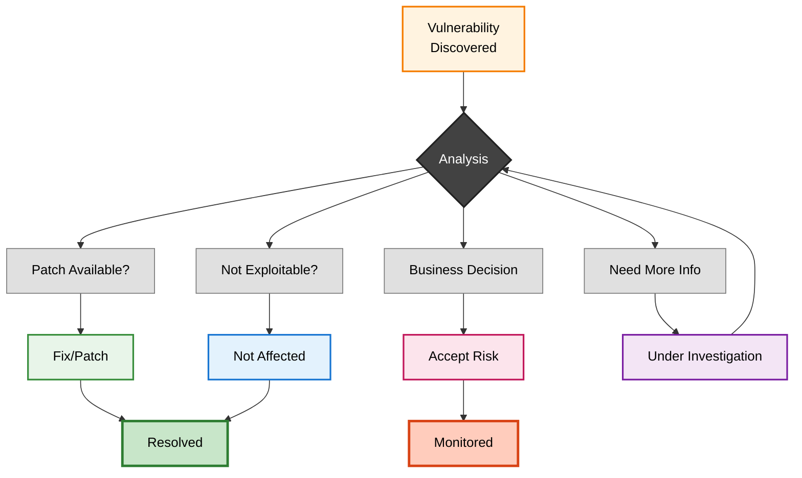

import Image from 'next/image';
import { Callout } from 'nextra/components';
import { Tooltip, TooltipTrigger, TooltipContent } from "@/components/ui/tooltip";

# Vulnerability Mitigation Strategies

Discovering vulnerabilities is only the first step—the critical question is how to respond. Not every vulnerability requires immediate patching, and understanding your response options enables efficient resource allocation while maintaining security posture. DevGuard supports four distinct mitigation strategies based on the <Tooltip><TooltipTrigger asChild>VEX</TooltipTrigger><TooltipContent>
Vulnerability Exploitability eXchange - A standard format for communicating vulnerability impact assessments
</TooltipContent></Tooltip> standard[^1].

## The Four Mitigation Strategies

### 1. Fix/Patch: Eliminate the Vulnerability

Patching involves updating vulnerable components to versions where the security flaw has been corrected. This is the gold standard—it eliminates the root cause entirely rather than merely reducing risk.

**When to use**: This should be your default strategy whenever a patched version is available and can be safely deployed.

**Example**: Your JSON parsing library has a vulnerability in version 2.3.1. You update to version 2.3.2 which contains the fix, test, and deploy—completely eliminating the vulnerability.

<Callout type="info" emoji="🔄">
  DevGuard automatically detects when you deploy patched versions and transitions vulnerabilities to Fixed state. Associated issue tracker tickets can be automatically closed if synchronization is enabled.
</Callout>

### 2. Not Affected: Document Why It Doesn't Apply

Not Affected indicates that while a vulnerability exists in your dependencies, it doesn't actually impact your application's security. This prevents wasted effort on vulnerabilities that pose no real risk.

**When to use**: After analysis, you've determined your application cannot be exploited through this vulnerability. The vulnerable code may be present but isn't used in a way that creates risk.

**VEX Justification Categories**[^1]:
- **Vulnerable code not present**: Your version doesn't contain the flaw
- **Vulnerable code not in execute path**: The code exists but is never called
- **Inline mitigations exist**: Controls prevent exploitation
- **Component not affected**: Only affects specific configurations you don't use

<Callout type="warning" emoji="📝">
  Always document your justification clearly. DevGuard includes these justifications in generated VEX reports for auditors and customers.
</Callout>

### 3. Accept Risk: Conscious Business Decision

Accept Risk represents a business decision to knowingly operate with a vulnerability present, accepting the associated risk. You acknowledge the vulnerability could be exploited but choose not to remediate for specific business reasons.

**When to use**:
- Remediation cost exceeds potential impact
- Unlikely conditions required for exploitation
- Business constraints prevent immediate action
- Sufficient <Tooltip><TooltipTrigger asChild>compensating controls</TooltipTrigger><TooltipContent>
Security measures that reduce vulnerability risk without fixing the code—like WAF rules or network restrictions
</TooltipContent></Tooltip> reduce risk to acceptable levels

Document the business justification, risk assessment, compensating controls, and establish a review date. Risk acceptance typically requires stakeholder approval.

<Callout type="warning" emoji="⚠️">
  Accepted risks require periodic review. DevGuard can notify you when <Tooltip><TooltipTrigger asChild>EPSS</TooltipTrigger><TooltipContent>
Exploit Prediction Scoring System - Probability that a vulnerability will be exploited
</TooltipContent></Tooltip> scores change for accepted vulnerabilities.
</Callout>

### 4. Under Investigation: Assessment in Progress

Under Investigation is a transitional state indicating active analysis of whether and how a vulnerability affects your application. Every Under Investigation vulnerability should eventually move to Fixed, Not Affected, or Accept Risk.

**When to use**: Immediately upon discovering vulnerabilities that require analysis before determining appropriate response, especially for newly disclosed findings where impact isn't immediately clear.

Establish investigation timelines based on severity: critical findings within 24 hours, high within 72 hours, medium within one week.

## Decision Framework

**High CVSS + High EPSS + Direct Dependency** → Prioritize patching immediately

**High CVSS + Low EPSS + Deep Transitive** → Analyze exploitability; likely Not Affected

**Vulnerability in Optional Feature** → Disable and mark Not Affected

**No Patch + Actively Exploited** → Implement controls, Accept Risk with documentation

**Unclear Impact** → Mark Under Investigation with timeline

## DevGuard Support

**Issue Tracker Integration**: Automatically create and sync tickets in GitHub, GitLab, or Jira. Status updates flow bidirectionally.

**VEX Statement Generation**: Export assessments as standardized VEX documents for customers and auditors.

**Automated State Detection**: Automatically transitions vulnerabilities to Fixed when you deploy patched versions.

**Risk-Based Notifications**: Configure webhooks for high-risk discoveries or risk score changes.

---

## Related Documentation

- [Vulnerability Lifecycle](vulnerability-lifecycle) - Understanding the complete vulnerability management process
- [Vulnerability Risk Assessment](risk-assessment-methodology) - How DevGuard calculates risk scores
- [Vulnerability States](vulnerability-states) - Detailed VEX states and justifications

## References

[^1]: CISA, *Vulnerability Exploitability eXchange (VEX)*, Cybersecurity and Infrastructure Security Agency, 2023, https://www.cisa.gov/sbom