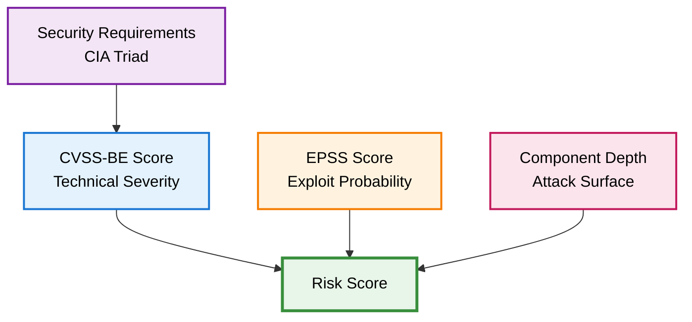

import Image from 'next/image';
import { Callout } from 'nextra/components';
import { Tooltip, TooltipTrigger, TooltipContent } from "@/components/ui/tooltip";

# Vulnerability Risk Assessment Methodology

Not all vulnerabilities pose equal risk. A critical severity <Tooltip><TooltipTrigger asChild><span className="underline decoration-dotted decoration-yellow-400 decoration-1 underline-offset-4 cursor-pointer">CVE</span></TooltipTrigger><TooltipContent><p>Common Vulnerabilities and Exposures - Standardized identifiers for publicly known security vulnerabilities</p></TooltipContent></Tooltip> in a deep transitive dependency with no known exploits presents far less danger than a moderate severity vulnerability in a direct dependency that's actively exploited in the wild. DevGuard's risk assessment methodology combines technical severity, exploit probability, organizational context, and structural factors to answer the critical question: *Which vulnerabilities actually threaten your applications?*

<Callout type="warning" emoji="⚠️">
  Risk scores guide remediation prioritization but don't represent absolute measurements. Environmental factors specific to your deployment may elevate or reduce actual risk beyond what automated scoring can capture.
</Callout>

## The Risk Formula

DevGuard calculates vulnerability risk using a multi-dimensional approach that balances four critical factors:
```
Risk = ((CVSS-BE × (EPSS + 1)) / 2) / Component Depth
```


## The Four Risk Dimensions

### 1. CVSS-BE: Technical Severity + Context

The <Tooltip><TooltipTrigger asChild><span className="underline decoration-dotted decoration-yellow-400 decoration-1 underline-offset-4 cursor-pointer">CVSS</span></TooltipTrigger><TooltipContent><p>Common Vulnerability Scoring System - A standardized framework for assessing vulnerability severity from 0.0 to 10.0</p></TooltipContent></Tooltip> Base + Environmental (CVSS-BE) score measures a vulnerability's technical characteristics while adjusting for your organizational priorities. Base metrics capture fundamental properties like attack vector, complexity, and impact on confidentiality, integrity, and availability. Environmental metrics modify this score based on your configured security requirements—the relative importance of the <Tooltip><TooltipTrigger asChild><span className="underline decoration-dotted decoration-yellow-400 decoration-1 underline-offset-4 cursor-pointer">CIA Triad</span></TooltipTrigger><TooltipContent><p>Confidentiality, Integrity, Availability - The three fundamental security objectives that define what we protect</p></TooltipContent></Tooltip> for each system.

A vulnerability with high confidentiality impact scores differently for a public marketing site (low confidentiality requirement) versus a patient database (high confidentiality requirement). This contextual adjustment ensures risk scores reflect actual business impact, not just generic severity ratings.

<Callout type="info" emoji="⚙️">
  Configure CIA security requirements per repository in DevGuard's project settings. These environmental metrics automatically adjust risk scores to match your organization's security priorities.
</Callout>

### 2. EPSS: Exploit Probability

The <Tooltip><TooltipTrigger asChild><span className="underline decoration-dotted decoration-yellow-400 decoration-1 underline-offset-4 cursor-pointer">EPSS</span></TooltipTrigger><TooltipContent><p>Exploit Prediction Scoring System - Machine learning-based probability estimate (0-100%) that a vulnerability will be exploited in the next 30 days</p></TooltipContent></Tooltip> (Exploit Prediction Scoring System) applies machine learning to historical exploit data and current threat intelligence to estimate exploitation probability within the next 30 days[^1]. EPSS analyzes exploit code availability, threat actor activity, and vulnerability characteristics to produce scores from 0% (extremely unlikely) to 100% (highly probable).

Two vulnerabilities with identical CVSS scores can have vastly different EPSS ratings. A vulnerability with 75% EPSS demands immediate attention regardless of other factors—active exploitation is highly probable. One with 0.8% EPSS, while still serious, presents lower immediate risk and can be scheduled for routine patching.

DevGuard integrates real-time EPSS data from FIRST.org and recalculates risk scores multiple times daily as threat intelligence evolves. This ensures prioritization remains aligned with the current threat landscape, not yesterday's assessments.

### 3. Component Depth: Attack Surface

A vulnerability's position in your dependency tree significantly impacts exploitability. Modern applications rely on complex dependency chains where libraries depend on other libraries, creating multiple levels of <Tooltip><TooltipTrigger asChild><span className="underline decoration-dotted decoration-yellow-400 decoration-1 underline-offset-4 cursor-pointer">transitive dependencies</span></TooltipTrigger><TooltipContent><p>Indirect dependencies pulled in by your direct dependencies. If your app depends on Library A, and Library A depends on Library B, then Library B is transitive</p></TooltipContent></Tooltip>. Deeper dependencies are inherently less exploitable because:

**Code Reachability**: Deep dependencies sit multiple abstraction layers away from your application code. The vulnerable code path may never execute in practice, even though the vulnerability technically exists in your dependency tree.

**Natural Isolation**: Multiple dependency layers create isolation boundaries that complicate exploitation. An attacker must chain through several components to reach deeply nested vulnerable code.

**Limited API Surface**: Direct dependencies expose broad API surfaces to your code, while deep dependencies are typically only partially utilized through specific upstream component needs.

**Example dependency structure:**
```
Your Application
└── Web Framework (depth 1)          ← Directly called by your code
    └── HTTP Parser (depth 2)        ← Called by framework  
        └── String Utils (depth 3)   ← Called by parser
```

A vulnerability in String Utils (depth 3) is substantially less exploitable than one in Web Framework (depth 1), even with identical CVSS scores. The framework vulnerability exposes directly through your API routes, while the string utility requires specific parser inputs that may never occur.

<div className='block lg:flex gap-6 mt-8'>
<div>

DevGuard incorporates component depth as a risk modifier by dividing the calculated risk by depth value. This structural context reflects reduced attack surface for deeper dependencies while maintaining non-zero risk—acknowledging that exploitation, while less probable, remains theoretically possible.

### 4. Continuous Intelligence

Risk assessment is continuous, not static. DevGuard updates vulnerability data and risk calculations multiple times daily by integrating threat intelligence from over 22 authoritative sources including NVD, OSV, GitHub Security Advisories, and the EPSS feed. When new exploits emerge or EPSS scores change, risk calculations automatically adjust.

</div>
<Image
    src="/screenshots/screenshot-risk-details.png"
    alt="DevGuard Risk Details Screenshot"
    width={200}
    height={100}
    className="h-full w-auto mx-auto border border-gray-800 rounded-md my-4"
/>
</div>

Configure webhooks to receive real-time notifications when risk scores change, and enable issue tracker synchronization to automatically update tickets when vulnerabilities are patched or risk levels shift.

## Example Risk Calculation

Consider a vulnerability with the following characteristics:
- **CVSS-BE**: 8.5 (High severity with your security requirements applied)
- **EPSS**: 15.2% (0.152 as decimal)
- **Component Depth**: 2 (transitive dependency)
```
Risk = ((8.5 × (0.152 + 1)) / 2) / 2
     = ((8.5 × 1.152) / 2) / 2  
     = (9.792 / 2) / 2
     = 4.896 / 2
     = 2.45 (Medium Risk)
```

Despite high CVSS severity, this vulnerability receives a moderate risk score due to low exploit probability and indirect dependency position. This enables teams to prioritize more immediate threats while scheduling this finding for routine patching cycles.

## Best Practices

**Prioritize by Risk Score**: Focus remediation on high-risk vulnerabilities first. Not all "Critical" severity findings demand immediate action if exploit probability is minimal.

**Configure Security Requirements**: Review and set CIA priorities per repository to ensure risk scores reflect your actual security posture, not generic assumptions.

**Monitor Risk Evolution**: Track how scores change over time. A low-risk vulnerability today may become critical if public exploits emerge tomorrow.

**Balance Automation with Judgment**: Risk scores guide prioritization but can't capture every environmental nuance. Review high-risk findings with organizational context before committing resources.

**Automate Notifications**: Configure webhooks and issue tracker sync for timely awareness of changing risk profiles without manual monitoring overhead.

---

## Related Documentation

- [Vulnerability Lifecycle](vulnerability-lifecycle) - Understanding the complete vulnerability management process
- [Mitigation Strategies](mitigation-strategies) - Detailed guidance on responding to vulnerabilities
- [Aggregated Vulnerability Database](aggregated-vulnerability-database) - DevGuard's comprehensive threat intelligence sources

## References

[^1]: FIRST.org, *Exploit Prediction Scoring System (EPSS)*, https://www.first.org/epss/

Additional standards referenced:
- FIRST.org, *Common Vulnerability Scoring System version 3.1*, https://www.first.org/cvss/
- NIST Special Publication 800-40 Rev. 4, *Guide to Enterprise Patch Management Planning*
- ISO/IEC 27000:2018, *Information Security Management Systems - Overview and Vocabulary*