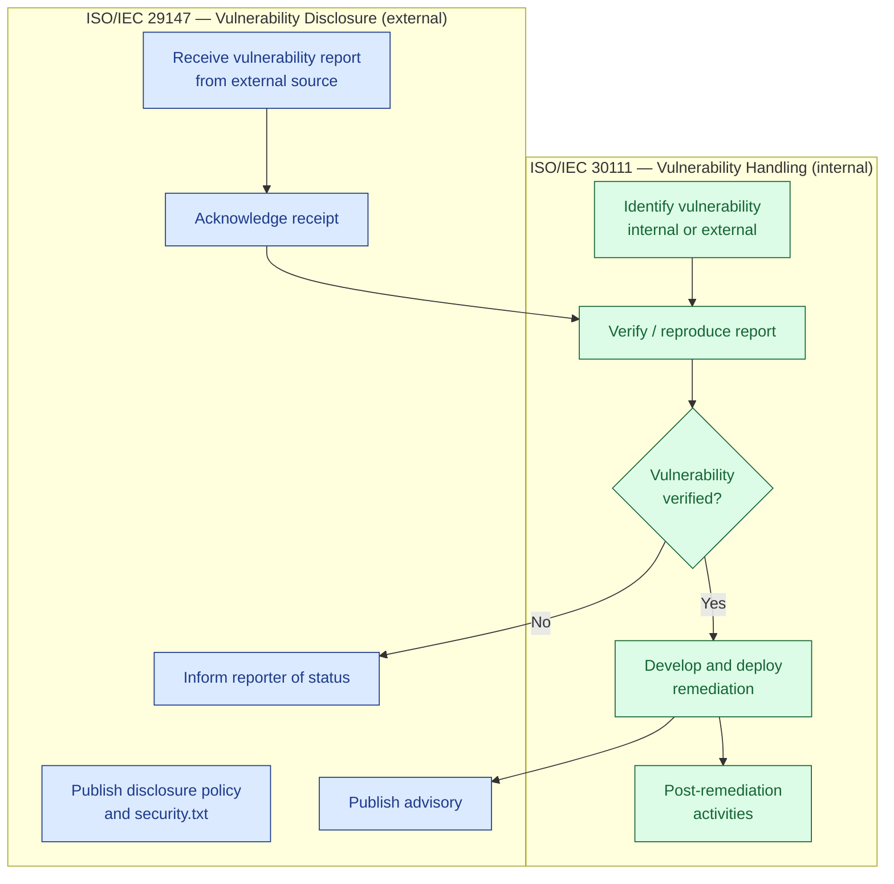
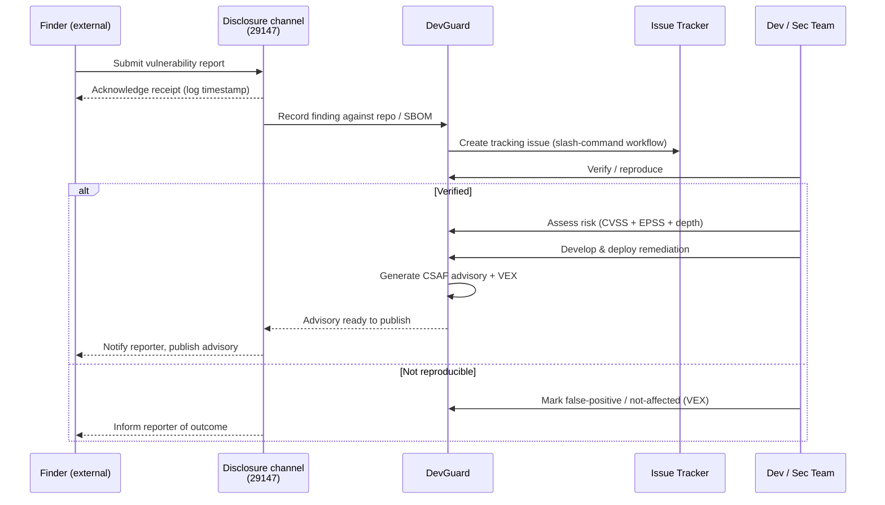
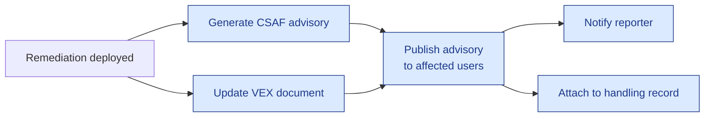
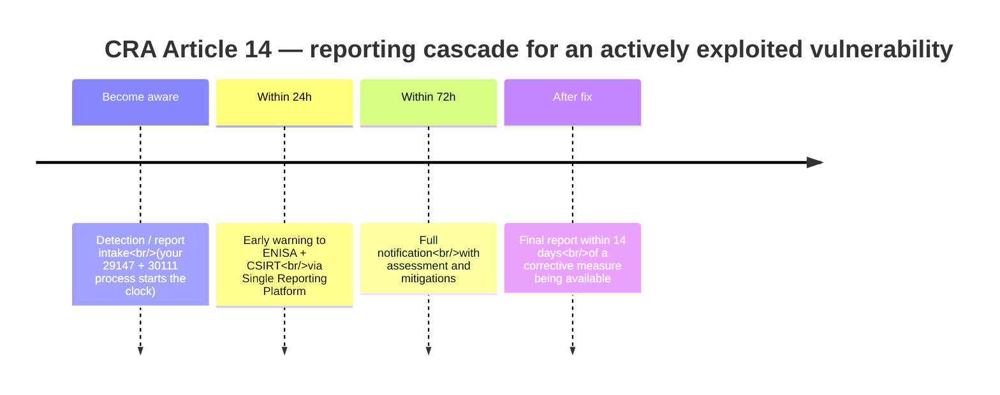

# CRA-Compliant Vulnerability Disclosure (ISO/IEC 29147 & 30111)

**A CRA-compliant vulnerability disclosure process is a coordinated
vulnerability disclosure (CVD) workflow that meets the EU Cyber Resilience Act's
vulnerability-handling and Article 14 reporting duties. In practice it combines
ISO/IEC 29147 (external disclosure) and ISO/IEC 30111 (internal handling) into
one auditable process. DevGuard implements this end to end: report intake,
risk-based triage, remediation tracking, and machine-readable CSAF/VEX
advisories.**

This guide shows how to set up and document a formal, **CRA-compliant
vulnerability disclosure** process with DevGuard. It maps the two relevant
international standards onto concrete DevGuard features so that both the
*external-facing disclosure* and the *internal handling* of vulnerabilities are
covered end to end and produce an audit-ready trail for Cyber Resilience Act
compliance.

- **ISO/IEC 29147 – Vulnerability Disclosure** describes the *external*
  interface: how your organization receives reports from finders and how it
  publishes advisories to affected users.
- **ISO/IEC 30111 – Vulnerability Handling Processes** describes the *internal*
  interface: how a received report is triaged, verified, remediated, and closed.

The two standards interlock. 29147 feeds reports *in* and pushes advisories
*out*; 30111 is the engine in between. DevGuard provides building blocks for
both sides.

> **Why this matters for the CRA.** The EU **Cyber Resilience Act (CRA,
> Regulation (EU) 2024/2847)** turns exactly this process into a legal
> obligation for manufacturers of products with digital elements. A CVD process
> built on 29147/30111 is the operational foundation that lets you meet the
> CRA's vulnerability-handling and reporting duties. See
> [Why CRA-compliant vulnerability disclosure depends on this process](#why-cra-compliant-vulnerability-disclosure-depends-on-this-process)
> below.

## How the standards relate

## Prerequisites

Before you begin, ensure you have:

- Access to a DevGuard organization with owner or admin rights
- At least one project and repository set up in DevGuard
- An [issue-tracker integration](https://docs.devguard.org/how-to-guides/integrations/)
  connected (GitHub, GitLab, or Jira) — this becomes your handling backbone
- A published contact channel for finders (a security mailbox or a
  `SECURITY.md` / `security.txt` file in your repositories)

## Step 1 — Establish the disclosure interface (ISO/IEC 29147)

29147 requires a documented, reliably reachable way for finders to reach you,
plus a policy that sets expectations.

### 1.1 Publish a vulnerability disclosure policy

Create a `SECURITY.md` in each repository and a `security.txt` under
`/.well-known/security.txt` on your public sites. State:

- the scope of what may be tested,
- the contact channel and preferred format,
- your expected acknowledgement and remediation timelines,
- your public-disclosure / safe-harbor stance.

DevGuard's per-repository **CSAF publisher metadata** (publisher name,
namespace, and contact URL) is the natural place to keep the canonical
organizational contact that your advisories will later reference. Configure it
once at the organization level so every advisory is consistent.

### 1.2 Provide a capability to receive reports

You need a channel that reliably lands reports in your handling process rather
than in someone's personal inbox. Two patterns work well with DevGuard:

- **Report → issue tracker:** finders open a report through your published
  channel; a triager files it in the connected issue tracker, which DevGuard
  is already watching.
- **Report → DevGuard directly:** for findings against components DevGuard
  already tracks, the finding can be recorded against the affected repository
  version so it is tied to a concrete SBOM.

The important property for 29147 is that *receipt is guaranteed and logged*.
Because DevGuard threads its handling state through the issue tracker, the
timestamp of report intake is preserved automatically.

## Step 2 — Handle the report internally (ISO/IEC 30111)

30111 defines the internal lifecycle. In DevGuard this maps onto the
vulnerability-management workflow you already use for scanner findings, so
externally-reported and internally-discovered vulnerabilities follow *one*
process.

### 2.1 Verify and triage

Assign the report and reproduce it. DevGuard's **risk-based prioritization**
(CVSS combined with EPSS, component depth, and your CIA/impact assessment)
gives triagers a defensible severity so remediation order is documented rather
than ad hoc — exactly the "assessment" activity 30111 expects.

For findings that turn out to be non-issues, record a **VEX** statement
(`not_affected` / `false_positive`) instead of silently closing them. This
preserves the reasoning, which both 30111 (handling record) and your later
advisory (29147) can reference.

### 2.2 Track remediation to closure

Use the connected issue tracker so remediation work lives where developers
already are. DevGuard keeps the finding's state in sync with the issue
(via slash commands and status sync), so "in progress → fixed → verified"
transitions are captured with timestamps. This synced state is your 30111
handling record.

### 2.3 Automate handoffs with webhooks

To make intake, escalation, and closure repeatable rather than manual,
subscribe to DevGuard's [webhook events](https://docs.devguard.org/how-to-guides/integrations/webhook-events).
For example: notify the security channel when a new externally-sourced finding
is created, or trigger advisory drafting when a finding is marked remediated.

## Step 3 — Publish the advisory (back to ISO/IEC 29147)

Once remediation is deployed, 29147 requires notifying affected users. DevGuard
generates machine-readable advisories so downstream consumers can act
automatically.

- **CSAF** — Produce a
  [CSAF advisory](https://docs.devguard.org/how-to-guides/vulnerability-management/csaf-common-security-advisory-framework)
  describing the vulnerability, affected versions, and the fix. CSAF is the
  standard advisory format 29147-aligned publishers use.
- **VEX** — Publish an updated
  [VEX document](https://docs.devguard.org/how-to-guides/scanning/upload-vex)
  so consumers of your SBOM immediately learn which versions are affected and
  which are fixed. Because VEX is dynamic, share it via a stable link rather
  than a snapshot.
- **Reporter notification** — Close the loop with the finder, referencing the
  published advisory. The acknowledgement and notification timestamps captured
  in Steps 1–2 document that this happened.

## Step 4 — Document and evidence the process

A formal CVD process must be *demonstrable*, not just performed. Use DevGuard's
compliance features to keep evidence together:

- **Attestation policies & compliance dashboards** — Encode process
  requirements (e.g. "every published release has a corresponding advisory
  where applicable") as policies and monitor them on the
  [compliance dashboards](https://docs.devguard.org/how-to-guides/compliance/compliance-dashboards).
- **Traceability** — Each finding links its intake timestamp, issue-tracker
  history, risk assessment, VEX/CSAF output, and closure state, giving you a
  per-vulnerability audit trail.
- **Metrics for review** — 30111 expects periodic process review. Track
  time-to-acknowledge, time-to-remediate, and open/closed counts using
  [monitoring & metrics](https://docs.devguard.org/how-to-guides/administration/monitoring-metrics)
  to feed continuous improvement.

## Mapping summary

| Standard clause / activity                | DevGuard mechanism                                              |
| ----------------------------------------- | -------------------------------------------------------------- |
| 29147 — Disclosure policy                 | `SECURITY.md` / `security.txt` + CSAF publisher metadata       |
| 29147 — Receive reports                   | Published channel → issue tracker → recorded finding           |
| 29147 — Acknowledge receipt               | Logged intake timestamp on the finding / issue                 |
| 29147 — Publish advisory                  | CSAF advisory + linked VEX document                            |
| 29147 — Inform reporter                   | Notification referencing the published advisory                |
| 30111 — Identify (internal or external)   | Unified finding workflow (scanners + reported)                 |
| 30111 — Verify / assess                   | Reproduce + risk-based prioritization (CVSS, EPSS, depth, CIA) |
| 30111 — Remediate                         | Issue-tracker sync, slash commands, status tracking            |
| 30111 — Post-remediation / review         | Compliance dashboards + monitoring & metrics                   |

## Why CRA-compliant vulnerability disclosure depends on this process

The **Cyber Resilience Act (Regulation (EU) 2024/2847)** does not merely
*recommend* coordinated vulnerability disclosure — it makes vulnerability
handling and reporting a **legal obligation** for manufacturers of products
with digital elements placed on the EU market. The 29147/30111 process you built
above is precisely the machinery the CRA assumes you already have.

### The CRA requires vulnerability handling as a process

Annex I, Part II of the CRA lists vulnerability-handling requirements that map
almost one-to-one onto the workflow in this guide: identifying and documenting
vulnerabilities (including maintaining an SBOM), addressing them without delay
through security updates, applying effective and regular testing, publicly
disclosing fixed vulnerabilities with advisory information, and having a
**coordinated vulnerability disclosure policy** in place. In other words, the
CRA effectively codifies ISO/IEC 30111 (handling) and ISO/IEC 29147
(disclosure) as mandatory practice. If your CVD process already satisfies those
two standards, you are covering the substance of the CRA's process-related
essential requirements.

### The CRA adds hard reporting deadlines (Article 14)

Beyond handling, the CRA requires manufacturers to notify actively exploited vulnerabilities and severe incidents having an impact on the security of their product with digital elements. The notification cascade is strict:

an early warning within 24 hours of becoming aware, a full notification within 72 hours, and a final report no later than 14 days after a corrective measure is available for actively exploited vulnerabilities (one month for severe incidents). Manufacturers report only once through the CRA Single Reporting Platform (SRP), which notifies ENISA and the relevant national CSIRT simultaneously.

These obligations under Article 14 kick in on September 11, 2026, and they apply broadly — even to legacy products shipped years ago. Non-compliance carries serious penalties: maximum fines up to €15 million or 2.5% of global turnover, whichever is higher, for serious breaches.

### Why the CVD process is the prerequisite, not an add-on

The 24-hour clock starts the moment you *become aware*. You cannot hit that
deadline by improvising. The CRA implicitly demands what this guide gives you:

- **A reliable intake channel (29147).** "Becoming aware" happens through your
  disclosure channel, scanners, or threat intel. If reports land in a personal
  inbox instead of a logged intake, your awareness timestamp — and therefore
  your 24-hour deadline — is undefined.
- **The ability to tell "actively exploited" from ordinary findings.**
  DevGuard's risk-based prioritization enriches findings with **EPSS** and
  exploit-availability signals (e.g. ExploitDB), which is exactly the evidence
  you need to decide whether Article 14's "actively exploited" trigger has
  fired.
- **A rehearsed handling and drafting workflow (30111).** The early warning,
  the 72-hour assessment, and the 14-day final report each require information
  your handling record already contains: affected versions, severity, and the
  corrective measure.
- **Machine-readable advisories.** The CRA expects public disclosure of fixed
  vulnerabilities with advisory information. DevGuard's **CSAF** advisories and
  **VEX** documents satisfy that disclosure duty and let downstream users react
  automatically.
- **Evidence of the whole thing.** The CRA is enforced through market
  surveillance; you must be able to *demonstrate* the process. DevGuard's
  compliance dashboards, attestations, and per-finding audit trail provide that
  evidence.

### CRA requirement → DevGuard mechanism

| CRA obligation                                             | Covered by (this guide / DevGuard)                                      |
| --------------------------------------------------------- | ---------------------------------------------------------------------- |
| Coordinated vulnerability disclosure policy (Annex I.II)  | Step 1 — `SECURITY.md` / `security.txt` + CSAF publisher metadata      |
| Identify & document vulnerabilities, maintain an SBOM     | DevGuard findings + automated SBOM generation                          |
| Address vulnerabilities without delay                     | Step 2 — issue-tracker sync, risk-based prioritization                 |
| Determine "actively exploited" (Art. 14 trigger)          | EPSS + exploit-availability signals in risk scoring                    |
| Public disclosure of fixed vulnerabilities                | Step 3 — CSAF advisories + VEX documents                               |
| 24h / 72h / 14-day reporting (Art. 14)                    | Handling record supplies the content; timestamps prove the timeline    |
| Demonstrate the process to market surveillance            | Step 4 — compliance dashboards, attestations, audit trail              |

> **Note:** DevGuard produces the SBOM, VEX, CSAF advisories, risk assessment,
> and audit trail that feed a CRA report, but the actual Article 14 submission
> is filed by the manufacturer through ENISA's Single Reporting Platform.
> DevGuard is the evidence and workflow engine behind the report, not the
> filing channel itself. Always confirm scope and obligations for your specific
> product with your compliance lead — the CRA's trigger and deadlines are its
> own and must be mapped onto your process rather than assumed to be covered by
> ISO 27001 or NIS2 alone.

## Frequently asked questions

### What is a CRA-compliant vulnerability disclosure process?

It is a coordinated vulnerability disclosure (CVD) process that satisfies the EU
Cyber Resilience Act's vulnerability-handling requirements (Annex I, Part II) and
its Article 14 reporting duties. It covers receiving reports, verifying and
remediating them, publicly disclosing fixed vulnerabilities, and reporting
actively exploited vulnerabilities to ENISA and the relevant CSIRT within the
required deadlines.

### How do ISO/IEC 29147 and ISO/IEC 30111 relate to the CRA?

ISO/IEC 29147 covers external disclosure and ISO/IEC 30111 covers internal
handling. Together they describe the CVD lifecycle the CRA assumes manufacturers
operate. Meeting both standards covers the substance of the CRA's process-related
essential requirements, though the CRA adds its own reporting triggers and
deadlines on top.

### What are the CRA vulnerability reporting deadlines?

For an actively exploited vulnerability, manufacturers must submit an early
warning within 24 hours of becoming aware, a full notification within 72 hours,
and a final report within 14 days of a corrective measure being available (one
month for severe incidents). Reports are filed once through ENISA's Single
Reporting Platform. These obligations apply from 11 September 2026.

### Does DevGuard file the CRA report for me?

No. DevGuard produces the SBOM, VEX, CSAF advisory, risk assessment, and audit
trail that feed a CRA report, but the Article 14 notification itself is filed by
the manufacturer through ENISA's Single Reporting Platform. DevGuard is the
evidence and workflow engine behind the report, not the submission channel.

### How does DevGuard help meet the 24-hour deadline?

DevGuard's risk-based prioritization enriches findings with EPSS and
exploit-availability signals, which helps you decide quickly whether a
vulnerability is "actively exploited" and therefore in scope for Article 14. A
logged intake channel establishes the "became aware" timestamp that starts the
24-hour clock.

## Next Steps

- [Connect an issue tracker](https://docs.devguard.org/how-to-guides/integrations/) — wire up your handling backbone
- [Generate CSAF advisories](https://docs.devguard.org/how-to-guides/vulnerability-management/csaf-common-security-advisory-framework) — produce standard-format disclosures
- [Upload and share VEX](https://docs.devguard.org/how-to-guides/scanning/upload-vex) — keep affected-version data current
- [Create webhooks](https://docs.devguard.org/how-to-guides/integrations/create-webhook) — automate intake and escalation
- [View compliance dashboards](https://docs.devguard.org/how-to-guides/compliance/compliance-dashboards) — evidence the process for CRA audits

---

**Related standards and regulations:** ISO/IEC 29147 (vulnerability
disclosure), ISO/IEC 30111 (vulnerability handling processes), EU Cyber
Resilience Act — Regulation (EU) 2024/2847, Article 14 (reporting obligations,
applicable from 11 September 2026).

*This guide reflects CRA obligations as of the date shown in the page footer.
The Cyber Resilience Act's deadlines and definitions should be verified against
the official text of Regulation (EU) 2024/2847 and current ENISA guidance;
consult your compliance lead for how the CRA applies to your specific product.*
