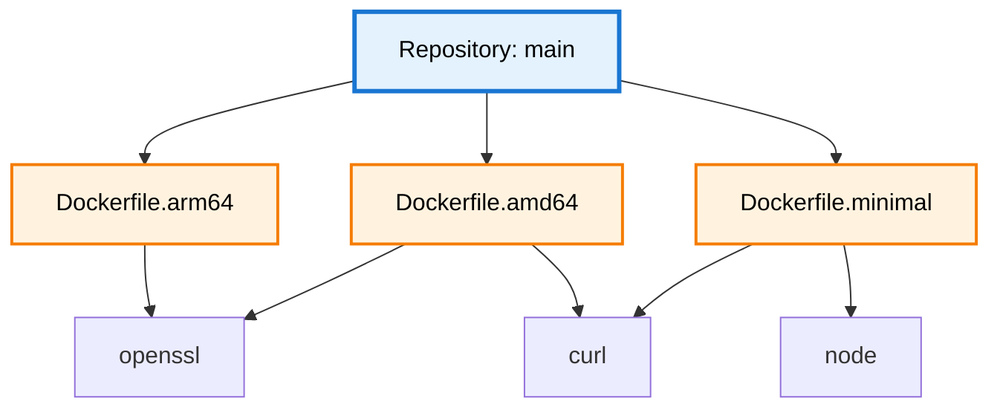

import Image from 'next/image';
import { Callout } from 'nextra/components';
import { Tooltip, TooltipTrigger, TooltipContent } from "@/components/ui/tooltip";

# Artifact Concept

A single repository branch can produce multiple build artifacts—different Docker images for architectures, minimal vs full distributions, or separate deployment targets. 

<Callout intent="info">DevGuard tracks vulnerabilities together across artifacts. It expects each artifacts to origin from the same source code, thus a false positive in a dependency tree will affect **all** artifacts built from that code. The dependency tree is shared across artifacts originating from the same source.</Callout>

If you need to track vulnerabilities separately, check out [Repository Versions](/explanations/core-concepts/repository-versions) to create separate branches for each artifact.



## Why Artifacts Matter

Same source code produces different artifacts with distinct dependency sets:

**Architecture-specific**: AMD64 includes Intel-optimized libraries, ARM64 uses ARM-native dependencies—each with potentially different vulnerabilities.

**Minimal vs Full**: Minimal excludes debugging tools and optional features. Full includes everything. Vulnerabilities in excluded components don't affect minimal builds.

**Environment-specific**: Production strips dev dependencies. Development includes testing frameworks. Different dependencies = different vulnerability profiles.

## Common Patterns

**Multi-Architecture**: `Dockerfile.amd64` with x86_64 packages vs `Dockerfile.arm64` with aarch64 packages. Same base, different architecture packages with separate vulnerabilities.

**Minimal vs Standard**: Alpine-based minimal (< 50MB) vs Ubuntu-based standard (~200MB) with debugging tools. Minimal excludes components with vulnerabilities present in standard.

**Production vs Development**: Optimized production builds with minimal dependencies vs development builds with debug symbols and test frameworks.

## Artifact Identification

DevGuard prefers having <Tooltip><TooltipTrigger asChild><span className="underline decoration-dotted decoration-yellow-400 decoration-1 underline-offset-4 cursor-pointer">PURLs</span></TooltipTrigger><TooltipContent><p>Package URL - Standardized package identifier</p></TooltipContent></Tooltip> (Package URL) for unique identification. But you can use any string. In some places DevGuard will URL-Encode the artifact name and place it in a path. Some reverse proxies like [traefik will block url encoded slashes `%2F`](https://doc.traefik.io/traefik/security/request-path/#path-sanitization) so keep that in mind:
```
pkg:oci/myapp@sha256:abc123?tag=v1.0.0-amd64
pkg:oci/myapp@sha256:def456?tag=v1.0.0-arm64
pkg:oci/myapp@sha256:ghi789?tag=v1.0.0-minimal
```


## Setup

1. Configure which Dockerfiles/build targets to track
2. Scan each artifact separately in CI/CD pipeline and pass the `--artifactName` flag to the scanner
3. View vulnerabilities, connected to multiple artifacts in DevGuard UI

---

## Related Documentation

- [Repository Versions](repository-versions) - Branch management
- [DevGuard Hierarchy](organization-groups-repos) - Organization structure
- [SBOM Standards](/explanations/compliance/sbom-standards) - Component inventory formats