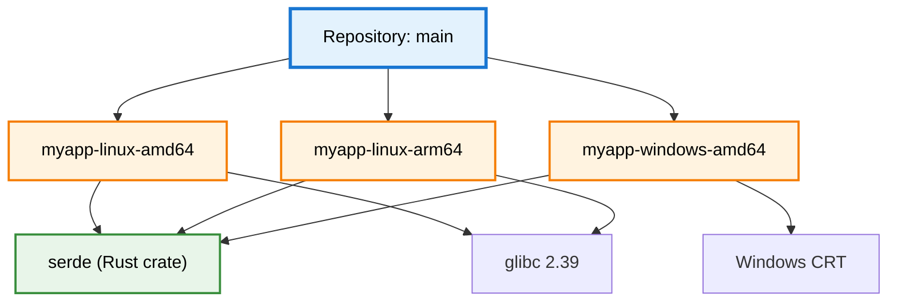

import Image from 'next/image';
import { Callout } from '@document-writing-tools/kernux-theme'

# Artifact Concept

A single repository branch can produce multiple build artifacts — one image per architecture, one package per target operating system, or several deployment variants. Each of them ships a different set of components and therefore has a different vulnerability profile, even though they are built from the same source code.

<Callout intent="info">DevGuard tracks vulnerabilities together across artifacts. It expects each artifacts to origin from the same source code, thus a false positive in a dependency tree will affect **all** artifacts built from that code. The dependency tree is shared across artifacts originating from the same source.</Callout>

If you need to track vulnerabilities separately, check out [Repository Versions](/explanations/core-concepts/repository-versions) to create separate branches for each artifact.


```mermaid
graph TD
    A["Repository: main"] --> B["myapp-linux-amd64"]
    A --> C["myapp-linux-arm64"]
    A --> D["myapp-windows-amd64"]

    B --> R["serde (Rust crate)"]
    C --> R
    D --> R

    B --> G["glibc 2.39"]
    C --> G
    D --> W["Windows CRT"]

    style A fill:#e3f2fd,stroke:#1976d2,stroke-width:3px,color:#000
    style B fill:#fff3e0,stroke:#f57c00,stroke-width:2px,color:#000
    style C fill:#fff3e0,stroke:#f57c00,stroke-width:2px,color:#000
    style D fill:#fff3e0,stroke:#f57c00,stroke-width:2px,color:#000
    style R fill:#e8f5e9,stroke:#388e3c,stroke-width:2px,color:#000
```

## Why Artifacts Matter

The same source code produces builds with overlapping but not identical component sets:

**Per operating system**: a Linux build links against glibc or musl and pulls in distribution packages; a Windows or macOS build of the same program does not. A CVE in a system library affects only the builds that actually contain it.

**Per architecture**: amd64 and arm64 builds can resolve to different package versions, different optional dependencies, or different vendored binaries — so their vulnerability sets diverge even for the same distribution.

**Per variant**: production builds strip test and debug dependencies that development builds keep.

What stays the same across all of them are the components that come from your own source tree — your language-level dependencies (the Rust crate, the npm package, the Go module). DevGuard is built around exactly this split.

## One Product, Many Operating Systems and Architectures

This is the most common reason to use artifacts: you support several OS/arch combinations and want each one's SBOM in DevGuard, without triaging shared findings once per combination.

**Model each OS/arch combination as its own artifact inside the same repository and branch.** Do **not** create a separate repository or a separate branch per target — that is what would force you to assess the same finding again and again.

```
pkg:oci/myapp-linux-amd64
pkg:oci/myapp-linux-arm64
pkg:oci/myapp-windows-amd64
```

Upload one SBOM per combination, each with its own `--artifactName` and the same `--assetName` and `--ref`:

```bash copy
for target in linux-amd64 linux-arm64 windows-amd64; do
  devguard-scanner sbom "sbom-${target}.json" \
    --assetName="myorg/projects/myproject/assets/myrepo" \
    --artifactName="pkg:oci/myapp-${target}" \
    --token="YOUR_TOKEN"
done
```

<Callout type="info">
  Do not encode the branch or release version into the artifact name, DevGuard appends the ref for you. See [Branches, Tags & Artifacts](/how-to-guides/scanning/branches-tags-and-artifacts).
</Callout>

What you get out of this:

- **Shared findings are assessed once.** A vulnerability in a dependency that all three builds contain — say the same Rust crate — is a single finding in DevGuard, linked to all three artifacts. You triage it, mark it as a false positive, or write a VEX statement once, and that decision applies to every artifact containing it.
- **Target-specific findings stay separate.** A glibc CVE shows up only on the artifacts whose SBOM actually lists glibc. The Windows build is not affected and is not reported as affected.
- **You can see which targets a CVE hits.** Each finding lists the artifacts it belongs to, so you know whether a fix has to go out for all platforms or only one.
- **One product view.** Risk, dashboards and reports stay aggregated at the repository level instead of being scattered across one repository per platform.

<Callout type="warning">
  Artifacts are meant for build targets of the **same source code at the same ref**. If two things are built from different sources or need independent triage — for example two separate products, or an old release line you maintain in parallel — use separate repositories or [branches/tags](/explanations/core-concepts/repository-versions) instead, because shared findings there should *not* be resolved together.
</Callout>

## Other Common Patterns

**Multi-architecture images**: `pkg:oci/myapp-amd64` and `pkg:oci/myapp-arm64` from the same Dockerfile, built for different platforms.

**Build variants**: a slim runtime image versus a debug image that adds a shell and diagnostic tooling on top of the *same* base. Both share the base OS packages and your application dependencies; the debug image simply contains more.

**Production vs development**: optimized production builds with minimal dependencies vs development builds with debug symbols and test frameworks.

**Application plus container**: an `sca` scan of the source tree and a `container-scanning` scan of the resulting image, tracked as two artifacts of the same repository.

## Artifact Identification

DevGuard prefers having PURLs (Package URL) for unique identification. But you can use any string. In some places DevGuard will URL-Encode the artifact name and place it in a path. Some reverse proxies like [traefik will block url encoded slashes `%2F`](https://doc.traefik.io/traefik/security/request-path/#path-sanitization) so keep that in mind:
```
pkg:oci/myapp-linux-amd64
pkg:oci/myapp-linux-arm64
pkg:oci/myapp-windows-amd64
```

Keep the name limited to *what* was built. The version comes from `--ref` and is appended by DevGuard.

## Setup

1. Decide which build targets to track — typically one per OS/arch combination or image variant
2. Scan or upload each target separately in your CI/CD pipeline, passing `--artifactName` to the scanner while keeping `--assetName` and `--ref` identical
3. View vulnerabilities in the DevGuard UI, where each finding shows the artifacts it affects

***

## Related Documentation

- [Repository Versions](/explanations/core-concepts/repository-versions) - Branch management
- [DevGuard Hierarchy](/explanations/core-concepts/organization-groups-repos) - Organization structure
- [SBOM Standards](/explanations/compliance/sbom-standards) - Component inventory formats
- [Multi-Level VEXing for Releases](/how-to-guides/vex/multi-level-vexing) - An artifact that bundles the SBOMs of several other assets