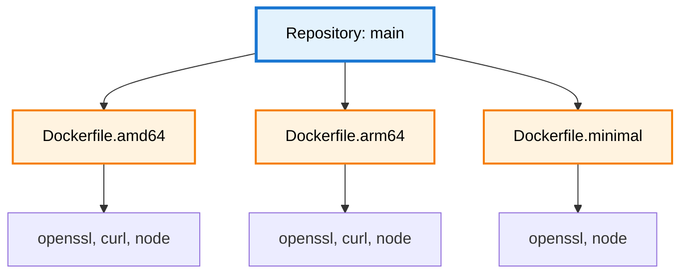

import Image from 'next/image';
import { Callout } from 'nextra/components';
import { Tooltip, TooltipTrigger, TooltipContent } from "@/components/ui/tooltip";

# Artifact Concept

A single repository branch can produce multiple build artifacts—different Docker images for architectures, minimal vs full distributions, or separate deployment targets. DevGuard tracks vulnerabilities independently for each artifact, recognizing that different build configurations create different security profiles.


## Why Artifacts Matter

Same source code produces different artifacts with distinct dependency sets:

**Architecture-specific**: AMD64 includes Intel-optimized libraries, ARM64 uses ARM-native dependencies—each with potentially different vulnerabilities.

**Minimal vs Full**: Minimal excludes debugging tools and optional features. Full includes everything. Vulnerabilities in excluded components don't affect minimal builds.

**Environment-specific**: Production strips dev dependencies. Development includes testing frameworks. Different dependencies = different vulnerability profiles.

<Callout type="info" emoji="📦">
  Without artifact-level tracking, you can't distinguish whether a dev-only dependency vulnerability affects production deployments.
</Callout>

## Common Patterns

**Multi-Architecture**: `Dockerfile.amd64` with x86_64 packages vs `Dockerfile.arm64` with aarch64 packages. Same base, different architecture packages with separate vulnerabilities.

**Minimal vs Standard**: Alpine-based minimal (< 50MB) vs Ubuntu-based standard (~200MB) with debugging tools. Minimal excludes components with vulnerabilities present in standard.

**Production vs Development**: Optimized production builds with minimal dependencies vs development builds with debug symbols and test frameworks.

## Artifact Identification

DevGuard uses <Tooltip><TooltipTrigger asChild><span className="underline decoration-dotted decoration-yellow-400 decoration-1 underline-offset-4 cursor-pointer">PURL</span></TooltipTrigger><TooltipContent><p>Package URL - Standardized package identifier</p></TooltipContent></Tooltip> (Package URL) for unique identification:
```
pkg:oci/myapp@sha256:abc123?tag=v1.0.0-amd64
pkg:oci/myapp@sha256:def456?tag=v1.0.0-arm64
pkg:oci/myapp@sha256:ghi789?tag=v1.0.0-minimal
```

## Independent Management

**Separate SBOMs**: Each artifact generates its own <Tooltip><TooltipTrigger asChild><span className="underline decoration-dotted decoration-yellow-400 decoration-1 underline-offset-4 cursor-pointer">SBOM</span></TooltipTrigger><TooltipContent><p>Software Bill of Materials - Component inventory</p></TooltipContent></Tooltip> documenting actual components in that specific build.

**Independent Risk Scores**: Calculated per artifact based on specific component versions, deployment context, and attack surface.

**Separate VEX Statements**: Each artifact can have different <Tooltip><TooltipTrigger asChild><span className="underline decoration-dotted decoration-yellow-400 decoration-1 underline-offset-4 cursor-pointer">VEX</span></TooltipTrigger><TooltipContent><p>Vulnerability Exploitability eXchange - Impact assessments</p></TooltipContent></Tooltip> assessments—production marked "Not Affected" while development marked "Affected" for same CVE.

<Callout type="info" emoji="🔄">
  Track which artifacts receive fixes. A patch in standard builds doesn't automatically fix minimal builds if they use different dependency resolution.
</Callout>

## Example

**Repository**: `backend-api` / **Branch**: `main`

**Production AMD64**: node, express, pg → No vulnerabilities  
**Production ARM64**: node, express, pg, arm-lib → CVE-2024-001 in arm-lib  
**Minimal**: node, express (pg excluded) → No vulnerabilities, reduced attack surface  
**Development**: All production + jest, nodemon → CVE-2024-002 in nodemon (dev only)

## Setup

1. Configure which Dockerfiles/build targets to track
2. Scan each artifact separately in CI/CD pipeline
3. Ensure unique PURL per artifact
4. Manage vulnerabilities per artifact independently

---

## Related Documentation

- [Repository Versions](repository-versions) - Branch management
- [DevGuard Hierarchy](organization-groups-repos) - Organization structure
- [SBOM Standards](/explanation/compliance/sbom-standards) - Component inventory formats