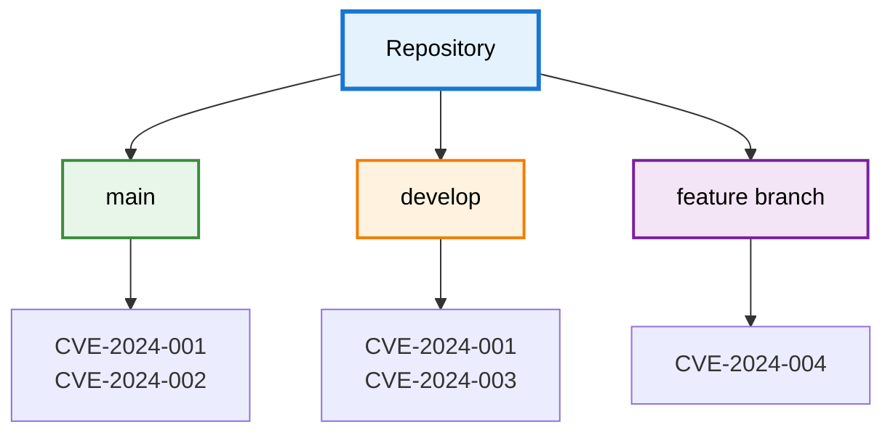

import Image from 'next/image';
import { Callout } from 'nextra/components';
import { Tooltip, TooltipTrigger, TooltipContent } from "@/components/ui/tooltip";

# Repository Versions (Branches & Tags)

DevGuard tracks vulnerabilities across multiple branches or tags within each repository, mirroring your Git workflow.
Like Git's branch and tag management, DevGuard scans and manages security findings independently per branch or tag — enabling separate
vulnerability tracking for production, development, and feature branches.

## Independent Vulnerability Management

Each branch or tag maintains its own vulnerability findings, risk assessments, and remediation status.
A vulnerability fixed in `main` doesn't automatically resolve in `develop`—branches are tracked independently.

**Why**: Different branches contain different code and dependencies. A feature branch might introduce
new dependencies with vulnerabilities not present in `main`. Production branches might use different versions than development.

**Example**: `main` uses `express@4.18.2` (patched), while `develop` uses `express@4.17.1` (vulnerable). DevGuard tracks the
vulnerability in `develop` while showing `main` as fixed.

<Callout type="info">
  NOTE: If you create a new branch or tag, it is always initalized with the vulnerability status of the `main` branch at the time of creation.
</Callout>

## Vulnerability Handling Per Branch

### State Management

<Tooltip><TooltipTrigger asChild>VEX</TooltipTrigger><TooltipContent>
Vulnerability Exploitability eXchange - Impact assessments
</TooltipContent></Tooltip> states managed per branch:

- Mark "Not Affected" in `main` after analysis
- Same vulnerability remains "Affected" in `develop` with different code paths
- Independent justifications per branch
- You can use query parameters to filter on vex live data endpoints per branch, e.g. `?ref=develop` to see only `develop` branch VEX data.

### Remediation Workflow

1. Patch in feature branch
2. Merge to `develop` with testing
3. Merge to `main` for production
4. DevGuard tracks progression automatically as your new scan results flow through branches. Vulnerability status updates as fixes merge.

<Callout type="info" emoji="🔄">
  DevGuard detects when dependency updates flow through branches. Vulnerability status updates automatically as fixes merge.
</Callout>

## Use Cases

**Production vs Development**: High security requirements in `main`, lower in `develop` for faster iteration without blocking development.

**Release Branches**: Track `release/v2.0` separately—only critical patches allowed, different from active `main` development.

**Feature Branch Scanning**: Scan on pull requests to catch issues before merge without permanent tracking overhead.

**Branch Comparison**: Identify vulnerabilities fixed in `main` but still present in `develop` requiring backport.

---

## Related Documentation

- [DevGuard Hierarchy](organization-groups-repos) - Organization, groups, repositories
- [Vulnerability Lifecycle](/explanations/vulnerability-management/vulnerability-lifecycle) - Managing vulnerabilities