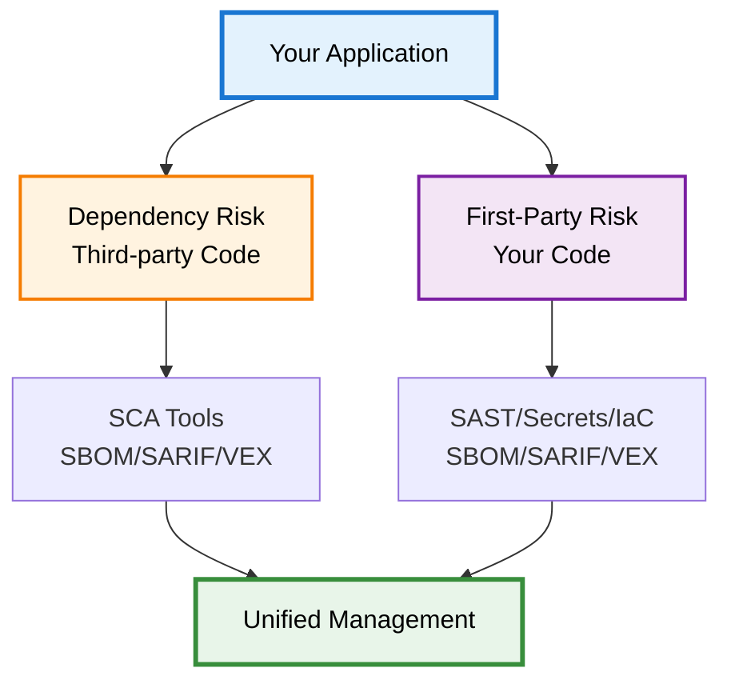

import Image from 'next/image';
import { Callout } from 'nextra/components';
import { Tooltip, TooltipTrigger, TooltipContent } from "@/components/ui/tooltip";

# Dependency Risk vs First-Party Risk

DevGuard distinguishes between **Dependency Risk** from third-party components and **First-Party Risk** from your own code. Both require different detection methods but share unified remediation workflows through <Tooltip><TooltipTrigger asChild>SBOM</TooltipTrigger><TooltipContent>
Software Bill of Materials - Component inventory
</TooltipContent></Tooltip>, <Tooltip><TooltipTrigger asChild>SARIF</TooltipTrigger><TooltipContent>
Static Analysis Results Interchange Format - Security findings format
</TooltipContent></Tooltip>, and <Tooltip><TooltipTrigger asChild>VEX</TooltipTrigger><TooltipContent>
Vulnerability Exploitability eXchange - Impact assessments
</TooltipContent></Tooltip>.

## Dependency Risk

**What**: Security vulnerabilities in third-party libraries, packages, and dependencies. <Tooltip><TooltipTrigger asChild>CVEs</TooltipTrigger><TooltipContent>
Common Vulnerabilities and Exposures - Standardized vulnerability identifiers
</TooltipContent></Tooltip> in code you didn't write.

**Examples**: Known CVE in `express@4.17.1`, SQL injection in database driver, outdated system packages.

**Detection**: Software Composition Analysis (SCA) tools scan dependencies, generate SBOMs, match against vulnerability databases.

**Remediation**: Update to patched versions, remove dependencies, or mark "Not Affected" with justification.

<Callout type="info" emoji="📦">
  Dependency risks are discovered vulnerabilities—someone else wrote the code, researchers found the flaw, you decide if it affects you.
</Callout>

## First-Party Risk

**What**: Security issues in your own code, configuration, and infrastructure. Vulnerabilities you introduced.

**Examples**: Hardcoded secrets, SQL injection in your logic, insecure S3 permissions in Terraform, missing authentication.

**Detection**: SAST (Static Application Security Testing), secret scanning, IaC scanning analyze your code. Results as SARIF or SBOM/VEX.

**Remediation**: Fix your code, rotate secrets, update configurations, implement security controls.

<Callout type="warning" emoji="⚠️">
  First-party risks require code changes you control—no waiting for upstream patches. You're responsible for both discovery and fix.
</Callout>

## Key Differences

| Aspect | Dependency Risk | First-Party Risk |
|--------|----------------|------------------|
| **Source** | Third-party code | Your code |
| **Detection** | SCA (Trivy, Grype) | SAST, Secret/IaC scanners |
| **Format** | SBOM, VEX | SARIF, SBOM, VEX |
| **Remediation** | Update dependencies | Fix your code |

## Unified Management

DevGuard handles both through common workflows:

**Ingestion**: SBOM for dependencies, SARIF for code issues, VEX for both  
**Assessment**: Single risk scoring regardless of source  
**Triage**: Same states (Affected, Not Affected, Fixed, Under Investigation)  
**Tracking**: Unified issue tracker integration and audit trails  
**View**: Combined dashboard showing all risks prioritized by actual severity

**Example**: Repository shows CVE in `express`, hardcoded secret, SQL injection in your code—all in one prioritized list sorted by risk, not source.

---

## Related Documentation

- [Vulnerability Lifecycle](/explanations/vulnerability-management/vulnerability-lifecycle) - Managing all vulnerability types
- [Vulnerability Risk Assessment](/explanations/vulnerability-management/risk-assessment-methodology) - Risk calculation