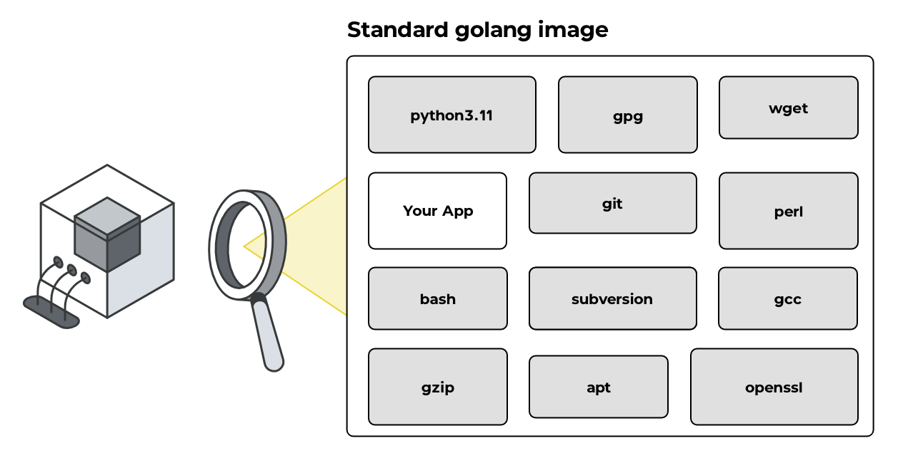

import { DocSteps as Steps, Callout } from '@document-writing-tools/kernux-theme'
import { DocTabs as Tabs } from '@document-writing-tools/kernux-theme'

# Container Scanning

Container images are the new deployment artifact — they bundle your application code, runtime, system libraries, and configuration into a single, portable unit. But that convenience comes with a hidden cost: every layer of a container image is a potential attack surface. Container scanning is the practice of systematically inspecting those layers before a vulnerability makes it into production.

## Why Container Scanning Is a Critical Security Control

When you `docker pull` a base image, you are inheriting the security posture of every package that image contains — often hundreds of them. Even a freshly pulled `ubuntu:22.04` or `node:20-alpine` image may carry known vulnerabilities in its system libraries. Add your application dependencies on top, and the attack surface grows further.

The problem is compounding: once a vulnerable image is deployed, it runs silently in production until someone discovers the issue — or until an attacker exploits it. Without automated container scanning in your CI/CD pipeline, there is no systematic check between "image built" and "image deployed."

Container scanning addresses this gap by making vulnerability detection a mandatory gate in the software delivery process, not an afterthought.

<Callout type="info">
Container scanning is distinct from Software Composition Analysis (SCA). SCA focuses on your application's declared dependencies (e.g., `package.json`, `go.mod`). Container scanning goes deeper — it inspects the entire image filesystem, including OS packages, system libraries, and any software installed at build time.
</Callout>

## What Is a Container?

A container is a lightweight, portable, and self-contained software package that includes everything needed to run an application: application code, runtime, system tools, libraries, and configuration. Containers share the host system's OS kernel rather than emulating hardware, making them significantly more resource-efficient than traditional virtual machines.

This architecture is both a strength and a security consideration. Because containers share the kernel and bundle their own userspace dependencies, a vulnerable library inside a container image can be exploited just like a vulnerable library on a bare-metal server. The isolation boundary protects the host from the container — it does not protect the container from its own contents.

Popular container runtimes include Docker, containerd, and Podman. Orchestration platforms like Kubernetes manage containers at scale, making it even more important to have a reliable container scanning strategy: a single vulnerable base image can propagate across dozens of running pods.

## How Container Scanning Works

Container scanning works by unpacking the container image, cataloguing every piece of software it contains, and then checking that catalogue against known vulnerability data. DevGuard implements this as a two-stage pipeline.

<Steps>

### Stage 1 — SBOM Generation

The first step is producing a Software Bill of Materials (SBOM): a structured, machine-readable inventory of every component in the image.

DevGuard uses [Trivy](https://github.com/aquasecurity/trivy) to analyze the image filesystem layer by layer. It identifies:

- **OS packages** — `.deb`, `.rpm`, and Alpine `apk` packages installed in the base image
- **Language runtime packages** — npm modules, Python packages, Go binaries, Java JARs, and more
- **Version metadata** — the exact version of each component, including patch-level information

The result is a CycloneDX-formatted SBOM that captures not just what is installed, but where it is installed, what package manager manages it, and what version constraints apply. This granularity matters: many CVEs are fixed in a specific patch release, and an SBOM without precise version data cannot be matched against those advisories reliably.

One challenge worth understanding: standard SBOM generation tools detect OS packages and language dependencies well, but custom or in-house binaries bundled into an image often go undetected unless additional metadata is provided. DevGuard addresses this with a `merge-sboms` command that combines multiple CycloneDX SBOMs into a single unified inventory — so if a binary ships with its own SBOM, it can be merged into the full image SBOM before scanning. See [Container SBOM Security Scanning Workflow](/explanations/sbom-problem-statement) for a detailed walkthrough of this approach, including how to leverage release attestations to capture dependencies that Trivy would otherwise miss. Automatic merging of embedded image SBOMs is tracked in [issue #2122](https://github.com/l3montree-dev/devguard/issues/2122).

### Stage 2 — Vulnerability Matching

With the SBOM in hand, DevGuard cross-references every component against its vulnerability database. This database aggregates data from multiple upstream sources — including the National Vulnerability Database (NVD), GitHub Security Advisories, and distribution-specific advisories from Debian, Red Hat, Alpine, and others.

For each identified vulnerability, DevGuard records:

- **CVE identifier and description** — what the vulnerability is and what it affects
- **Severity score** — CVSS v3 score and qualitative severity (Critical, High, Medium, Low)
- **Fixed version** — the version in which the vulnerability was patched, if one exists
- **Reachability context** — whether the vulnerable component is actually used at runtime

Vulnerabilities are surfaced in the DevGuard UI as risks tied to the specific asset (container image), so your team has a clear, prioritized view of what needs remediation rather than a raw list of CVEs.

</Steps>

## What Makes Container Scanning Different from Other Security Scans

Container scanning occupies a unique position in a defense-in-depth security strategy because it operates at the image level — after the build, before deployment. This means it catches vulnerabilities that other tools miss:

- **SCA misses OS-layer vulnerabilities.** Your application dependency scanner does not know about the `libssl` version in your base image.
- **SAST misses runtime dependencies.** Static code analysis cannot detect a vulnerable version of `curl` that was installed via `apt-get` in your Dockerfile.
- **Runtime scanning is too late.** Detecting a vulnerability after the container is live means the window of exposure has already opened.

By running container scanning as a CI/CD pipeline gate, you close this gap and enforce a policy that no image with unacknowledged critical vulnerabilities reaches your container registry or production environment.

## Container Scanning and the Software Supply Chain

The concept of the software supply chain has gained significant attention following high-profile incidents that exploited weaknesses in third-party components. Container images are a particularly important link in that chain: they encapsulate your entire runtime environment and are often derived from public base images maintained by third parties.

Container scanning gives you visibility into exactly what you are shipping. Combined with SBOM attestation, it enables you to prove to customers, auditors, and regulators what your software contains — a requirement that is becoming increasingly explicit under frameworks like the EU Cyber Resilience Act and US Executive Order 14028.

<Callout type="warning">
Running container scanning once at build time is not sufficient. Base images receive vulnerability disclosures continuously, even after your build. DevGuard supports periodic re-scanning of images already in your registry, so newly disclosed CVEs are surfaced even without a new build.
</Callout>

## Container Scanning with DevGuard

DevGuard integrates container scanning directly into your CI/CD pipeline via native GitLab Components and GitHub Actions workflow templates. For teams running workloads on Kubernetes, DevGuard also supports cluster-level scanning via the [Trivy Operator](https://github.com/aquasecurity/trivy-operator) integration — so images already running in your cluster are scanned continuously, not just at build time (coming soon: https://github.com/l3montree-dev/devguard/pull/1988).

Scan results are automatically linked to the corresponding asset in the DevGuard platform, where your team can:

- **Triage vulnerabilities** with severity-based prioritization and fixed-version guidance
- **Track remediation** through automatic issue creation in GitLab or GitHub Issues
- **Monitor risk over time** with a dashboard that shows how your container security posture changes between releases
- **Generate compliance evidence** by exporting SBOMs and scan reports for audits

Container scanning in DevGuard is built on the same SBOM-first architecture as the rest of the platform, meaning scan results feed into a unified risk view across your entire software supply chain — not just isolated reports per image.

Ready to add container scanning to your pipeline? [Get started with DevGuard](/getting-started) and have your first container scan running in minutes.

## Related Documentation

- [Getting Started with DevGuard](/getting-started)
- [DevGuard How-To Guides](/how-to-guides)
- [DevGuard Explanations](/explanations)
