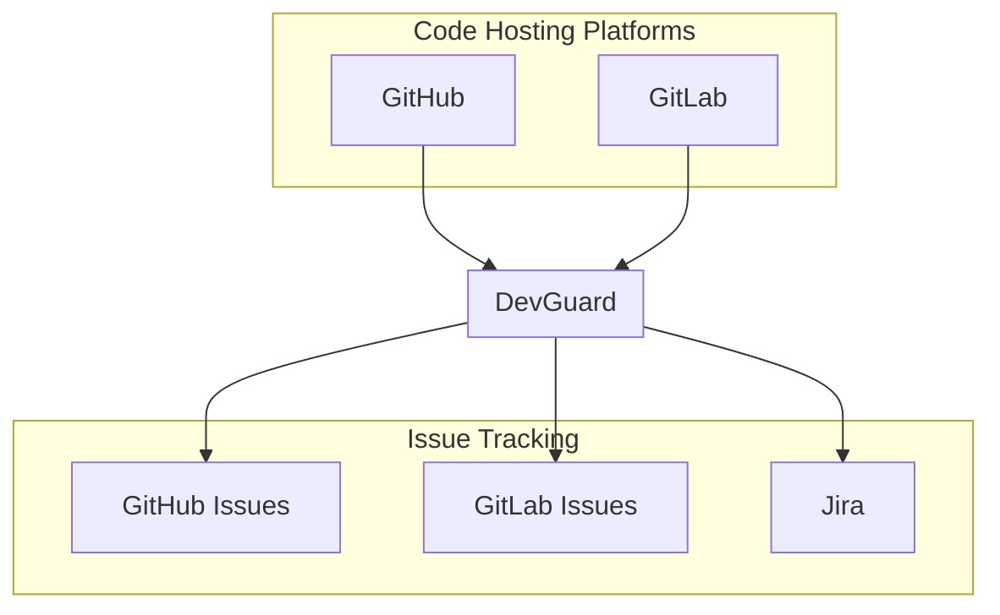

import Image from 'next/image';
import { Callout, Cards, Card } from 'nextra/components';
import { Tooltip, TooltipTrigger, TooltipContent } from "@/components/ui/tooltip";

# Integration Architecture

DevGuard is designed as a flexible and extensible platform that integrates with a wide variety of security tools, code hosting platforms, and issue tracking systems. The architecture is built around a core API that allows for seamless integration with third-party services.

## Overview

DevGuard's integration architecture serves two primary purposes:

1. [**Finding Vulnerabilities**](#finding-vulnerabilities): Integrate with your code repositories and CI/CD pipelines to automatically scan code for vulnerabilities
2. [**Managing Vulnerabilities**](#managing-vulnerabilities): Track and manage discovered vulnerabilities in your preferred issue tracking system

## Finding Vulnerabilities

You can integrate DevGuard with your code repository and CI/CD pipeline so that every time you push code or create a pull request, DevGuard automatically scans your code for vulnerabilities and reports the results.

### Authentication Method
 Scan results are sent to DevGuard using a **Personal Access Token (PAT)** also called DevGuard Token. This token authenticates the scanner and to your asset in DevGuard. 

## Managing Vulnerabilities

Once DevGuard has identified vulnerabilities in your code, you can manage them in your preferred issue tracking platform. This could be:

- **Same Platform**: GitHub Issues or GitLab Issues where your code is hosted
- **Different Platform**: A separate project on GitHub/GitLab or a specialized system like Jira

<Callout type="info">
  The issue tracking platform doesn't need to be the same as your code hosting platform. For example, you can host your code on GitHub but track vulnerabilities in Jira.
</Callout>

### Authentication Methods

Each platform uses a different authentication method for issue management:

| Platform | Authentication Method | Description |
|----------|----------------------|-------------|
| [**GitHub**](./github-integration) | GitHub App | Install the DevGuard GitHub App in your organization |
| [**GitLab**](./gitlab-integration) | [OAuth2](./external-entity-providers) or Access Token | Use OAuth2 for gitlab.com/self-hosted instances, or configure an Access Token |
| [**Jira**](./jira-integration) | API Token | Configure an API token with your Jira user email |

### Bidirectional Synchronization

DevGuard maintains bidirectional synchronization with integrated platforms:

1. **DevGuard → External System**: 
   - Creating tickets when vulnerabilities are discovered
   - Updating ticket status when vulnerabilities are resolved
   - Adding comments with remediation information

2. **External System → DevGuard**:
   - Closing tickets marks vulnerabilities as accepted
   - Reopening tickets reopens the vulnerability
   - Comments with special commands (e.g., `/accept`, `/false-positive`) update vulnerability status

## Webhook System

DevGuard uses webhooks to receive real-time updates from integrated platforms. The webhook handler:

1. Validates the incoming webhook payload
2. Routes the webhook to the appropriate integration
3. Processes events (issue updates, comments, etc.)
4. Updates vulnerability states accordingly

<Callout type="warning">
  Webhook secrets should be configured to ensure only authenticated requests are processed.
</Callout>

