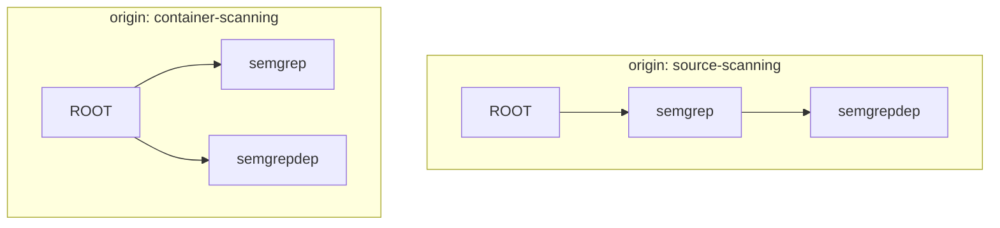

import { Callout } from '@document-writing-tools/kernux-theme'

# Supplementary SBOMs: Filling the Gaps Trivy Can't

A Software Bill of Materials (SBOM) is a structured inventory of every component that makes up a piece of software (libraries, their versions, and how they depend on one another), typically encoded as CycloneDX or SPDX. It's the artifact that [Software Composition Analysis](/explanations/devsecops/software-composition-analysis) feeds into [vulnerability matching](/explanations/vulnerability-management/vulnerability-matching) against vulnerability databases, so how complete and accurate that inventory is directly determines how much of your real dependency tree gets checked. That completeness is exactly what breaks down for the class of components described below.

Scanners such as Trivy identify components by reading metadata that already exists on disk: a `go.sum`, a `package-lock.json`, an RPM/DPKG database, a Python `dist-info` folder. When a component was built without leaving this metadata behind, which is the normal case for compiled, self-built, or vendored binaries, the scanner has no basis for identifying it.

DevGuard addresses this by allowing a component to carry its own SBOM, which is merged into the scan's dependency graph at scan time. This page describes the failure mode this addresses, how the merge is implemented, and why DevGuard does not attempt to automatically resolve disagreements between two sources describing the same package's dependency tree.

---

## The problem: a scan that does not resolve the component it is scanning

[German Heise article on this issue](https://www.heise.de/hintergrund/Docker-Image-Security-Teil-1-Die-groessten-Irrtuemer-ueber-Image-Scanner-10497655.html)

Scanning the official `redis` image with Trivy:

```bash
trivy image --format cyclonedx redis:8 -o redis-sbom.json
```

produces correct results for the OS packages in the base layer (`glibc`, `libssl`, `zlib`, and so on). It does not, in general, produce a resolvable, versioned component for `redis-server` itself. Depending on how the image was built, the binary is reported, if at all, as an `application`-type component whose name is its filesystem path, with no version, no `purl` (the package URL vulnerability databases match against), and no dependency tree: none of the libraries `redis-server` links against are recorded as its dependencies.

```json
{
  "type": "application",
  "bom-ref": "/usr/local/bin/redis-server",
  "name": "/usr/local/bin/redis-server"
}
```

This is not a defect in Trivy but a limit of the method. Trivy identifies components by recognizing build artifacts: lockfiles, package databases, embedded version strings. A statically linked binary with stripped symbols and no VCS stamping leaves none of these behind, so Trivy reports the presence of an executable and does not attempt to infer its contents.

The consequence is that a container scan of Redis can report zero CVE matches against Redis itself while correctly reporting matches against the OS packages sharing its base image. The same failure mode applies to `gitleaks`, `trivy`, `crane`, and DevGuard's own `devguard-scanner`/`devguard`/`devguard-cli` binaries when built into a Nix OCI-Image.

<Callout type="warning">
  An `application`-type component with no `purl` cannot be matched against a vulnerability database. No `purl` means no lookup key, and no lookup key means no CVEs are ever reported for that component, regardless of how many apply to it.
</Callout>

---

## The mechanism: a component supplies its own description

If the scanner cannot derive a component's identity and dependency tree from the artifact on disk, the most reliable remaining source is whoever built the component, since that party has direct knowledge of its contents.

`devguard-scanner` accepts supplementary SBOMs: CycloneDX documents, hand-authored or generated at build time, placed at a fixed path (`--sbomPath`, default `/sboms`) inside the scan target, which can be a directory tree or a container image. At scan time, `devguard-scanner` reads every `*.json` file under that path as a CycloneDX BOM and merges each into the scan's dependency graph.

This merge happens inside `devguard-scanner`, before anything is uploaded. The DevGuard backend never sees the unresolved stub and the supplementary SBOM as two separate documents; it receives one already-enriched SBOM for that scan.

A supplementary SBOM for `redis-server`:

```json
{
  "bomFormat": "CycloneDX",
  "specVersion": "1.5",
  "metadata": {
    "component": {
      "type": "application",
      "bom-ref": "/usr/local/bin/redis-server",
      "name": "/usr/local/bin/redis-server",
      "version": "7.4.0",
      "purl": "pkg:generic/redis@7.4.0"
    }
  },
  "components": [
    { "bom-ref": "pkg:generic/jemalloc@5.3.0", "name": "jemalloc", "version": "5.3.0", "purl": "pkg:generic/jemalloc@5.3.0" },
    { "bom-ref": "pkg:generic/lua@5.1", "name": "lua", "version": "5.1", "purl": "pkg:generic/lua@5.1" }
  ],
  "dependencies": [
    { "ref": "/usr/local/bin/redis-server", "dependsOn": ["pkg:generic/jemalloc@5.3.0", "pkg:generic/lua@5.1"] }
  ]
}
```

The precondition for merging: the root component's `name` must match the identity the base scan already assigned it. For a binary, that is its in-image filesystem path, matching what Trivy recorded in `metadata.component.name`. This shared name is the mechanism by which DevGuard associates a supplementary SBOM with an existing unresolved component rather than treating it as an unrelated addition.

### Merge behavior

1. Matching is by name, not by `bom-ref`. Scanners frequently assign a new `bom-ref` for the same real-world path across different runs, so name is the only stable anchor available.
2. When a match exists (the common case, where `redis-server` is already present as an unresolved stub), the existing node's `bom-ref` is kept, but its subtree is replaced with what the supplementary SBOM declares, including replacement with an empty subtree if that is what it declares.
3. When no match exists, the supplementary SBOM's root is attached as a new child of the scan root; nothing else under the scan root is affected.
4. Stale flat edges are pruned. Some scanners can only attach every package they find directly to the scan root, because pip installs carry no relationship metadata. Trivy against a flat Python `site-packages` layout is the recurring case. Once a supplementary SBOM places one of those packages under its actual parent, several levels deep, the earlier direct root-to-package edge is removed.

`devguard-scanner` logs which of these paths was taken for each supplementary SBOM merged (`enrichment attached a new node under the scan root` vs. `enrichment replaced an existing component's subtree`), so a CI log records what was enriched on each run.

### Residual gaps

Not every unresolved `application` component requires a supplementary SBOM. Some already have a resolved tree (a `Cargo.lock`-derived component, for example, already has versioned children). `devguard-scanner` warns only about components that are genuinely unresolved: `type: application`, no `purl`, not already covered by a supplementary SBOM, and with no properly versioned child of its own. For each one it prints a JSON skeleton for the required supplementary SBOM, using that component's path as `metadata.component.name`.

---

## Where DevGuard's own supplementary SBOMs come from (maybe an approach for you to adopt)

DevGuard ships `gitleaks`, `trivy`, `crane`, and its own scanner tooling inside a Nix-built `devguard-scanner` image. All are statically built Go binaries subject to the same lack of VCS stamping as `redis-server` above. Rather than hand-maintain a supplementary SBOM per tool, which would go stale as soon as a dependency changed, the Nix build ([`nix/sbom-lib.nix`](https://github.com/l3montree-dev/devguard)) generates one for each tool automatically:

1. Run `trivy fs` against the tool's vendored Go source. This resolves a real, versioned dependency tree, since the source checkout has `go.sum` on disk.
2. Retarget the resulting graph's root onto the tool's built binary path in the final image (`/bin/gitleaks`, `/bin/devguard-scanner`, ...), tagged with the version being built.
3. Write the result to `/sboms/<tool>.json` in the image.

---

## How DevGuard stores SBOMs from different scans

An artifact is often scanned more than once, and in more than one way. A typical pipeline runs a source scan (`trivy fs` against the lockfiles) and a container scan (`trivy image` against the built image) of the same application. Each of these uploads is tagged with an origin, set via `devguard-scanner --origin` (for example `source-scanning` or `container-scanning`). Upstream SBOMs that DevGuard fetches itself use their URL as the origin.

DevGuard does not merge these uploads into one combined graph. Every origin of an artifact is stored as its own SBOM, and rescanning the same origin replaces that origin's SBOM without touching the others.

### Content-addressed storage

Each SBOM is stored as a Merkle tree. Every node is identified by a hash over its component's `purl` and the sorted hashes of its direct children:

```text
hash(node) = sha256(purl + "->" + sorted(hash(child) for child in children))
```

Two consequences follow from that definition:

1. **Agreement is stored once.** If a source scan and an image scan describe `semgrep` with the same set of children, both produce the same hash for that subtree, and it is stored exactly once. The same holds across assets and projects on the same DevGuard instance, and for an unchanged rescan, which writes nothing new.
2. **Disagreement is preserved, not overwritten.** If the two scans describe `semgrep` with different children, they produce different hashes, and both descriptions are kept side by side. Neither scan can overwrite the other.

Because the hash covers the whole child set and children are sorted before hashing, the result does not depend on the order in which scans arrive or the order in which a document lists its components. Uploading the source scan first and the image scan second produces exactly the same stored state as the reverse.

Components without a usable `purl` (such as the unresolved `redis-server` stub above) are dropped when a tree is built, and their children are reattached to the stub's parent so the subtree below stays connected. This is another reason a stub on its own contributes nothing to vulnerability matching.

### What this looks like for a disagreement

Consider the Python tooling example again:

- Source scan (`trivy fs` against `uv.lock`) resolves the real tree: `semgrep` depends on `semgrepdep` (a made up dependency).
- Image scan (`trivy image` against installed `site-packages`) cannot see that relationship, because pip installs carry no relationship metadata. Trivy reports `semgrep` and `semgrepdep` as two independent direct dependencies of the scan root.



Both trees are stored. If `semgrepdep` has a known vulnerability, DevGuard reports both paths to it: `ROOT → semgrep → semgrepdep` from the source scan and `ROOT → semgrepdep` from the image scan. That is an accurate summary of what DevGuard was told: one tool saw a transitive dependency, the other a direct one.

---

## Why DevGuard does not pick a winner

Given two SBOMs that disagree about the same package's dependency tree, one candidate policy is to prefer whichever source is "more complete", "more recent", or has more edges. DevGuard does not do this, because no such rule holds in general:

- A flatter tree is not necessarily incorrect. It may genuinely describe a leaf package with no dependencies, rather than a scanner that failed to detect its tree.
- A deeper tree is not necessarily correct. A scanner can report spurious relationships as readily as it can omit real ones, so edge count alone is not evidence of correctness.
- Recency does not correlate with correctness. It only tracks scan order, and a "most recent wins" policy would make the reported graph depend on which CI job happened to finish last.

No signal in the data reliably indicates which of two conflicting sources reflects reality, because both are inferences produced by different tools over different artifacts (a source tree versus an installed filesystem), each with its own blind spots. An incorrect automatic choice produces a graph that looks complete while misrepresenting what is actually shipped. Keeping both descriptions makes the disagreement visible instead of hiding it.

Authority over which tree is correct rests with whoever produces the supplementary SBOM, typically the build author, who has direct knowledge the scanner does not. That authority is applied where it belongs: inside the scan that carries the supplementary SBOM, before upload, using the name-matched replacement described above.

### When is a finding marked fixed?

Since several origins can report the same component, a single scan dropping a component is not enough to close a finding. A vulnerability is only marked fixed once no SBOM of the artifact reports the affected component anymore. If the source scan stops reporting a vulnerable package but the image scan still contains it, the finding stays open, and the remaining path shows which origin still reports it.

This replaces the older behaviour where scans of the same artifact overwrote each other's graph, which caused findings to toggle between fixed and open depending on which scan ran last.

### Making origins agree

If two origins disagree about a component you care about, the fix is the mechanism this page is about: give every scan the same supplementary SBOM. Once the image scan carries the same description of `semgrep` as the source scan, both produce an identical subtree hash, the subtree is stored once, and only the correct path is reported. Finding the cause of an unexpected path is a matter of checking which origin reports it, and adding the missing supplementary SBOM to that scan.

## Related

- [Transitive Dependencies](/explanations/transitive-dependencies): why depth in the dependency graph matters for triage
- [Vulnerability Matching](/explanations/vulnerability-management/vulnerability-matching): how DevGuard matches SBOM components against vulnerability databases
