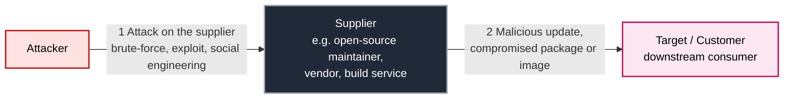

import { Callout } from '@document-writing-tools/kernux-theme'

# What is a Supply Chain Attack?

A **supply chain attack** is a cyberattack that does not target its victim directly. Instead, the attacker compromises a **trusted third party** — a software supplier, an open-source maintainer, a build tool, or an update server — and uses that trust relationship as a delivery vehicle to reach the real target.

The European Union Agency for Cybersecurity (ENISA) gives the most widely cited working definition:

> "A supply chain attack is a combination of **at least two attacks**. The first attack is on a supplier that is then used to attack the target to gain access to its assets."
> — [ENISA Threat Landscape for Supply Chain Attacks, July 2021](https://www.enisa.europa.eu/publications/threat-landscape-for-supply-chain-attacks)

This two-step structure is what distinguishes a software supply chain attack from a classic, direct intrusion. Because the malicious code travels through a legitimate, signed and trusted distribution channel — a package registry, a vendor update, a container image — it bypasses most perimeter defences and reaches a very large number of downstream targets at once.

***

## Classification: Why a Supply Chain Attack Always Has Two Stages

The canonical way to think about a software supply chain attack is as a two-stage flow. There is always a **supplier** (the entity that produces software, components or libraries) and a **customer** (the entity that consumes them — and the actual target of the attacker).

### Stage 1 — Attack on the Supplier

The attacker needs a foothold in something the target already trusts. Typical techniques used against the supplier include:

- **Credential compromise / brute-force attacks** against maintainer accounts on package registries (npm, PyPI, Maven Central, crates.io, …).
- **Exploitation of software vulnerabilities** in the supplier's infrastructure — CI runners, artifact repositories, source forges.
- **Social engineering** of maintainers, including long-running "trust building" campaigns by fake contributors (see the XZ Utils backdoor example below).
- **Typosquatting and dependency confusion**, where the attacker is technically not compromising the supplier but is *impersonating* one in the namespace the customer's build system resolves.
- **Insider threats** — a legitimate maintainer turning malicious, as seen in several npm self-sabotage incidents.

### Stage 2 — Attack on the Real Target

Once the supplier is compromised, the attacker uses the supplier's legitimate distribution channels to push the malicious payload downstream. Because the package or update is:

- **Signed with the supplier's real key**,
- **Published from the supplier's real account**,
- **Pulled automatically by the customer's CI/CD pipeline**,

…the malicious artifact passes through firewalls, EDR allowlists and code-review gates as if it were a trusted release. The actual exploitation — data exfiltration, ransomware, espionage — happens inside the customer's environment.

<Callout type="info">
This is exactly why a supply chain attack scales so well for the attacker: **one compromised supplier yields hundreds or thousands of compromised customers**. The 2020 SolarWinds incident reached ~18,000 organisations from a single tampered build.
</Callout>

***

## Real-World Examples of Supply Chain Attacks

| Incident | Stage 1 (Supplier) | Stage 2 (Target) |
| --- | --- | --- |
| [**SolarWinds / SUNBURST**](https://en.wikipedia.org/wiki/2020_United_States_federal_government_data_breach) | Build server of SolarWinds Orion was compromised; malicious code inserted during the build, not in source. | Signed updates delivered to ~18,000 customers, including multiple US federal agencies. |
| [**Log4Shell**](https://en.wikipedia.org/wiki/Log4Shell) | Critical RCE in the widely used Log4j logging library. | Millions of Java applications using Log4j as a transitive dependency. |
| [**Codecov bash uploader**](https://about.codecov.io/security-update/) | Attacker modified the Codecov uploader script via leaked credentials. | Secrets from thousands of customer CI pipelines were exfiltrated. |
| [**XZ Utils backdoor (CVE-2024-3094)**](https://en.wikipedia.org/wiki/XZ_Utils_backdoor) | Multi-year social-engineering campaign by "Jia Tan" earned maintainer rights. | Backdoor in `liblzma` would have given RCE on most Linux SSH servers; caught by chance weeks before stable releases. |

The pattern is identical in every case: **compromise something the target already trusts, then ride that trust into the target's environment**.

***

## Why Traditional Security Controls Don't Catch a Supply Chain Attack

Most security tooling is built around two assumptions that supply chain attacks deliberately violate:

1. *"Code I review is the code I run."* — Wrong, because the build server may inject code after review.
2. *"Signed and verified means safe."* — Wrong, because the attacker may be in control of the signing key.

Vulnerability scanners, e.g. SAST find flaws in code that *exists* in your repository. A supply chain attack adds **malicious code that was never in your repository** and arrives via a trusted, signed channel. Defending against it therefore requires a different model — one based on **verifiable provenance** rather than on perimeter scanning.

***

## How to Defend Against a Supply Chain Attack

Effective defence relies on the four pillars discussed in [What is Supply Chain Security](/explanations/supply-chain-security/what-is-supply-chain-security): **visibility, identity & integrity, provenance, and policy enforcement**. Two open frameworks operationalise these pillars.

### in-toto — Verifying the Chain of Custody

The [**in-toto framework**](/explanations/supply-chain-security/in-toto-framework) defines a cryptographically verifiable chain of custody across every step of the pipeline. Each step records the hashes of its inputs (materials) and outputs (products) and signs them. During verification, the products of step *n* must exactly match the materials of step *n+1*. If an attacker injects code between two steps the hash mismatch is detected.

### SLSA — Hardening the Build Itself

[**SLSA (Supply-chain Levels for Software Artifacts)**](/explanations/supply-chain-security/slsa-framework) is an OpenSSF maturity model that grades a build process from Level 0 (no guarantees) to Level 3 (hardened, isolated, signed provenance). SLSA uses in-toto as its provenance format and answers three questions for every artifact:

1. **Provenance** — do we know how it was built?
2. **Isolation** — was the build resistant to tampering?
3. **Authenticity** — can we cryptographically prove the first two?

A build that reaches SLSA Level 3 makes compromise dramatically harder, because the malicious build step would itself be recorded in signed provenance and detected at verification.

### Practical Controls You Can Adopt Today

- **Generate an [SBOM](/explanations/explaining-sboms)** for every build and store it next to the artifact. You cannot react to the next Log4Shell if you don't know which of your services contain the vulnerable library.
- **Pin dependencies by hash**, not by version range, so a hijacked maintainer cannot silently push a malicious patch release into your build.
- **Require signed provenance** for any artifact deployed to production (verify with Cosign / Sigstore or a Kubernetes admission controller).
- **Isolate build environments** — no developer laptops, no shared runners, ephemeral and reproducible CI jobs.
- **Continuously monitor your dependencies** for newly disclosed CVEs and malicious-package advisories from sources such as the GitHub Advisory Database or OSV.dev.

DevGuard implements these controls end-to-end — SBOM generation, in-toto attestations, SLSA-aligned provenance and policy enforcement — so that a compromised supplier does not automatically become a compromised production environment. See [Supply Chain Verification](/explanations/supply-chain-security/supply-chain-verification) for the verification flow in detail.

***

## Summary

A supply chain attack is fundamentally a **trust attack**: the adversary does not break your perimeter, they corrupt something your perimeter already lets in. The ENISA two-stage model — *attack the supplier, then attack the target through the supplier* — explains every major incident from SolarWinds to the ongoing npm hijack campaigns. Defending against it requires shifting the security question from *"is this code vulnerable?"* to *"can I cryptographically prove how this code was produced?"* — which is exactly what the [in-toto](/explanations/supply-chain-security/in-toto-framework) and [SLSA](/explanations/supply-chain-security/slsa-framework) frameworks are designed to answer.

***

## References

- ENISA — Threat Landscape for Supply Chain Attacks (July 2021) — linked above
- [SLSA v1.0 — Threats and Mitigations](https://slsa.dev/spec/v1.0/threats-overview)
- [in-toto Specification](https://github.com/in-toto/docs/blob/master/in-toto-spec.md)
- [NIST SP 800-161r1 — Cybersecurity Supply Chain Risk Management Practices](https://csrc.nist.gov/pubs/sp/800/161/r1/final)
- [CISA — Defending Against Software Supply Chain Attacks](https://www.cisa.gov/resources-tools/resources/defending-against-software-supply-chain-attacks)

***
