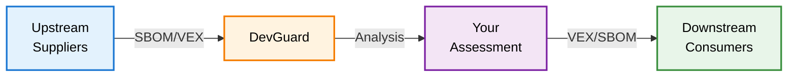

import Image from 'next/image'
import { Callout } from 'nextra/components'
import {
    Tooltip,
    TooltipTrigger,
    TooltipContent,
} from '@/components/ui/tooltip'

# External Vulnerability Synchronization

Modern software supply chains involve multiple parties conducting vulnerability assessments. External synchronization enables sharing security intelligence across organizational boundaries, reducing duplicate work. DevGuard imports assessments from upstream sources and exports your own through standardized <Tooltip><TooltipTrigger asChild><span className="underline decoration-dotted decoration-yellow-400 decoration-1 underline-offset-4 cursor-pointer">SBOM</span></TooltipTrigger><TooltipContent><p>Software Bill of Materials - Inventory of software components</p></TooltipContent></Tooltip> and <Tooltip><TooltipTrigger asChild><span className="underline decoration-dotted decoration-yellow-400 decoration-1 underline-offset-4 cursor-pointer">VEX</span></TooltipTrigger><TooltipContent><p>Vulnerability Exploitability eXchange - Vulnerability impact assessments</p></TooltipContent></Tooltip> documents.



## Importing Upstream Information

DevGuard consumes vulnerability data from external sources in <Tooltip><TooltipTrigger asChild><span className="underline decoration-dotted decoration-yellow-400 decoration-1 underline-offset-4 cursor-pointer">CycloneDX</span></TooltipTrigger><TooltipContent><p>Industry-standard format for SBOM and VEX documents</p></TooltipContent></Tooltip> format.

### Upload Methods

**Web UI**: Repository settings → "Identify Risk" → "Custom Setup" → Upload VEX/SBOM files

**CLI**: Automate uploads with DevGuard scanner:

```bash
devguard-scanner vex --token xyz --assetName my-org/my-repo vex.json
devguard-scanner sbom --token xyz --assetName my-org/my-repo sbom.json
```

**External URL Sync**: Configure periodic fetching from supplier endpoints for continuous integration.

### Key Rules

**VEX Precedence**: VEX assessments override SBOM findings. If VEX states "not affected", DevGuard respects this despite SBOM listing the vulnerability.

**Source Tracking**: Each document is tracked by origin. Multiple sources can report the same vulnerability.

**Paranoid Mode**: Require explicit approval before accepting upstream assessments. Enable in repository settings for strict compliance environments.

<Callout type="info" emoji="🔗">
    External URL sync enables automated supply chain transparency—suppliers
    publish endpoints, DevGuard continuously ingests their latest assessments.
</Callout>

## Exporting Your Assessments

Generate standardized VEX and SBOM documents for downstream consumers.

### Public Endpoints

Enable "Public access to vulnerability data" in settings to expose:

```
/api/v1/public/{assetId}/vex.json    # Vulnerability assessments
/api/v1/public/{assetId}/sbom.json   # Component inventory
```

**Contents**: Vulnerability states (Fixed, Not Affected, etc.), justifications, component versions, external references.

### Use Cases

**Supply Chain Automation**: Suppliers publish VEX endpoints → You import → Your customers import your VEX → Eliminates redundant analysis.

**Regulatory Compliance**: Standardized SBOM/VEX documentation for audits and regulations.

**Ecosystem Transparency**: Machine-readable security communication across organizational boundaries.

<Callout type="info" emoji="📄">
    Public endpoints enable customers to configure their DevGuard instances to
    sync from your endpoints automatically.
</Callout>

## Best Practices

**Verify Sources**: Use Paranoid Mode for untrusted suppliers.

**Document Origins**: Use meaningful identifiers (e.g., "Supplier-CompanyX" not just "Scanner").

**Maintain Stability**: Keep public URLs stable—consumers automate around them.

**Review Periodically**: External assessments may become outdated.

---

## Related Documentation

- [Vulnerability Lifecycle](vulnerability-lifecycle) - Vulnerability management process
- [Mitigation Strategies](mitigation-strategies) - Responding to vulnerabilities
