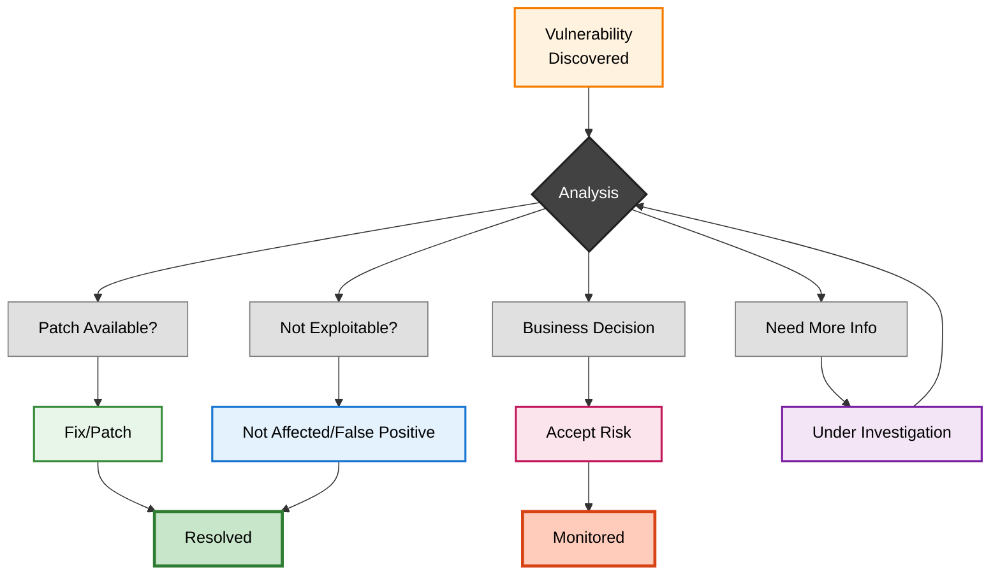
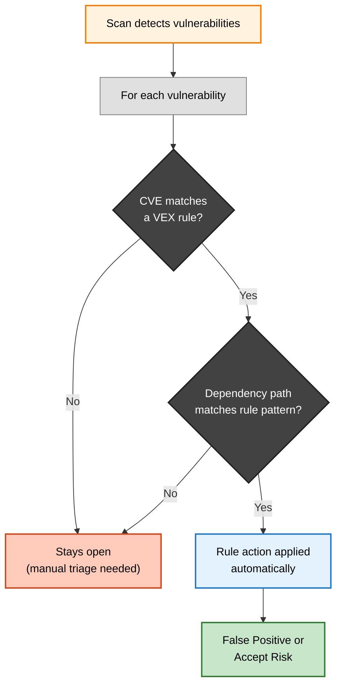
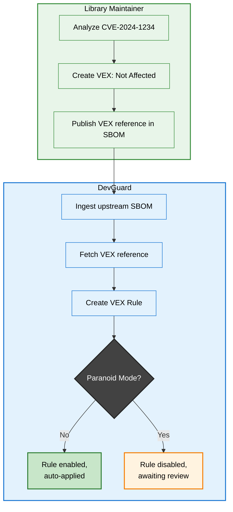
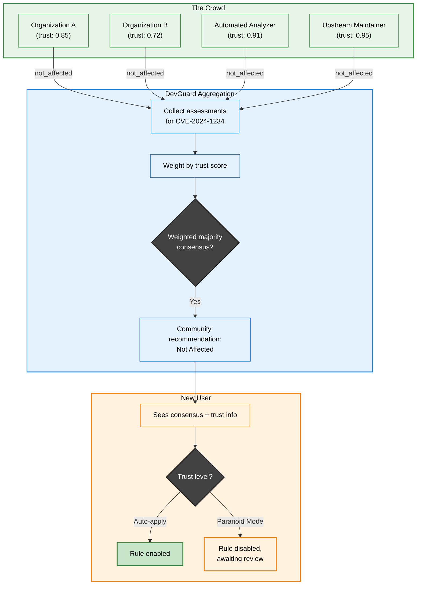

import Image from 'next/image'
import { Callout } from 'nextra/components'
import {
    Tooltip,
    TooltipTrigger,
    TooltipContent,
} from '@/components/ui/tooltip'

# Vulnerability Mitigation Strategies & VEX Rules

Discovering vulnerabilities is only the first step—the critical question is how to respond. Not every vulnerability requires immediate patching, and understanding your response options enables efficient resource allocation while maintaining security posture. DevGuard supports four distinct mitigation strategies based on the <Tooltip><TooltipTrigger asChild><span className="underline decoration-dotted decoration-yellow-400 decoration-1 underline-offset-4 cursor-pointer">VEX</span></TooltipTrigger><TooltipContent><p>Vulnerability Exploitability eXchange - A standard format for communicating vulnerability impact assessments</p></TooltipContent></Tooltip> standard[^1] and provides **VEX Rules** to automate these strategies at scale.

## The Four Mitigation Strategies



### 1. Fix/Patch: Eliminate the Vulnerability

Patching involves updating vulnerable components to versions where the security flaw has been corrected. This is the gold standard—it eliminates the root cause entirely rather than merely reducing risk.

**When to use**: This should be your default strategy whenever a patched version is available and can be safely deployed.

**Example**: Your JSON parsing library has a vulnerability in version 2.3.1. You update to version 2.3.2 which contains the fix, test, and deploy—completely eliminating the vulnerability.

<Callout type="info" emoji="🔄">
    DevGuard automatically detects when you deploy patched versions and
    transitions vulnerabilities to Fixed state. Associated issue tracker tickets
    can be automatically closed if synchronization is enabled.
</Callout>

### 2. Not Affected: Document Why It Doesn't Apply

Not Affected indicates that while a vulnerability exists in your dependencies, it doesn't actually impact your application's security. This prevents wasted effort on vulnerabilities that pose no real risk.

**When to use**: After analysis, you've determined your application cannot be exploited through this vulnerability. The vulnerable code may be present but isn't used in a way that creates risk.

**VEX Justification Categories**[^1]:

- **Vulnerable code not present**: Your version doesn't contain the flaw
- **Vulnerable code not in execute path**: The code exists but is never called
- **Inline mitigations exist**: Controls prevent exploitation
- **Component not affected**: Only affects specific configurations you don't use

<Callout type="warning" emoji="📝">
    Always document your justification clearly. DevGuard includes these
    justifications in generated VEX reports for auditors and customers.
</Callout>

### 3. Accept Risk: Conscious Business Decision

Accept Risk represents a business decision to knowingly operate with a vulnerability present, accepting the associated risk. You acknowledge the vulnerability could be exploited but choose not to remediate for specific business reasons.

**When to use**:

- Remediation cost exceeds potential impact
- Unlikely conditions required for exploitation
- Business constraints prevent immediate action
- Sufficient <Tooltip><TooltipTrigger asChild><span className="underline decoration-dotted decoration-yellow-400 decoration-1 underline-offset-4 cursor-pointer">compensating controls</span></TooltipTrigger><TooltipContent><p>Security measures that reduce vulnerability risk without fixing the code—like WAF rules or network restrictions</p></TooltipContent></Tooltip> reduce risk to acceptable levels

Document the business justification, risk assessment, compensating controls, and establish a review date. Risk acceptance typically requires stakeholder approval.

<Callout type="warning" emoji="⚠️">
    Accepted risks require periodic review. DevGuard can notify you when{' '}
    <Tooltip>
        <TooltipTrigger asChild>
            <span className="cursor-pointer underline decoration-yellow-400 decoration-dotted decoration-1 underline-offset-4">
                EPSS
            </span>
        </TooltipTrigger>
        <TooltipContent>
            <p>
                Exploit Prediction Scoring System - Probability that a
                vulnerability will be exploited
            </p>
        </TooltipContent>
    </Tooltip>{' '}
    scores change for accepted vulnerabilities.
</Callout>

### 4. Under Investigation: Assessment in Progress

Under Investigation is a transitional state indicating active analysis of whether and how a vulnerability affects your application. Every Under Investigation vulnerability should eventually move to Fixed, Not Affected, or Accept Risk.

**When to use**: Immediately upon discovering vulnerabilities that require analysis before determining appropriate response, especially for newly disclosed findings where impact isn't immediately clear.

Establish investigation timelines based on severity: critical findings within 24 hours, high within 72 hours, medium within one week.

## Decision Framework

**High CVSS + High EPSS + Direct Dependency** → Prioritize patching immediately

**High CVSS + Low EPSS + Deep Transitive** → Analyze exploitability; likely Not Affected

**Vulnerability in Optional Feature** → Disable and mark Not Affected

**No Patch + Actively Exploited** → Implement controls, Accept Risk with documentation

**Unclear Impact** → Mark Under Investigation with timeline

## VEX Rules: Automating Mitigation at Scale

Manually triaging every vulnerability is unsustainable. Many vulnerabilities recur across assets, versions, and scans—often with identical conclusions. **VEX Rules** let you define reusable mitigation decisions that are automatically applied whenever a matching vulnerability is detected.

A VEX rule consists of three parts:

1. **A CVE identifier** — which vulnerability to match
2. **A path pattern** — which dependency paths to match (with wildcard support)
3. **An action** — mark as False Positive or Accept Risk



When a scan discovers vulnerabilities, DevGuard matches each one against all enabled VEX rules. If a rule matches (same CVE **and** matching dependency path), the corresponding action is applied automatically—no manual intervention required.

<Callout type="info" emoji="ℹ️">
    VEX rules are **idempotent**. Applying the same rule multiple times never creates duplicate events. This makes them safe for continuous integration pipelines where the same scan may run repeatedly.
</Callout>

### Path Pattern Matching

VEX rules use **suffix-based path pattern matching** with wildcard support to target specific dependency paths. Each vulnerability in DevGuard has a dependency path—the chain of packages from your application root down to the vulnerable component.

For example, a vulnerability path might look like:

```
pkg:npm/my-app@1.0.0 → pkg:npm/express@4.18.0 → pkg:npm/qs@6.5.0
```

A path pattern is an ordered list of elements where each element is either a **literal package identifier** or a **wildcard** (`*`). The pattern matches against the suffix of the vulnerability path.

#### Pattern Examples

| Pattern | Matches | Explanation |
|---------|---------|-------------|
| `["pkg:npm/qs@6.5.0"]` | Any path ending in `qs@6.5.0` | Exact match on the vulnerable package regardless of how it's reached |
| `["*", "pkg:npm/qs@6.5.0"]` | Any path ending in `qs@6.5.0` | Wildcard before target—equivalent to above since suffix matching is used |
| `["pkg:npm/express@4.18.0", "*", "pkg:npm/qs@6.5.0"]` | Paths where `express@4.18.0` leads (through any intermediaries) to `qs@6.5.0` | Scoped match—only applies when `qs` is reached through `express` |
| `["*"]` | Any path | Blanket rule—applies regardless of dependency path |

<Callout type="warning" emoji="⚠️">
    Broad patterns like `["*"]` combined with a CVE will dismiss that CVE across **all** dependency paths. Use specific patterns when the vulnerability only affects certain code paths.
</Callout>

#### How Matching Works

The matching algorithm works by trying the pattern against increasingly longer suffixes of the vulnerability path:

1. Count the non-wildcard elements in the pattern to determine the minimum path length
2. Starting from the shortest possible suffix, try to match the pattern
3. A wildcard (`*`) matches **zero or more** path elements at that position
4. If any suffix produces a match, the rule applies

This means `["pkg:npm/qs@6.5.0"]` matches the path `[my-app, express, qs@6.5.0]` because the suffix `[qs@6.5.0]` matches the pattern.

### Rule Sources

VEX rules can enter DevGuard through three paths:

**Manual creation** — A developer analyzes a vulnerability and creates a rule through the DevGuard UI or API. The rule is immediately applied to all matching existing vulnerabilities.

**VEX document upload** — External VEX documents (CycloneDX VEX format) are parsed and converted into VEX rules. This is the primary way to import assessments from upstream vendors or security tools. The DevGuard scanner supports this via `devguard-scanner vex <vex-file>`.

**External VEX references** — When an SBOM contains external reference URLs pointing to VEX documents, DevGuard fetches and ingests those documents automatically. This enables upstream library maintainers to publish VEX assessments that flow downstream to all consumers.

### Paranoid Mode

By default, VEX rules from external sources (uploaded VEX documents, external references) are automatically enabled and applied. For environments requiring stricter control, assets can be configured with **Paranoid Mode**.

When Paranoid Mode is enabled, externally-sourced rules are created in a **disabled** state. They appear in the VEX rules list but have no effect until a team member manually reviews and enables them. This gives security teams full control over which external assessments they trust.

<Callout type="info" emoji="🔒">
    Paranoid Mode only affects externally-sourced rules. Rules created manually through the DevGuard UI are always enabled immediately.
</Callout>

## Sharing VEX Assessments

One of the most powerful aspects of VEX is that assessments are **shareable**. When you determine a vulnerability is a false positive in your library, every downstream consumer of that library benefits from your analysis.

### How Sharing Works

DevGuard generates standardized CycloneDX VEX documents from your assessments. These can be:

- **Published as external references** in your SBOM, so downstream consumers automatically ingest your assessments
- **Exported and shared** with customers, auditors, or partner organizations
- **Attached to releases** in your CI/CD pipeline so they travel alongside your artifacts



This creates a chain of trust: library maintainers assess vulnerabilities once, and all downstream consumers automatically benefit—dramatically reducing the industry-wide duplication of vulnerability analysis work.

### Why Path Patterns Are Essential for Sharing

Consider a vulnerability (CVE-2024-XXXX) in the `debug` package, discovered through this dependency chain:

```
next@14.0.0 → react@18.2.0 → debug@4.3.0 (CVE-2024-XXXX)
```

The Next.js team analyzes this and concludes: **not affected**. But the critical question for the community is: *why* is it not affected, and *where* in the chain is the vulnerability blocked?

**Scenario A**: Next.js never calls the React APIs that lead to `debug`. The false positive lives at the boundary between Next.js and React. Any other consumer of React that *does* call those APIs could still be affected.

**Scenario B**: React never calls the vulnerable function in `debug`. The false positive lives at the boundary between React and `debug`. This means *no* consumer of React is affected—the assessment is generalizable to the entire ecosystem.

The path pattern in the VEX rule captures exactly this distinction:

| Pattern | Where is it blocked? | Who benefits? |
|---------|---------------------|---------------|
| `["pkg:npm/next@14.0.0", "*", "pkg:npm/debug@4.3.0"]` | At Next.js — Next.js doesn't reach the vulnerable code through React | Only projects using Next.js |
| `["pkg:npm/react@18.2.0", "*", "pkg:npm/debug@4.3.0"]` | At React — React never calls the vulnerable `debug` function | **All** React consumers |

Without the path pattern, there is no way to determine whether a "not affected" assessment can be generalized beyond the original project or whether it only applies to one specific consumer.

<Callout type="warning" emoji="⚠️">
    When creating VEX rules intended for sharing, choose your path pattern carefully. A pattern scoped to your specific application protects your project but doesn't help others. A pattern scoped to the library itself benefits the entire ecosystem—but requires deeper analysis to justify.
</Callout>

Importantly, DevGuard itself is both a **producer and consumer** of VEX. When you triage a vulnerability in DevGuard—whether manually or through a VEX rule—that assessment becomes part of the VEX document DevGuard generates for your SBOM. If another DevGuard instance (or any VEX-compatible tool) consumes your SBOM, it automatically picks up your assessments as VEX rules. This means two teams using DevGuard on related projects can benefit from each other's triage work without any extra configuration—DevGuard's output feeds directly back into DevGuard as input.

### Crowdsourced VEX (coming soon)

Today, most vulnerability triage is duplicated effort. When a CVE is published against a widely-used library, thousands of organizations independently analyze whether it affects them—often reaching the same conclusion. This is wasteful.

DevGuard is designed with **crowdsourced vulnerability assessment** as a first-class concept. Rather than treating VEX as something each organization does in isolation, DevGuard aggregates assessments from a crowd of independent sources to build community consensus.

#### How It Works

Each participant in the crowd submits VEX assessments for open-source components. DevGuard aggregates these assessments and, when a sufficient majority agrees on a conclusion, surfaces that as a community recommendation. Each source in the crowd is assigned a **trust score** based on its track record—how often its assessments align with the eventual consensus, and how consistently it produces accurate results.



#### Who Is in the Crowd?

The crowd is not limited to human reviewers. Any entity that can produce a VEX assessment is a valid participant:

- **Organizations** sharing their manual assessments (anonymized) for components they use
- **Upstream library maintainers** publishing VEX statements alongside their releases
- **Automated reachability analyzers** that use static analysis to determine whether vulnerable code is actually callable

Automated tools are particularly valuable because they operate at ecosystem scale. For example, [VeXing NPM](https://github.com/l3montree-dev/vexing-npm)[^2] is an automated pipeline that uses <Tooltip><TooltipTrigger asChild><span className="underline decoration-dotted decoration-yellow-400 decoration-1 underline-offset-4 cursor-pointer">call graph analysis</span></TooltipTrigger><TooltipContent><p>A static analysis technique that builds a directed graph of function calls to determine if vulnerable code can actually be reached at runtime</p></TooltipContent></Tooltip> to assess npm packages at scale. By analyzing over 172,000 npm packages, it found that roughly **70% of vulnerabilities** reported by metadata-based scanners like `npm audit` are false positives—the vulnerable code is simply never called. These automated assessments feed directly into the crowd as a high-trust source.

#### Trust Scores

Not all assessments carry equal weight. A trust score reflects how reliable a source has been historically:

- **Automated analyzers** with proven precision (like reachability tools) can earn high trust scores through validation against known ground truths
- **Upstream maintainers** who publish VEX for their own packages naturally have high authority over those specific components
- **Organizations** build trust over time as their assessments consistently align with community consensus
- **New participants** start with a lower trust score that increases as their contributions are validated

This trust-weighted model means a single high-confidence automated analysis can be more influential than several unverified human opinions—and vice versa, expert human judgment on context-specific questions outweighs generic automated output.

<Callout type="info" emoji="🔬">
    Trust scores for crowdsourced VEX are an active area of research at L3montree. We are currently investigating how to derive reliable trust scores from assessment history, validate them against ground truth datasets, and make the consensus model robust against adversarial contributions. Follow our progress on [GitHub](https://github.com/l3montree-dev/devguard/issues/1571).
</Callout>

<Callout type="info" emoji="🌐">
    Crowdsourced VEX turns vulnerability triage from a duplicated cost into a shared community asset. DevGuard's architecture—with shareable VEX documents, external references, trust scores, and Paranoid Mode—provides the foundation for this model.
</Callout>

## DevGuard Support

**Issue Tracker Integration**: Automatically create and sync tickets in GitHub, GitLab, or Jira. Status updates flow bidirectionally.

**VEX Statement Generation**: Export assessments as standardized VEX documents for customers and auditors.

**Automated State Detection**: Automatically transitions vulnerabilities to Fixed when you deploy patched versions.

**Risk-Based Notifications**: Configure webhooks for high-risk discoveries or risk score changes.

**VEX Rule Management**: Create, review, enable/disable, and delete VEX rules through the UI or API. Each rule shows how many vulnerabilities it currently matches.

---

## Related Documentation

- [Vulnerability Lifecycle](vulnerability-lifecycle) - Understanding the complete vulnerability management process
- [Vulnerability Risk Assessment](risk-assessment-methodology) - How DevGuard calculates risk scores
- [Vulnerability Events](vulnerability-events) - Actions generating audit events
- [False Positive Detection](false-positive-detection) - Understanding and reducing false positives

## References

[^1]: CISA, _Vulnerability Exploitability eXchange (VEX)_, Cybersecurity and Infrastructure Security Agency, 2023, https://www.cisa.gov/sbom
[^2]: Bastin, T., _VeXing NPM — Call Graph Analysis for False Positive Reduction in JavaScript Vulnerability Detection_, Master's Thesis, 2025, https://github.com/l3montree-dev/vexing-npm