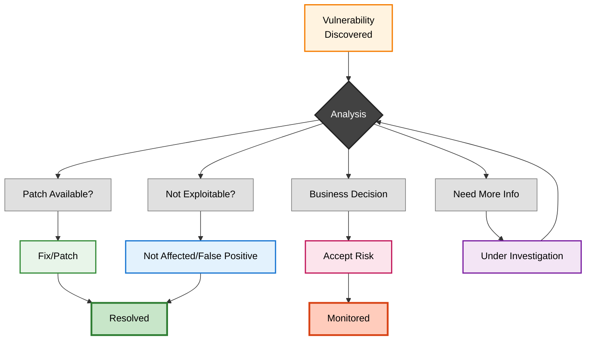
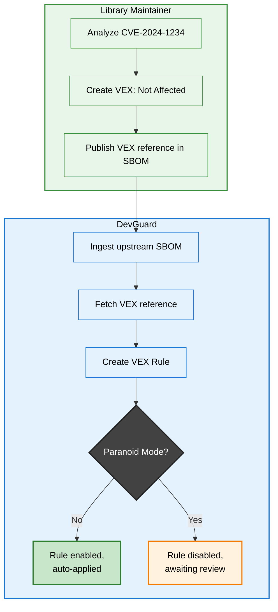
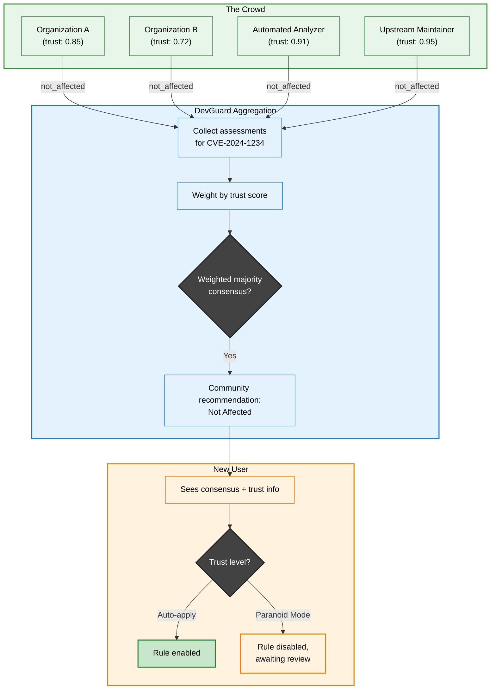

import Image from 'next/image'
import { Callout } from '@document-writing-tools/kernux-theme'

# Vulnerability Mitigation Strategies

Discovering vulnerabilities is only the first step—the critical question is how to respond. Not every vulnerability requires immediate patching, and understanding your response options enables efficient resource allocation while maintaining security posture. DevGuard supports four distinct mitigation strategies based on the VEX standard[^1] and provides **VEX Rules** to automate these strategies at scale.

## The Four Mitigation Strategies


```mermaid
graph TD
    A[Vulnerability<br/>Discovered] --> B{Analysis}

    Q1[Patch Available?]
    Q2[Not Exploitable?]
    Q3[Business Decision]
    Q4[Need More Info]

    B --> Q1
    B --> Q2
    B --> Q3
    B --> Q4

    Q1 --> C[Fix/Patch]
    Q2 --> D[Not Affected/False Positive]
    Q3 --> E[Accept Risk]
    Q4 --> F[Under Investigation]

    F --> B
    C --> G[Resolved]
    D --> G
    E --> H[Monitored]

    style A fill:#fff3e0,stroke:#f57c00,stroke-width:2px,color:#000
    style B fill:#424242,stroke:#212121,stroke-width:2px,color:#fff
    style Q1 fill:#e0e0e0,stroke:#757575,stroke-width:1px,color:#000
    style Q2 fill:#e0e0e0,stroke:#757575,stroke-width:1px,color:#000
    style Q3 fill:#e0e0e0,stroke:#757575,stroke-width:1px,color:#000
    style Q4 fill:#e0e0e0,stroke:#757575,stroke-width:1px,color:#000
    style C fill:#e8f5e9,stroke:#388e3c,stroke-width:2px,color:#000
    style D fill:#e3f2fd,stroke:#1976d2,stroke-width:2px,color:#000
    style E fill:#fce4ec,stroke:#c2185b,stroke-width:2px,color:#000
    style F fill:#f3e5f5,stroke:#7b1fa2,stroke-width:2px,color:#000
    style G fill:#c8e6c9,stroke:#2e7d32,stroke-width:3px,color:#000
    style H fill:#ffccbc,stroke:#d84315,stroke-width:3px,color:#000
```

### 1. Fix/Patch: Eliminate the Vulnerability

Patching involves updating vulnerable components to versions where the security flaw has been corrected. This is the gold standard—it eliminates the root cause entirely rather than merely reducing risk.

**When to use**: This should be your default strategy whenever a patched version is available and can be safely deployed.

**Example**: Your JSON parsing library has a vulnerability in version 2.3.1. You update to version 2.3.2 which contains the fix, test, and deploy—completely eliminating the vulnerability.

<Callout type="info" emoji="🔄">
    DevGuard automatically detects when you deploy patched versions and
    transitions vulnerabilities to Fixed state. Associated issue tracker tickets
    can be automatically closed if synchronization is enabled.
</Callout>

### 2. Not Affected: Document Why It Doesn't Apply

Not Affected indicates that while a vulnerability exists in your dependencies, it doesn't actually impact your application's security. This prevents wasted effort on vulnerabilities that pose no real risk.

**When to use**: After analysis, you've determined your application cannot be exploited through this vulnerability. The vulnerable code may be present but isn't used in a way that creates risk.

**VEX Justification Categories**[^1]:

- **Vulnerable code not present**: Your version doesn't contain the flaw
- **Vulnerable code not in execute path**: The code exists but is never called
- **Inline mitigations exist**: Controls prevent exploitation
- **Component not affected**: Only affects specific configurations you don't use

<Callout type="warning" emoji="📝">
    Always document your justification clearly. DevGuard includes these
    justifications in generated VEX reports for auditors and customers.
</Callout>

### 3. Accept Risk: Conscious Business Decision

Accept Risk represents a business decision to knowingly operate with a vulnerability present, accepting the associated risk. You acknowledge the vulnerability could be exploited but choose not to remediate for specific business reasons.

**When to use**:

- Remediation cost exceeds potential impact
- Unlikely conditions required for exploitation
- Business constraints prevent immediate action
- Sufficient compensating controls reduce risk to acceptable levels

Document the business justification, risk assessment, compensating controls, and establish a review date. Risk acceptance typically requires stakeholder approval.

<Callout type="warning" emoji="⚠️">
    Accepted risks require periodic review. DevGuard can notify you when{' '}
    EPSS{' '}
    scores change for accepted vulnerabilities.
</Callout>

### 4. Under Investigation: Assessment in Progress

Under Investigation is a transitional state indicating active analysis of whether and how a vulnerability affects your application. Every Under Investigation vulnerability should eventually move to Fixed, Not Affected, or Accept Risk.

**When to use**: Immediately upon discovering vulnerabilities that require analysis before determining appropriate response, especially for newly disclosed findings where impact isn't immediately clear.

Establish investigation timelines based on severity: critical findings within 24 hours, high within 72 hours, medium within one week.

## Decision Framework

**High CVSS + High EPSS + Direct Dependency** → Prioritize patching immediately

**High CVSS + Low EPSS + Deep Transitive** → Analyze exploitability; likely Not Affected

**Vulnerability in Optional Feature** → Disable and mark Not Affected

**No Patch + Actively Exploited** → Implement controls, Accept Risk with documentation

**Unclear Impact** → Mark Under Investigation with timeline

## Automating Mitigation at Scale

Manually triaging every vulnerability is unsustainable. Many vulnerabilities recur across assets, versions and scans — often with identical conclusions. A **VEX rule** captures a mitigation decision as a reusable condition: DevGuard evaluates it against every dependency vulnerability and applies your chosen strategy — *Not Affected* or *Accept Risk* — to each match, on creation and on every later scan.

The condition is a [CEL expression](/reference/vex-cel-reference). Because it is a general expression rather than a fixed template, a rule can key on whatever actually determines the decision: an advisory id, a component version range, a CVSS threshold, or — most usefully — the specific **dependency path** through which the vulnerable component enters your product.

That last capability is what makes rules more than bulk-editing. The same library reached two different ways can warrant two different conclusions, and a path-scoped rule dismisses only the route where the vulnerable code is genuinely unreachable.

<Callout type="info" emoji="ℹ️">
    VEX rules are **idempotent**. Applying the same rule repeatedly never creates duplicate events, which makes them safe in continuous integration where the same scan runs again and again.
</Callout>

Rules reach DevGuard three ways: written by hand in the web UI or over the API, generated from a VEX document you upload, or synced from an upstream supplier's URL. Rules from external sources can be held back for manual review by enabling **Paranoid Mode** on the repository.

Beyond a specific supplier's own URL, DevGuard also syncs official upstream VEX sources on your behalf — currently the [Rancher VEX Hub](https://github.com/rancher/vexhub). If you know of a VEX source that should be part of DevGuard's official VEX rule database, open a ticket. These official rules are distributed through the same mechanism as the vulnerability database itself, and are recommended to you automatically whenever one matches a vulnerability in your dependencies.

For the mechanics — expression syntax, the create and edit flows, imports and Paranoid Mode — see [Working with VEX in DevGuard](/how-to-guides/vex) and [Create & Manage VEX Rules](/how-to-guides/vex/vex-rules).

## Sharing VEX Assessments

One of the most powerful aspects of VEX is that assessments are **shareable**. When you determine a vulnerability is a false positive in your library, every downstream consumer of that library benefits from your analysis.

### How Sharing Works

DevGuard generates standardized CycloneDX VEX documents from your assessments. These can be:

- **Published as external references** in your SBOM, so downstream consumers automatically ingest your assessments
- **Exported and shared** with customers, auditors, or partner organizations
- **Attached to releases** in your CI/CD pipeline so they travel alongside your artifacts


```mermaid
graph TD
    subgraph Upstream ["Library Maintainer"]
        A1[Analyze CVE-2024-1234] --> A2[Create VEX: Not Affected]
        A2 --> A3[Publish VEX reference in SBOM]
    end

    subgraph DevGuard ["DevGuard"]
        B1[Ingest upstream SBOM] --> B2[Fetch VEX reference]
        B2 --> B3[Create VEX Rule]
        B3 --> B4{Paranoid Mode?}
        B4 -->|No| B5[Rule enabled,<br/>auto-applied]
        B4 -->|Yes| B6[Rule disabled,<br/>awaiting review]
    end

    A3 --> B1

    style Upstream fill:#e8f5e9,stroke:#388e3c,stroke-width:2px,color:#000
    style A1 fill:#e8f5e9,stroke:#388e3c,stroke-width:1px,color:#000
    style A2 fill:#e8f5e9,stroke:#388e3c,stroke-width:1px,color:#000
    style A3 fill:#e8f5e9,stroke:#388e3c,stroke-width:1px,color:#000
    style DevGuard fill:#e3f2fd,stroke:#1976d2,stroke-width:2px,color:#000
    style B1 fill:#e3f2fd,stroke:#1976d2,stroke-width:1px,color:#000
    style B2 fill:#e3f2fd,stroke:#1976d2,stroke-width:1px,color:#000
    style B3 fill:#e3f2fd,stroke:#1976d2,stroke-width:1px,color:#000
    style B4 fill:#424242,stroke:#212121,stroke-width:2px,color:#fff
    style B5 fill:#c8e6c9,stroke:#2e7d32,stroke-width:2px,color:#000
    style B6 fill:#fff3e0,stroke:#f57c00,stroke-width:2px,color:#000
```

This creates a chain of trust: library maintainers assess vulnerabilities once, and all downstream consumers automatically benefit—dramatically reducing the industry-wide duplication of vulnerability analysis work.

### Why the Dependency Path Is Essential for Sharing

Consider a vulnerability (CVE-2024-XXXX) in the `debug` package, discovered through this dependency chain:

```
next@14.0.0 → react@18.2.0 → debug@4.3.0 (CVE-2024-XXXX)
```

The Next.js team analyzes this and concludes: **not affected**. But the critical question for the community is: *why* is it not affected, and *where* in the chain is the vulnerability blocked?

**Scenario A**: Next.js never calls the React APIs that lead to `debug`. The false positive lives at the boundary between Next.js and React. Any other consumer of React that *does* call those APIs could still be affected.

**Scenario B**: React never calls the vulnerable function in `debug`. The false positive lives at the boundary between React and `debug`. This means *no* consumer of React is affected—the assessment is generalizable to the entire ecosystem.

A VEX rule's path expression captures exactly this distinction:

| Expression | Where is it blocked? | Who benefits? |
|---------|---------------------|---------------|
| `matchesPattern(vuln, ["pkg:npm/next@14.0.0", "*", "pkg:npm/debug@4.3.0"])` | At Next.js — Next.js doesn't reach the vulnerable code through React | Only projects using Next.js |
| `matchesPattern(vuln, ["pkg:npm/react@18.2.0", "*", "pkg:npm/debug@4.3.0"])` | At React — React never calls the vulnerable `debug` function | **All** React consumers |

Without the dependency path, there is no way to determine whether a "not affected" assessment can be generalized beyond the original project or whether it only applies to one specific consumer. This is also why CSAF — the only VEX format that models dependency relationships — is the right choice when the assessment is meant to travel. See [CSAF & VEX Standards](/explanations/compliance/csaf-vex-explained).

<Callout type="warning" emoji="⚠️">
    When creating VEX rules intended for sharing, scope the path carefully. A path scoped to your specific application protects your project but doesn't help others. A path scoped to the library itself benefits the entire ecosystem—but requires deeper analysis to justify.
</Callout>

Importantly, DevGuard itself is both a **producer and consumer** of VEX. When you triage a vulnerability in DevGuard—whether manually or through a VEX rule—that assessment becomes part of the VEX document DevGuard generates for your SBOM. If another DevGuard instance (or any VEX-compatible tool) consumes your SBOM, it automatically picks up your assessments as VEX rules. This means two teams using DevGuard on related projects can benefit from each other's triage work without any extra configuration—DevGuard's output feeds directly back into DevGuard as input.

### Crowdsourced VEX

Today, most vulnerability triage is duplicated effort. When a CVE is published against a widely-used library, thousands of organizations independently analyze whether it affects them—often reaching the same conclusion. This is wasteful.

DevGuard is designed with **crowdsourced vulnerability assessment** as a first-class concept. Rather than treating VEX as something each organization does in isolation, DevGuard aggregates assessments from a crowd of independent sources to build community consensus.

#### How It Works

Each participant in the crowd submits VEX assessments for open-source components. DevGuard aggregates these assessments and, when a sufficient majority agrees on a conclusion, surfaces that as a community recommendation. Each source in the crowd is assigned a **trust score** based on its track record—how often its assessments align with the eventual consensus, and how consistently it produces accurate results.


```mermaid
graph TD
    subgraph Crowd ["The Crowd"]
        direction LR
        S1["Organization A<br/>(trust: 0.85)"]
        S2["Organization B<br/>(trust: 0.72)"]
        S3["Automated Analyzer<br/>(trust: 0.91)"]
        S4["Upstream Maintainer<br/>(trust: 0.95)"]
    end

    subgraph Aggregation ["DevGuard Aggregation"]
        A1["Collect assessments<br/>for CVE-2024-1234"]
        A2["Weight by trust score"]
        A3{"Weighted majority<br/>consensus?"}
        A4["Community recommendation:<br/>Not Affected"]
    end

    S1 -->|not_affected| A1
    S2 -->|not_affected| A1
    S3 -->|not_affected| A1
    S4 -->|not_affected| A1
    A1 --> A2 --> A3
    A3 -->|Yes| A4

    subgraph Consumer ["New User"]
        C1["Sees consensus + trust info"] --> C2{Trust level?}
        C2 -->|Auto-apply| C3["Rule enabled"]
        C2 -->|Paranoid Mode| C4["Rule disabled,<br/>awaiting review"]
    end

    A4 --> C1

    style Crowd fill:#e8f5e9,stroke:#388e3c,stroke-width:2px,color:#000
    style S1 fill:#e8f5e9,stroke:#388e3c,stroke-width:1px,color:#000
    style S2 fill:#e8f5e9,stroke:#388e3c,stroke-width:1px,color:#000
    style S3 fill:#e8f5e9,stroke:#388e3c,stroke-width:1px,color:#000
    style S4 fill:#e8f5e9,stroke:#388e3c,stroke-width:1px,color:#000
    style Aggregation fill:#e3f2fd,stroke:#1976d2,stroke-width:2px,color:#000
    style A1 fill:#e3f2fd,stroke:#1976d2,stroke-width:1px,color:#000
    style A2 fill:#e3f2fd,stroke:#1976d2,stroke-width:1px,color:#000
    style A3 fill:#424242,stroke:#212121,stroke-width:2px,color:#fff
    style A4 fill:#e3f2fd,stroke:#1976d2,stroke-width:1px,color:#000
    style Consumer fill:#fff3e0,stroke:#f57c00,stroke-width:2px,color:#000
    style C1 fill:#fff3e0,stroke:#f57c00,stroke-width:1px,color:#000
    style C2 fill:#424242,stroke:#212121,stroke-width:2px,color:#fff
    style C3 fill:#c8e6c9,stroke:#2e7d32,stroke-width:2px,color:#000
    style C4 fill:#fff3e0,stroke:#f57c00,stroke-width:2px,color:#000
```

#### Who Is in the Crowd?

The crowd is not limited to human reviewers. Any entity that can produce a VEX assessment is a valid participant:

- **Organizations** sharing their manual assessments (anonymized) for components they use
- **Upstream library maintainers** publishing VEX statements alongside their releases
- **Automated reachability analyzers** that use static analysis to determine whether vulnerable code is actually callable

Automated tools are particularly valuable because they operate at ecosystem scale. For example, [VeXing NPM](https://github.com/l3montree-dev/vexing-npm)[^2] is an automated pipeline that uses call graph analysis to assess npm packages at scale. By analyzing over 172,000 npm packages, it found that roughly **70% of vulnerabilities** reported by metadata-based scanners like `npm audit` are false positives—the vulnerable code is simply never called. These automated assessments feed directly into the crowd as a high-trust source.

#### Trust Scores

Not all assessments carry equal weight. A trust score reflects how reliable a source has been historically:

- **Automated analyzers** with proven precision (like reachability tools) can earn high trust scores through validation against known ground truths
- **Upstream maintainers** who publish VEX for their own packages naturally have high authority over those specific components
- **Organizations** build trust over time as their assessments consistently align with community consensus
- **New participants** start with a lower trust score that increases as their contributions are validated

This trust-weighted model means a single high-confidence automated analysis can be more influential than several unverified human opinions—and vice versa, expert human judgment on context-specific questions outweighs generic automated output.

<Callout type="info" emoji="🔬">
    Trust scores for crowdsourced VEX are an active area of research at L3montree. We are currently investigating how to derive reliable trust scores from assessment history, validate them against ground truth datasets, and make the consensus model robust against adversarial contributions. Follow our progress on [GitHub](https://github.com/l3montree-dev/devguard/issues/1571).
</Callout>

<Callout type="info" emoji="🌐">
    Crowdsourced VEX turns vulnerability triage from a duplicated cost into a shared community asset. DevGuard's architecture—with shareable VEX documents, external references, trust scores, and Paranoid Mode—provides the foundation for this model.
</Callout>

You already see the result of this in the product: where a consensus exists for a vulnerability in your repository, DevGuard surfaces it as a **recommendation** — on the vulnerability's detail page and in a *Recommended by other DevGuard users* section on the VEX Rules page. A recommendation is never applied automatically; it pre-fills a rule for you to review. See [Create a rule from a recommendation](/how-to-guides/vex/vex-rules#from-a-recommendation).

## DevGuard Support

**Issue Tracker Integration**: Automatically create and sync tickets in GitHub, GitLab, or Jira. Status updates flow bidirectionally.

**VEX Statement Generation**: Export assessments as standardized VEX documents for customers and auditors.

**Automated State Detection**: Automatically transitions vulnerabilities to Fixed when you deploy patched versions.

**Risk-Based Notifications**: Configure webhooks for high-risk discoveries or risk score changes.

**VEX Rule Management**: Create, review, enable/disable, and delete VEX rules through the UI or API. Each rule shows how many vulnerabilities it currently matches.

***

## Related Documentation

- [Vulnerability Lifecycle](/explanations/vulnerability-management/vulnerability-lifecycle) - Understanding the complete vulnerability management process
- [Vulnerability Risk Assessment](/explanations/vulnerability-management/risk-assessment-methodology) - How DevGuard calculates risk scores
- [Vulnerability Events](/explanations/vulnerability-management/vulnerability-events) - Actions generating audit events
- [Reduce False Positives](/explanations/vulnerability-management/reduce-false-positives) - Understanding and reducing false positives

## References

[^1]: CISA, _Vulnerability Exploitability eXchange (VEX)_, Cybersecurity and Infrastructure Security Agency, 2023, https://www.cisa.gov/topics/information-communications-technology-supply-chain-security/sbom
[^2]: Bastin, T., _VeXing NPM — Call Graph Analysis for False Positive Reduction in JavaScript Vulnerability Detection_, Master's Thesis, 2025, https://github.com/l3montree-dev/vexing-npm