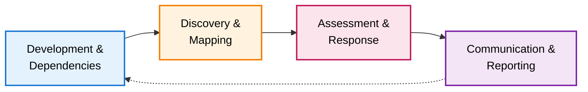

import Image from 'next/image'
import { Callout } from 'nextra/components'
import { Button } from '@/components/ui/button'
import {
    Tooltip,
    TooltipTrigger,
    TooltipContent,
} from '@/components/ui/tooltip'

# Vulnerability Lifecycle

Modern software relies on hundreds of dependencies, each potentially containing security vulnerabilities. The vulnerability lifecycle describes the systematic process of identifying, assessing, and communicating security findings throughout your software's development and deployment. Understanding this lifecycle enables teams to transform overwhelming security data into actionable intelligence.

## The Four-Phase Lifecycle

### Phase 1: Development & Dependencies

Every application begins with code and dependencies. As developers build features, they incorporate external libraries and frameworks to accelerate development. These dependencies—both direct and <Tooltip><TooltipTrigger asChild>transitive</TooltipTrigger><TooltipContent>
Indirect dependencies pulled in by your direct dependencies. For example, if your application depends on Library A, and Library A depends on Library B, then Library B is a transitive dependency.
</TooltipContent></Tooltip>—form the foundation of your software supply chain.

DevGuard tracks your dependency tree from the moment you declare them in your package manifests (package.json, pom.xml, go.mod, etc.). This continuous monitoring ensures that every component entering your codebase is cataloged and ready for security analysis.

### Phase 2: Discovery & Mapping

Once dependencies are identified, DevGuard maps them against comprehensive vulnerability databases to discover known security issues. This process cross-references your components with data from the <Tooltip><TooltipTrigger asChild>CVE</TooltipTrigger><TooltipContent>
Common Vulnerabilities and Exposures - Standardized identifiers for publicly known cybersecurity vulnerabilities. Each CVE ID uniquely identifies a specific vulnerability.
</TooltipContent></Tooltip> List, GitHub Security Advisories, and other authoritative sources.

The platform generates a complete <Tooltip><TooltipTrigger asChild>SBOM</TooltipTrigger><TooltipContent>
Software Bill of Materials - A comprehensive inventory of all components, libraries, and dependencies that make up a software application
</TooltipContent></Tooltip> (Software Bill of Materials) documenting every component and its associated <Tooltip><TooltipTrigger asChild>CVEs</TooltipTrigger><TooltipContent>
Common Vulnerabilities and Exposures - Standardized identifiers for publicly known cybersecurity vulnerabilities. Each CVE ID uniquely identifies a specific vulnerability.
</TooltipContent></Tooltip>. DevGuard enriches these findings with severity scores, exploit probability data, and contextual information about each vulnerability's potential impact.

<Callout type="info" emoji="🔍">
    DevGuard performs continuous scanning—not just at build time. When new
    vulnerabilities are disclosed, the platform automatically identifies which
    of your applications are affected, enabling proactive security management.
</Callout>

### Phase 3: Assessment & Response

Not every discovered vulnerability represents genuine risk. This phase focuses on determining which findings require action and which can be safely dismissed or accepted. Security and development teams analyze each vulnerability to assign appropriate states and mitigation strategies.

DevGuard provides intelligent workflows for vulnerability triage, including reachability analysis to determine if vulnerable code paths are actually used in your application. The platform integrates with your existing issue trackers and supports automated state transitions when vulnerabilities are patched. Teams can document justifications for accepted risks, track mitigation progress, and establish clear remediation priorities based on actual exploitability.

For detailed guidance on handling different vulnerability scenarios, see our [mitigation strategies documentation](mitigation-strategies).

### Phase 4: Communication & Reporting

The final phase involves communicating your security posture to stakeholders—customers, auditors, downstream consumers, and internal teams. DevGuard generates standardized <Tooltip><TooltipTrigger asChild>VEX</TooltipTrigger><TooltipContent>
Vulnerability Exploitability eXchange - A standard format for sharing information about the exploitability of vulnerabilities in a specific product or context
</TooltipContent></Tooltip> (Vulnerability Exploitability eXchange) documents that clearly communicate which vulnerabilities affect your software and which do not.

These machine-readable reports enable automated security assessments throughout your supply chain. When customers or partners ask about specific <Tooltip><TooltipTrigger asChild>CVEs</TooltipTrigger><TooltipContent>
Common Vulnerabilities and Exposures
</TooltipContent></Tooltip>, you can provide authoritative documentation of your analysis and remediation status. <Tooltip><TooltipTrigger asChild>VEX</TooltipTrigger><TooltipContent>
Vulnerability Exploitability eXchange
</TooltipContent></Tooltip> reports reduce duplicate security work across organizations and build trust through transparent communication about your security practices.

<Callout type="info" emoji="📄">
    DevGuard's VEX reports can be automatically generated and distributed as
    part of your release process, ensuring stakeholders always have current
    vulnerability status information.
</Callout>

## Continuous Improvement

The vulnerability lifecycle is continuous, not linear. As you release updates and new vulnerabilities are disclosed, the cycle repeats. DevGuard's automation ensures that each iteration becomes more efficient—learned assessments inform future triage, documented justifications reduce repetitive analysis, and established workflows accelerate response times.

---

## Related Documentation

- [Mitigation Strategies](mitigation-strategies) - Detailed guidance on responding to vulnerabilities
- [Vulnerability Risk Assessment](risk-assessment-methodology) - Understanding how vulnerability risk is calculated
- [SBOM Standards](/explanations/compliance/sbom-standards) - Creating comprehensive software inventories and their standards

## References

1. National Institute of Standards and Technology (NIST), _National Vulnerability Database_, https://nvd.nist.gov/
2. CISA, _Vulnerability Exploitability eXchange (VEX)_, Cybersecurity and Infrastructure Security Agency, https://www.cisa.gov/sbom
