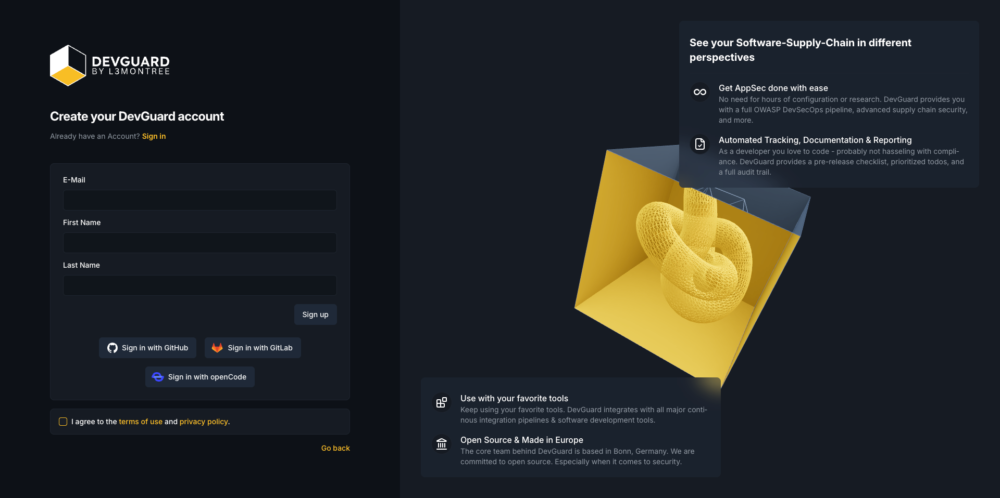
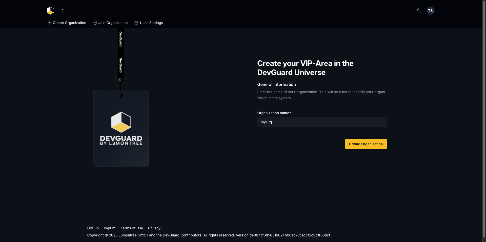
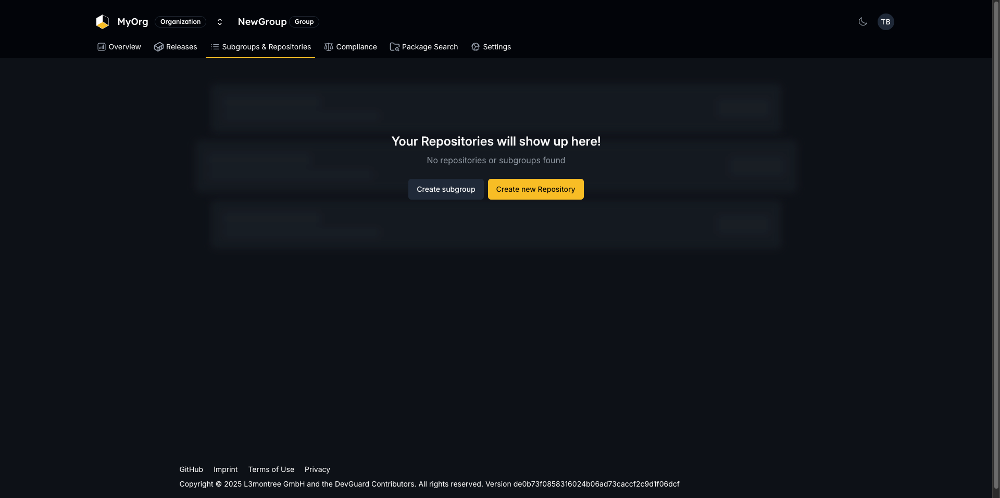
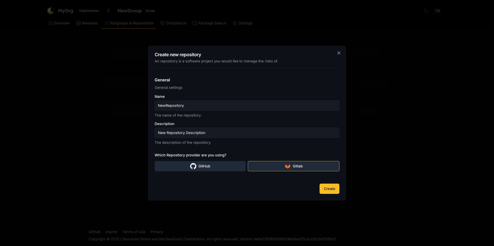
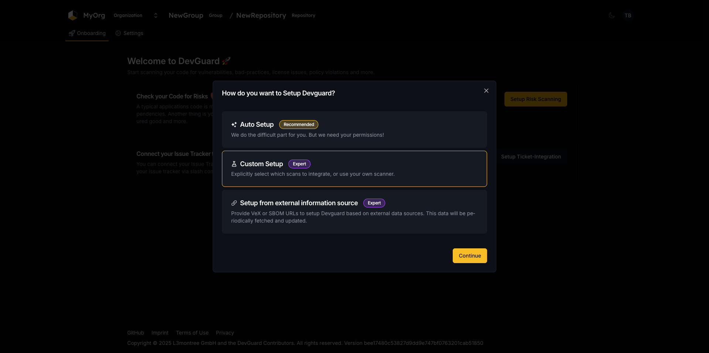
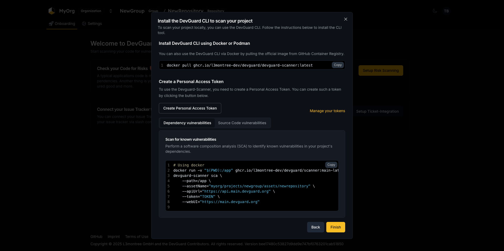
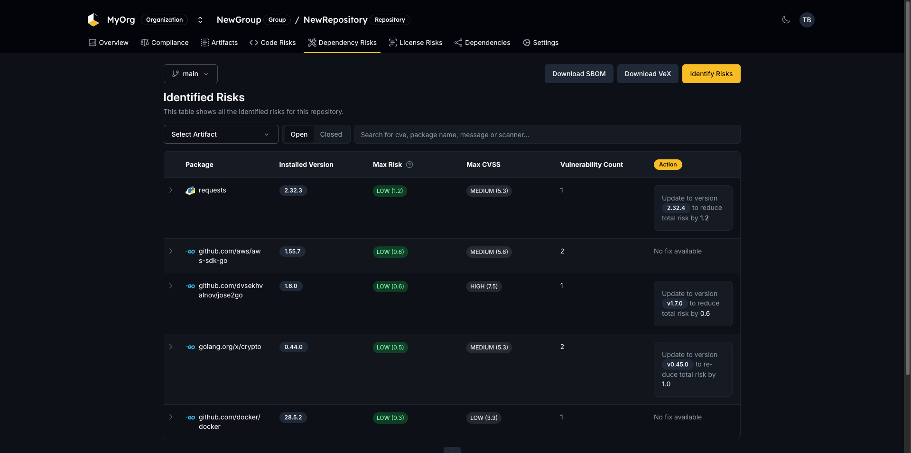
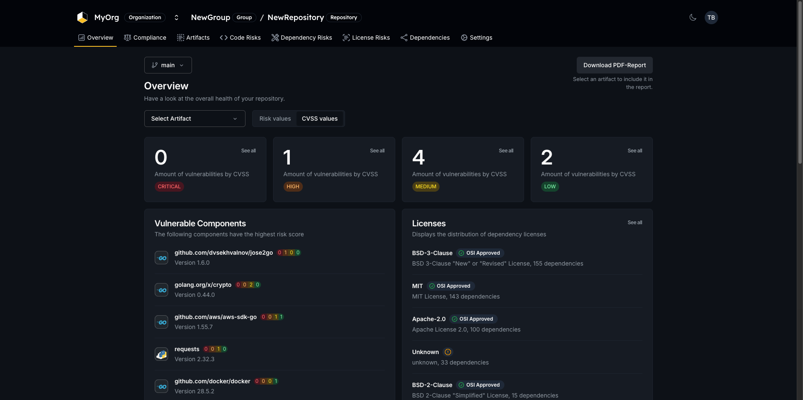

import { Tabs, Steps, Callout } from 'nextra/components'

# Setup a Fresh DevGuard Instance and Scan for Vulnerabilities

Learn how to quickly set up DevGuard using Docker Compose and perform your first vulnerability scan to detect known CVEs in your software.

## What You'll Learn

In this tutorial, you'll learn how to:

- Set up a DevGuard instance using docker-compose
- Create a project and repository within DevGuard
- Use the DevGuard scanner to scan a software project for known vulnerabilities

## What You'll Build

By the end of this tutorial, you'll have a fully functional DevGuard instance running via docker-compose, with a project and repository set up, and a successful vulnerability scan completed on a sample software project.

## Prerequisites

Before you begin, you should have:

- Basic command line knowledge
- Docker installed on your system

If you don't have Docker installed, follow the [Docker installation guide](https://docs.docker.com/engine/install/).

## Tutorial

<Steps>

### Set up a local DevGuard instance

First, download the necessary configuration files and start DevGuard using docker-compose:

```bash
curl -LO https://raw.githubusercontent.com/l3montree-dev/devguard/refs/heads/main/docker-compose-try-it.yaml \
&& curl -LO https://raw.githubusercontent.com/l3montree-dev/devguard/refs/heads/main/initdb.sql \
&& curl -LO https://raw.githubusercontent.com/l3montree-dev/devguard/refs/heads/main/.kratos/identity.schema.json \
&& curl -L -o kratos.yml https://raw.githubusercontent.com/l3montree-dev/devguard/refs/heads/main/.kratos/kratos.example.yml \
&& mkdir -p kratos \
&& mv kratos.yml kratos/kratos.yml \
&& mv identity.schema.json kratos/identity.schema.json \
&& docker-compose -f docker-compose-try-it.yaml up
```

This command downloads all required configuration files and starts the DevGuard services.

**Verify it worked:** DevGuard services should start without errors. The web frontend will be available at http://localhost:3000, the API at http://localhost:8080, and Kratos (authorization server) at http://localhost:4433.

### Log into DevGuard

Open your web browser and navigate to http://localhost:3000 to access the DevGuard web interface.

### Create your account

Navigate to the registration page at http://localhost:3000/registration and create a new user account:

1. Enter any email address (you won't need to verify it for local instances)
2. Choose a secure password
3. Click the **Sign up** button



<Callout type="info">
The local instance doesn't send emails until you configure an SMTP server. If you see an email verification screen, simply use the back button to continue.
</Callout>

**Verify it worked:** You should be redirected to the organization creation page.

### Create an organization

Organizations help you structure your security scanning projects:

1. Choose a name for your organization (for example, "MyOrg")
2. Click the **Create Organization** button



**Verify it worked:** You should be redirected to the group overview page.



### Create a new group

Groups organize projects within your organization. Each group can contain subgroups and projects, allowing you to monitor security posture across multiple repositories.

1. On the group overview page, enter a name for your group
2. Add a description (optional but recommended)
3. Click the **Create Group** button

You can create unlimited groups in an organization and change these values later. Groups also support releases and dashboards for monitoring subgroups and their repositories.

**Verify it worked:** You should be redirected to the group overview page of your newly created group.


### Create a new repository

Repositories represent the actual software projects you want to scan for vulnerabilities:

1. Click the **New Repository** button on the group overview page
2. Enter a name for your repository
3. Add a description
4. Select a provider (GitLab or GitHub) - this helps DevGuard optimize configuration options and CI/CD integration
5. Click the **Create Repository** button



**Verify it worked:** You should be redirected to the onboarding page of your newly created repository.

### Open the risk scanning setup

Click the **Setup Risk Scanning** button to configure how you'll scan your code. For this tutorial, we'll use the Custom Setup option to perform a single scan.

<Callout type="tip">
If you're using GitLab, the Auto Setup option can automatically configure DevGuard CI/CD integration for your repository.
</Callout>

Click the **Custom Setup** button to open the custom setup dialog.



### Choose your scanning method

The custom setup dialog presents several options for integrating DevGuard:

<Tabs items={["CLI", "CI/CD Integration", "Upload SARIF/SBOM", "External Information Source"]}>
  <Tabs.Tab>
    **DevGuard CLI (Recommended for this tutorial)**: Use the DevGuard CLI to perform on-demand vulnerability scans from your local environment. This option provides flexibility for ad-hoc assessments without CI/CD integration.
  </Tabs.Tab>
  
  <Tabs.Tab>
  **CI/CD Integration**: Automate vulnerability scanning as part of your CI/CD pipeline using GitLab CI components or GitHub Actions. Scans trigger automatically on code changes.
  </Tabs.Tab>
  
  <Tabs.Tab>
    **Upload SARIF/SBOM**: Import existing SARIF reports or Software Bill of Materials (SBOMs) from other security tools for analysis in DevGuard.
  </Tabs.Tab>
  
  <Tabs.Tab>
    **External Information Source**: Configure DevGuard to fetch vulnerability information from external vendors, such as VEX URLs, with periodic updates.
  </Tabs.Tab>
</Tabs>

For this tutorial, we'll use the DevGuard CLI approach.

### Install and run the DevGuard scanner

First, pull the DevGuard scanner Docker image:

```bash
docker pull ghcr.io/l3montree-dev/devguard/devguard-scanner:latest
```

Next, create a personal access token by clicking the token generation button in the dialog. This token enables secure communication between the scanner and DevGuard.

Copy the command from the dialog, which automatically includes your personal access token and the correct DevGuard API URL:

```bash
docker run -v "$(PWD):/app" ghcr.io/l3montree-dev/devguard/scanner:main-latest \
devguard-scanner sca \
    --path=/app \
    --assetName="myorg/projects/newgroup/assets/newrepository" \
    --apiUrl="https://api.main.devguard.org" \
    --token="0135..." \
    --webUI="https://main.devguard.org"
```



Navigate to a directory containing code you want to scan and run the command. The scanner will analyze your dependencies and identify known vulnerabilities.

**Example output:**

```bash
11:48AM INF scanning directory dir=/app
11:49AM INF Scan completed successfully dependencyVulnAmount=7 openedByThisScan=7 closedByThisScan=0
+--------------------------------------------+----------------+------+------+---------------------+---------+--------+
| LIBRARY                                    | VULNERABILITY  | RISK | CVSS | INSTALLED           | FIXED   | STATUS |
+--------------------------------------------+----------------+------+------+---------------------+---------+--------+
| pkg:golang/github.com/aws/aws-sdk-go       | CVE-2020-8912  | 0.28 |  2.5 | 1.55.7              |         | open   |
| pkg:golang/github.com/docker/docker        | CVE-2025-54410 | 0.31 |  3.3 | 28.5.2+incompatible |         | open   |
| pkg:golang/golang.org/x/crypto             | CVE-2025-47914 | 0.49 |  5.3 | 0.44.0              | v0.45.0 | open   |
| pkg:golang/golang.org/x/crypto             | CVE-2025-58181 | 0.49 |  5.3 | 0.44.0              | v0.45.0 | open   |
| pkg:golang/github.com/dvsekhvalnov/jose2go | CVE-2025-63811 | 0.57 |  7.5 | 1.6.0               | v1.7.0  | open   |
| pkg:golang/github.com/aws/aws-sdk-go       | CVE-2020-8911  | 0.63 |  5.6 | 1.55.7              |         | open   |
| pkg:pypi/requests                          | CVE-2024-47081 | 1.22 |  5.3 | 2.32.3              | 2.32.4  | open   |
+--------------------------------------------+----------------+------+------+---------------------+---------+--------+
```

<Callout type="warning">
**Common Issues:**
- **API URL Mismatch:** Ensure you're using the correct API URL from the dialog (http://localhost:8080 for local instances)
- **Token Issues:** Make sure you've generated a valid personal access token and included it in the command
</Callout>

**Verify it worked:** The terminal output should display a table of found vulnerabilities with their risk scores and CVSS ratings.

### View scan results in the web interface

Return to the DevGuard web frontend in your browser and navigate to your repository. You can use the link printed in the terminal output for quick access.

The repository page now displays a comprehensive summary of the scan results, including the total number of vulnerabilities, their risk distribution, and details about affected dependencies.



### Explore DevGuard features

Congratulations! You've successfully set up a DevGuard instance, created an organization structure, and performed your first vulnerability scan.

Take some time to explore additional features:

- Navigate through individual vulnerability details to understand remediation options
- Check the dashboard for an overview of your security posture across all repositories
- Explore the risk scoring methodology and how DevGuard prioritizes vulnerabilities



</Steps>

## Verify Your Success

You've completed this tutorial successfully if:

- Your DevGuard dashboard shows the scanned repository with detected vulnerabilities
- The terminal output from the DevGuard CLI displays found vulnerabilities in a formatted table
- You can navigate through the DevGuard web frontend to view detailed scan results and repository information

## Next Steps

Now that you have DevGuard running and have completed your first scan, here are some recommended next steps:

1. **Understand Deep Git Integration** - Learn how DevGuard integrates with your repository structure and tracks changes over time
2. **Set up CI/CD Integration** - Automate vulnerability scanning using GitLab CI or GitHub Actions to scan on every commit
3. **Explore Vulnerability Management** - Learn strategies for triaging, prioritizing, and remediating detected vulnerabilities

## Related Resources

- [DevGuard GitHub Repository](https://github.com/l3montree-dev/devguard)
- [Docker Installation Guide](https://docs.docker.com/engine/install/)
