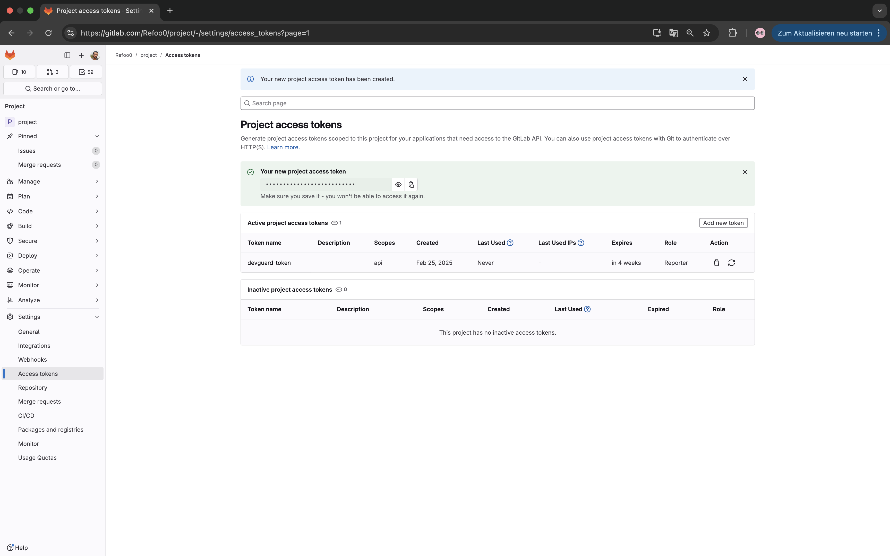
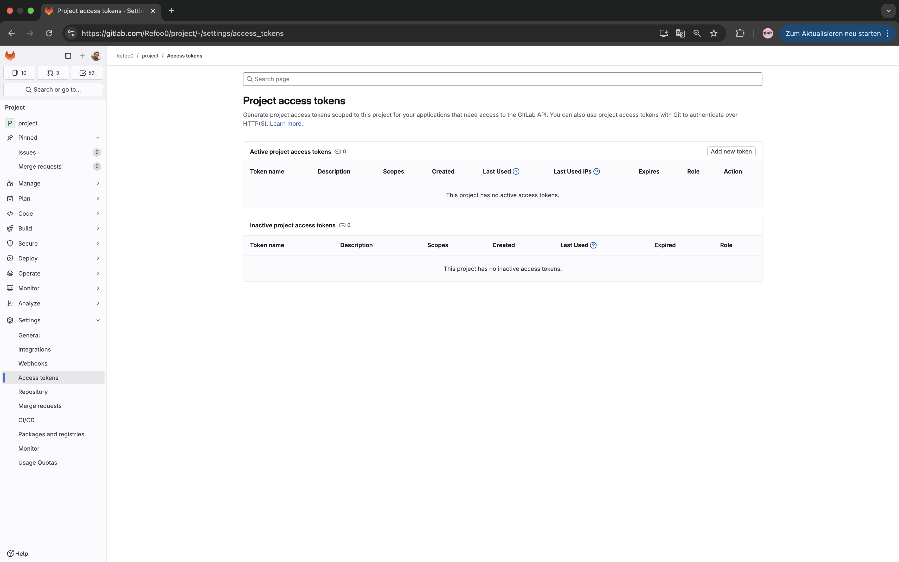

import { Steps, ImageZoom } from 'nextra/components'
import { Callout } from 'nextra/components'

# Set-up GitLab Integration

DevGuard integrates with GitLab to provide a seamless experience for developers. This guide will walk you through the steps to set up the integration.

## Steps

<Steps>

### Generate a new access token on GitLab
 
       Go to Project you want to integrate with Devguard on GitLab.  
      Choose Access tokens under Settings then click on `Add new token`.

    

    ### Configure your GitLab access token 
    Input a name and a description for the token.
     Under `Select a role` choose `Reporter`, you don't need to select any scope.
    Then click on Create project access token.
    

    ### Copy the generated token

    


### Go to organization settings on Devguard & click integrate with GitLab


### Configure your GitLab instance settings 

Add a name for the Integration (like Tom's Personal Access Token, or Project Access Token for DevGuard), the URL of your GitLab instance and the access token you generated in the previous step.


### Navigate to an asset within one of your projects and select your corresponding GitLab project.


    ### Add a webhook to your GitLab project
    Go to your GitLab project settings
    select Webhooks under Settings, then click on Add new webhook.

    

    ### Configure your GitLab webhook

    Paste following URL in the URL field: 

    if you are using devguard under stage.devguard.org
    ```sh copy 
    https://api.stage.devguard.org/api/v1/webhook/
    ```

    if you are using devguard under main.devguard.org
    ```sh copy
    https://api.main.devguard.org/api/v1/webhook/
    ```
    then select the events you want to trigger the webhook, it is recommended to select following events:

    - Comments
    - Issues events

    then click on Save changes


### Add a pipeline configuration
If you don’t have a .gitab-ci.yml file, create one by adding a new file in the root directory of your repository. The file should be located in the `.gitlab-ci.yml` directory and have a `.yml` extension. 

You can now add devguard components to your pipeline configuration file.
You can find more information about the pipeline configuration file [here](/other/gitlab-components/full.mdx).


Finally, push the changes to your repository.
</Steps>

## GitLab Access Tokens: Workaround for Limited Permissions

<Callout emoji="💡">
**Context:**
GitLab restricts group and project access tokens to paid plans. Additionally, group webhooks are not universally available. To simplify setup and grant access to only specific repositories (e.g., for DevGuard), you can use a **robot user** as a workaround.
</Callout>

---

#### Why Use a Robot User?
- **Granular Access:** Add the robot user only to the repositories you want to share.
- **No Paid Features Required:** Avoids the need for group/project access tokens.
- **Simplified Automation:** Works seamlessly with autosetup functionalities.

---

#### How to Set Up a Robot User

1. **Create a New GitLab Account**
   Register a new account (e.g., `devguard-robot@example.com`).
   Use a clear naming convention to distinguish it as a service account.

2. **Generate a Personal Access Token**
   Log in to the robot account.
   Navigate to **Settings > Access Tokens**.
   Create a token with the required permissions (e.g., `read_repository`, `write_repository`).

3. **Add the Robot User to Target Repositories**
   Go to the repository’s **Settings > Members**.
   Invite the robot user with the appropriate role (e.g., **Developer** or **Maintainer**).

4. **Use the Token in Your Automation**
   Configure your autosetup tool (e.g., DevGuard) to use the robot user’s token for authentication.

---

#### Best Practices
- **Security:** Restrict the robot user’s permissions to the minimum required.
- **Auditability:** Document the robot user’s purpose and access scope for your team.
- **Token Management:** Rotate tokens periodically and revoke access if the repository scope changes.

---


{/* ### Go to the security control center of the asset and click on auto setup to create a pipeline

 */}


Now you have successfully integrated your GitLab repository with DevGuard. You can integrate the CI/CD pipeline with DevGuard from the security control center of the asset in DevGuard. 