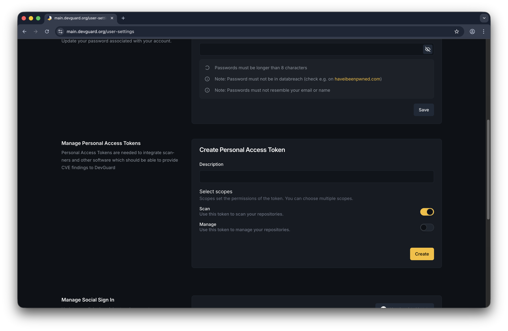

import { Callout } from '@document-writing-tools/kernux-theme'
import { DocTabs as Tabs } from '@document-writing-tools/kernux-theme'

# Use DevGuard API with Personal Access Tokens

Personal Access Tokens (PATs) authenticate with the DevGuard API for automation, CI/CD pipelines, and programmatic access. DevGuard supports two token types suited to different use cases.

## Token Types

Both token types grant the same API access — any action available to a Bearer token is equally available with an ECDSA-signed request, and vice versa. The difference is in how authentication works and the resulting security properties.

<Callout type="info">
  **Use request signing (ECDSA) whenever possible.** ECDSA signing provides stronger guarantees than a Bearer token:
  - **No secret transmission** — the private key never leaves your environment; only a signature travels over the wire
  - **Request integrity** — the full request body is included in the signature via a content digest, so tampering with the payload invalidates the signature
  - **Replay protection** — each signature covers the HTTP method and content digest, making captured requests useless without the private key
  
  A stolen Bearer token can be replayed from anywhere until it expires. A stolen ECDSA signature is worthless without the corresponding private key.
</Callout>

### Asymmetric Token (ECDSA Request Signing)

An asymmetric token uses a locally-generated ECDSA P-256 private key. The private key never leaves your machine — only the derived public key is registered with DevGuard. Each API request is signed with the private key; DevGuard verifies the signature.

**Best for:** CI/CD pipelines, automated scanners, any environment where you control the private key material.

### Symmetric Bearer Token

<Callout type="info">
  Available since **v1.6.0**
</Callout>

A symmetric token is an opaque secret prefixed with `dvg_` generated by DevGuard and shown to you once. You store it and send it as an `Authorization: Bearer <token>` header. DevGuard stores only a SHA-256 hash.

**Best for:** Quick automation scripts, webhooks, and integrations where request signing is impractical.

<Callout type="warning">
  The Bearer token cleartext is shown **only once** at creation. Copy it immediately and store it in a secrets manager or environment variable. It cannot be retrieved again.
</Callout>

## Scopes

Every token is created with one or more scopes that limit what the token can do:

| Scope | Access |
|-------|--------|
| `scan` | Upload scan results, read asset data |
| `manage` | Create, update, and delete resources via the API and Web UI |

Grant the minimum scope required for the task. Use `scan` for CI/CD scanners; use `manage` only for administrative automation.

## Expiry

All tokens have a mandatory expiry date. The maximum lifetime is **one year** from creation. Expired tokens are rejected at authentication time. Set the expiry as short as practical for your use case and rotate tokens regularly.

## Create a Token

**Top Right** → User Profile → **Settings** → **API Tokens** → **Create New Token**



Fill in:
- **Description** — a human-readable label (e.g., `github-actions-scanner`)
- **Token type** — *Asymmetric* (paste your ECDSA public key) or *Symmetric* (leave blank, server generates)
- **Scopes** — `scan`, `manage`, or both
- **Expiry date** — when the token should stop working (max 1 year)

For asymmetric tokens, generate a key pair first with the DevGuard CLI:

```sh
devguard-cli key generate
```

This outputs your private key (keep it secret) and the public key to paste during token creation.

## Authenticate Using a Token

<Tabs items={['Bearer Token', 'ECDSA Signing']}>
  <Tabs.Tab>
    Add the token to the `Authorization` header:

    ```sh
    curl -H "Authorization: Bearer dvg_<your-token>" \
      https://app.devguard.org/api/v1/organizations/my-org/projects/
    ```

    Or set it in your CI/CD environment:

    ```sh
    export DEVGUARD_TOKEN="dvg_<your-token>"
    ```
  </Tabs.Tab>
  <Tabs.Tab>
    The DevGuard scanner and CLI handle signing automatically when you provide the private key:

    ```sh
    devguard-scanner scan \
      --token <hex-private-key> \
      --asset my-org/my-project/my-asset
    ```

    For raw HTTP requests, the scanner signs the request with the ECDSA private key and attaches `X-Fingerprint`, `Signature`, and `Signature-Input` headers.
  </Tabs.Tab>
</Tabs>

## Revoke a Token

**Settings** → **API Tokens** → select token → **Revoke**

Revoked tokens are immediately rejected. For asymmetric tokens you can also revoke by private key from the CLI:

```sh
devguard-cli pat revoke --private-key <hex-private-key>
```

## Onboarding

Following the DevGuard onboarding flow, DevGuard can create a token for you with the permissions needed to get started quickly.

## Next Steps

- [API Reference](/reference) — Full REST API reference with interactive Swagger UI

## Related Documentation

- [Getting Started with DevGuard](/getting-started)
- [DevGuard How-To Guides](/how-to-guides)
- [DevGuard Explanations](/explanations)
