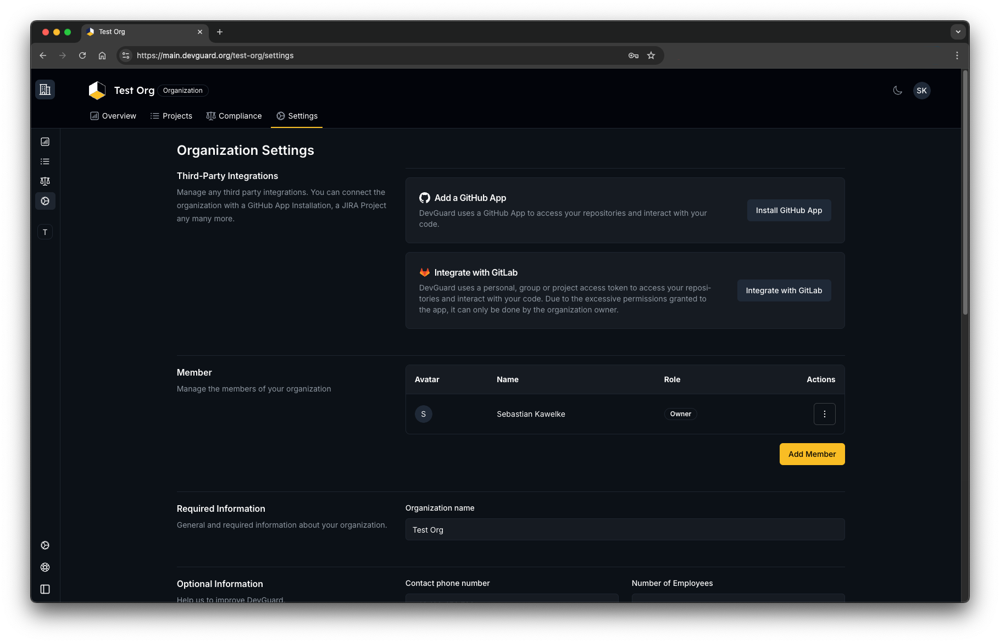
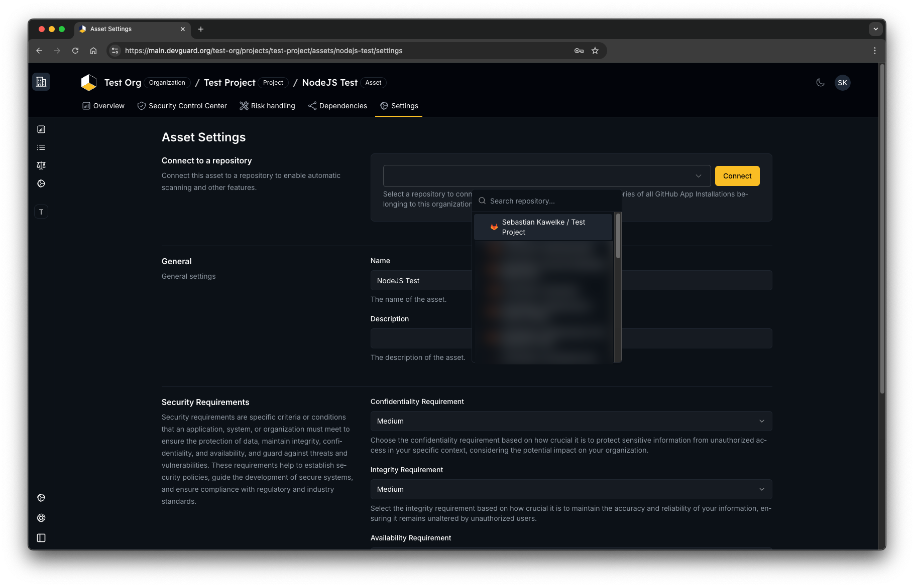
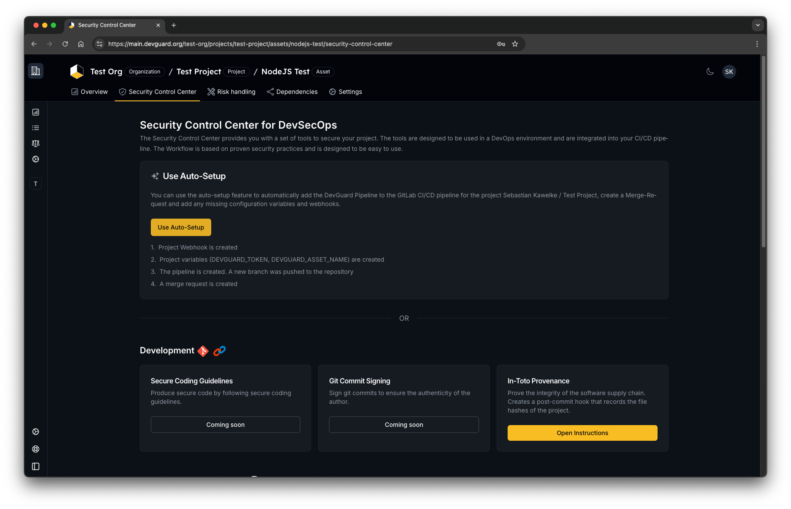

import { Steps, ImageZoom } from 'nextra/components'

# Set-up GitLab Integration

DevGuard integrates with GitLab to provide a seamless experience for developers. This guide will walk you through the steps to set up the integration.

## Steps

<Steps>
### Go to organization settings & click integrate with GitLab

### Configure your GitLab instance settings 

To use Auto-Setup and benefit from ticket creation etc. your token will need `api` access.

### Navigate to an asset within one of your projects and select your corresponding GitLab project

### Go to the security control center of the asset and click on auto setup to create a pipeline

</Steps>

