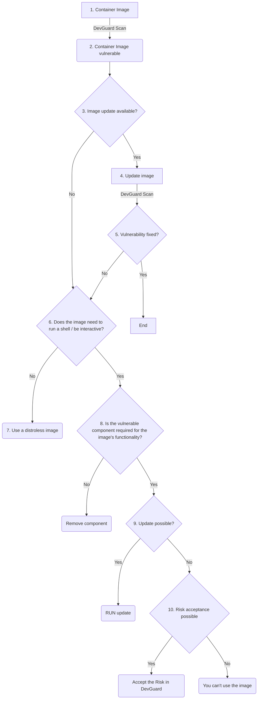

import Image from "next/image";

# Container Hardening Overview
You should harden container images to reduce the attack surface and minimize security risks. Lean, hardened images remove unnecessary tools, packages, and shells that attackers could exploit. This ensures compliance with security best practices, lowers the chance of vulnerabilities, and improves reliability by keeping images minimal, predictable, and easier to maintain.

This Guide shows you a possible Workflow for your container hardening in DevGuard.

## The General Process
The following Flow-Chart demonstrates the thought and action process, you need to follow for the succesfull hardening of your container image.

**A. Scan the container image**  
   - Run a DevGuard scan of the image.  
   - If no vulnerabilities are found, the process ends here.   

**B. Check if an image update is available**  
   - Verify if an updated base image or patch release exists.  
   - If yes, update the image and re-scan.    

**C. Evaluate if the vulnerability is fixed**  
   - If the vulnerability is resolved after the update, the process ends here.  
   - If not, continue with step 6.  

**D. Determine if the image needs a shell or interactivity**  
   - If no, switch to a **distroless image**.  
   - If yes, continue with step 8.  

**E. Check if the vulnerable component is required**  
   - If no, remove the component and re-scan.  
   - If yes, continue with step 9.  

**F. Check if updating the component is possible**  
   - If yes, update the component and re-scan.  
   - If no, continue with step 10.  

**G. Assess risk acceptance**  
   - If the risk can be accepted, document it in DevGuard (include justification, compensating controls, and expiry date).  
   - If not, the image must not be used.   

---

## General Best Practices for Image Hardening

- Always use **minimal base images** and prefer distroless if possible.  
- Remove **unnecessary packages, tools, and shells** to reduce the attack surface.  
- Run containers as a **non-root user**.  
- Use **read-only file systems** and restrict Linux capabilities to the minimum required.  
- Apply **Seccomp or AppArmor profiles** to limit runtime attacks.  
