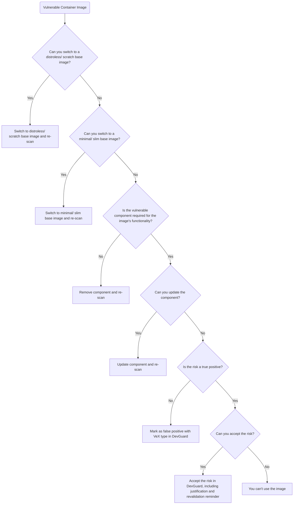

# Container Hardening CVE Decision Guide

Critical part of container hardening is the handling of vulnerabilities found in your container images and your
applications dependencies.

For findings in your application dependencies, you can follow the process described in the
[SCA risk mitigation guide](/risk-mitigation-guides/software-composition-analysis).

For findings in your container images, you can follow the process described in this guide.

## A CVE Decision Process

The following decision tree describes a process you can follow when handling vulnerabilities found in your container images.

### Explanation of the Decision Points

1. **Can you switch to a distroless/ scratch base image?**
   Distroless and scratch images are minimal and contain only the application and its runtime dependencies, reducing the attack surface.
   If you can switch to such an image, do so and re-scan for vulnerabilities.

2. **Can you switch to a minimal/ slim base image?**
   If a distroless or scratch image is not feasible, consider switching to a minimal or slim base image (e.g., Alpine, Debian Slim).
   These images are smaller and often have fewer vulnerabilities than full-featured base images.
   If you can switch to such an image, do so and re-scan for vulnerabilities.

3. **Is the vulnerable component required for the image's functionality?**
   If the vulnerable component is not essential for the image's functionality, remove it and re-scan for vulnerabilities.

4. **Can you update the component?**
   If the component is essential, check if an updated version is available that resolves the vulnerability.
   If an update is available, apply it and re-scan for vulnerabilities.

5. **Is the risk a true positive?**
   If no updates are available, assess whether the vulnerability is a true positive or a false positive.
   DevGuard supports you here with details like the location of the vulnerable component.
   If it's a false positive, mark it as such in DevGuard using the VeX types.

6. **Can you accept the risk?**
   If the vulnerability is a true positive, evaluate whether the risk can be accepted based on factors like the severity of
   the vulnerability, the exposure of the container, and the potential impact on your application and users.
   If you can accept the risk, document the justification in DevGuard and set a reminder for revalidation.
   If the risk cannot be accepted, you cannot use the image and must look for alternatives.