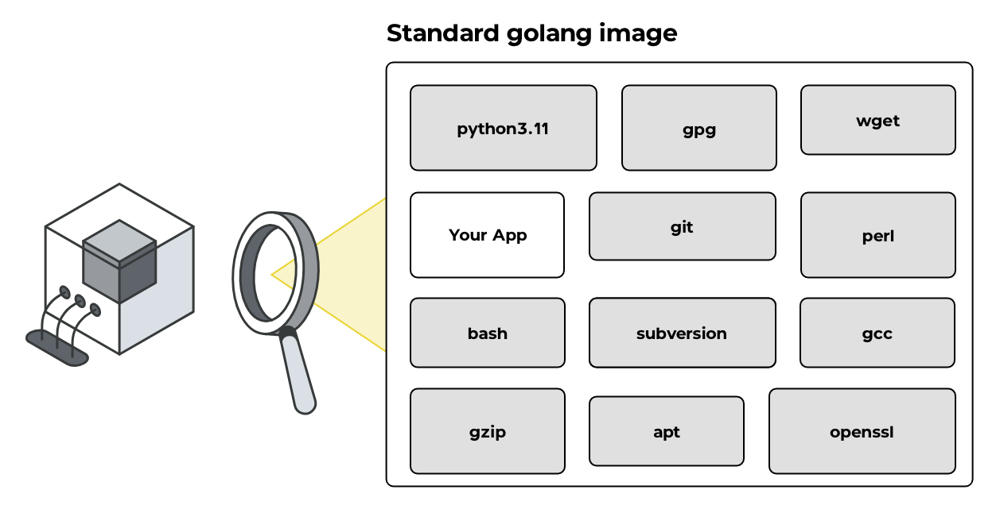

import { Steps } from 'nextra/components'
import { Tabs } from 'nextra/components'

# Container Scanning

## Handling Found Flaws: Practical Steps for Mitigation

When DevGuard's container scanning detects vulnerabilities, such as the example provided below, it’s essential to address them 
promptly to maintain security and compliance. Here’s a step-by-step guide to managing identified flaws.

```md filename="Example Flaw"
# CVE-2022-41903

Git is distributed revision control system. git log can display commits in an arbitrary...

## Affected component

The vulnerability is in `pkg:deb/debian/git@2.39.5-0+deb12u1`, detected by the `container-scanning` scan.

## Recommended fix

Upgrade to version 1:2.39.1-0.1 or later.
```

### Where to Look

The `Dockerfile` of the container is typically the starting point for analysis. This file defines the container’s 
base image and specifies instructions for building the containerized application. Vulnerabilities often originate 
from the base image or additional packages installed during the build. Your dependencies will be checked in the 
"Software Composition Analysis" (SCA) step.

### Steps to Fix

<Steps>
### Check the Base Image
 
Examine the base image specified in the Dockerfile. For example:
 
### Update the Base Image or Switch to Distroless
 
If the base image contains the vulnerability and a direct update is possible:
- **Update the base image:**
Replace the current base image with a patched version.

If the base image cannot be updated or you’re looking to minimize attack surface:

- **Switch to a distroless base image:**
Use distroless images, which contain only the runtime essentials, reducing potential vulnerabilities.

Example multi-stage, distroless build:

<Tabs items={['Golang', 'NodeJS']}>
    <Tabs.Tab>
        ```docker filename="Dockerfile" copy
        # Step 1 - Build the application
        FROM golang:1.23.3@sha256:73f06be4578c9987ce560087e2e2ea6485fb605e3910542cadd8fa09fc5f3e31 as build
        WORKDIR /go/src/app
        COPY . .
        RUN go mod download
        RUN CGO_ENABLED=0 go build -o /go/bin/app /go/src/app/cmd/scanner

        # Step 2 - Create the final image
        FROM gcr.io/distroless/static-debian12:nonroot@sha256:d71f4b239be2d412017b798a0a401c44c3049a3ca454838473a4c32ed076bfea
        USER 53111
        COPY --from=build /go/bin/app /
        EXPOSE 8080

        CMD ["/app"]
        ```
    </Tabs.Tab>
    <Tabs.Tab>
        ```docker filename="Dockerfile" copy
        # Step 1 - Build the application
        FROM node:22.11.0-bookworm@sha256:5c76d05034644fa8ecc9c2aa84e0a83cd981d0ef13af5455b87b9adf5b216561 as builder
        WORKDIR /usr/app/
        ENV PORT 3000
        ENV NODE_ENV production
        COPY package.json .
        COPY package-lock.json .
        RUN npm ci
        COPY . .
        RUN npm run build

        # Step 2 - Create the final image
        FROM gcr.io/distroless/nodejs22-debian12:nonroot@sha256:de286271ef771e563194702ff49cc5d60e7ea59a09349cdae129e3b0c6ab396b
        USER 53111
        WORKDIR /usr/app/
        ENV PORT 3000
        ENV NODE_ENV production
        EXPOSE 3000
        COPY --from=builder --chown=53111:53111 /usr/app/.next /usr/app/.next
        COPY --from=builder /usr/app/node_modules /usr/app/node_modules
        COPY --from=builder /usr/app/package.json /usr/app/package.json
        COPY --from=builder --chown=53111:53111 /usr/app/public /usr/app/public

        CMD [ "./node_modules/next/dist/bin/next", "start" ]
        ```
    </Tabs.Tab>
</Tabs>

### Manually Update Vulnerable Packages

If reproducibility is not a strict requirement or the base image cannot be updated:
Use the package manager during the build to patch the specific vulnerability.
Example for Debian-based containers:

```docker filename="Dockerfile" copy
RUN apt-get update && apt-get install --only-upgrade git -y
```

**Disclaimer:** This approach may hinder reproducibility, as future builds may result in different package versions if repositories change.

### Alternative Measures

If none of the above fixes are feasible:
- **Risk Acceptance**: Temporarily accept the risk using DevGuard’s risk management feature.
  - Document the accepted risk by providing a justification. Use the UI or slash commands in the issue.
  - Set a reminder for future review; DevGuard will automatically notify you after a predefined period.

- **Avoidance**: Disable risky functionality or service.

</Steps>

## What is a Container?

A container is a lightweight, standalone, and executable software package that includes everything 
needed to run a piece of software: code, runtime, system tools, libraries, and settings. Containers 
are built on the concept of virtualization but are more resource-efficient because they share the 
host system’s operating system kernel (basically, they are an encapsulated “normal process”).

They are widely used in modern software development to ensure consistency across different environments, 
such as development, testing, and production, as they encapsulate the application and its dependencies. 
Popular containerization tools include Docker and Kubernetes for container management.

## What Happens During Container Scanning?



Container scanning is a crucial process in a security assessment, designed to uncover vulnerabilities 
and security risks within containerized applications. With tools like DevGuard, the scanning process 
involves the following key steps:

1. **Generating a Software Bill of Materials (SBOM)**

An SBOM is a detailed inventory of all components and dependencies within the container. During this phase:
- The container image is analysed to identify the software packages, libraries, and tools it contains.
- Version information for each component is extracted.

This SBOM provides a transparent view of the container’s contents, serving as the foundation for further 
security analysis.

2. **Checking for Known Vulnerabilities**

DevGuard leverages its vulnerability database to detect known security flaws in the components listed in the SBOM:
- The identified software packages are cross-referenced with vulnerability databases, such as CVE (Common Vulnerabilities and Exposures) lists, and DevGuard’s extended database.
- The scanning process flags outdated or insecure versions of software.
- Vulnerabilities are categorized by severity, enabling prioritization of remediation efforts.

By detecting known vulnerabilities, container scanning helps prevent the exploitation of weaknesses in production environments.