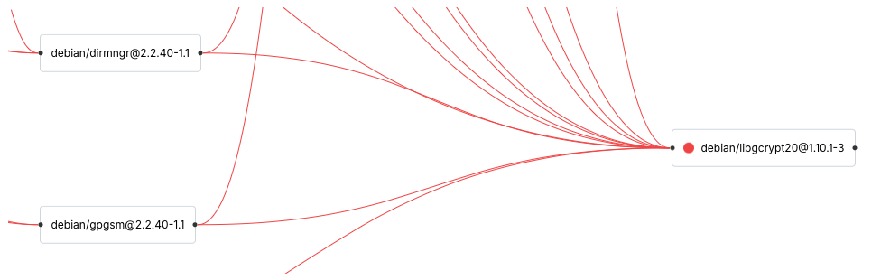

import { Steps, Tabs, Callout } from 'nextra/components'

# Software Composition Analysis (SCA)

<Callout type="info" emoji="ℹ️">
  DevGuard performs continous sca to identify vulnerabilities in your project's dependencies after your first scan (based on SBOM).
</Callout>

## Handling Found Flaws: Practical Steps for Mitigation

When DevGuard's **software composition analysis** detects vulnerabilities, such as the example provided below, it’s essential to address them 
promptly to maintain security and compliance. Here’s a step-by-step guide to manage identified flaws.

```md filename="Example Flaw"
# CVE-2024-45812

Vite a frontend build tooling framework for javascript. Affected versions of vite..

## Affected component

The vulnerability is in `pkg:npm/webpack@5.88.1`, detected by the `sca` scan.

## Recommended fix

Upgrade to version 5.94.0 or later.
```

### Where to Look

When addressing vulnerabilities found in the Software Composition Analysis (SCA) step, start by examining the dependencies in your project. The key areas to review include:
- **Package Files:** Inspect `package.json`, `requirements.txt`, `pom.xml`, `Gemfile.lock`, or equivalent files based on your project’s language and dependency manager.
- Dependency Trees: Use DevGuard's dependency tree visualization to map out direct and transitive dependencies and their risks. ([Example for DevGuard Docs](https://main.devguard.org/l3montree-cybersecurity/projects/devguard/assets/devguard-documentation/dependency-graph))
- Configuration Files: Analyze any custom configurations or overrides for dependency versions.

### Steps to Fix

<Steps>

### Analyze and Update Direct Dependencies

1.	**Locate the Vulnerable Package:** Identify the specific package and version causing the vulnerability. For example:

```json filename="package.json"
{
  ...
  "dependencies": {
    "webpack": "5.88.1"
    ...
  }
  ...
}
```

2.	**Upgrade the Dependency:** Update the vulnerable package to the recommended version. For npm-based projects:

<Tabs items={['npm', 'npm audit', 'go']}>
    <Tabs.Tab>
        ```bash filename="Terminal" copy
        npm install webpack@5.94.0
        ```
    </Tabs.Tab>
    <Tabs.Tab>
        ```bash filename="Terminal" copy
        npm audit fix # see: docs.npmjs.com/cli/v10/commands/npm-audit
        ```
    </Tabs.Tab>
    <Tabs.Tab>
        ```bash filename="Terminal" copy
        go get -u && go mod tidy
        ```
    </Tabs.Tab>
</Tabs>

3.	**Test Changes:** Verify the application for any breaking changes due to the update.

### Handling Transitive Dependencies



Dealing with transitive dependencies is a complex and often resource-intensive process, especially when the vulnerable code is buried deep within your dependency tree.

1.	**Analyze and Track the Vulnerable Dependency:** Use DevGuard’s dependency tree visualization to identify the vulnerable transitive dependency (see example above). The identify the direct dependency that includes the vulnerable transitive dependency.
	
2.	**Assess Reachability:** Determine whether your application actually uses the vulnerable functionality. If it’s not reachable in your execution path, the practical risk may be lower. This is a challenging task to perform manually and often requires detailed knowledge of the dependency and its implementation.
	
3.	**Automating Reachability Analysis (Future Development):** DevGuard is actively researching and developing a reachability analysis feature that will automate this process. This tool aims to identify whether vulnerabilities in transitive dependencies are truly exploitable in your specific application context, significantly reducing the burden on developers.

4.	**Mitigation Strategies:**
    - Risk Acceptance: If the direct dependency maintainer has not yet released a fix and you’ve verified limited exposure to the vulnerability, you may accept the risk temporarily and document the decision. DevGuard monitors the dependency for updates and will notify you.
    - Temporary Workarounds: Disable or replace the affected functionality where possible.
    - Help in Upstream: Engage with the maintainers of the relevant dependencies to ensure they’re aware of the issue and help them to update.

### Alternative Measures

If none of the above fixes are feasible:
- **Risk Acceptance**: Temporarily accept the risk using DevGuard’s risk management feature.
  - Document the accepted risk by providing a justification. Use the UI or slash commands in the issue.
  - Set a reminder for future review; DevGuard will automatically notify you after a predefined period.

- **Avoidance**: Limit exposure by sandboxing or disabling affected functionality.

</Steps>

## What is Software Composition Analysis?

Software Composition Analysis (SCA) identifies and assesses open-source and third-party dependencies in your software. By analyzing dependency manifests and runtime libraries, SCA detects known vulnerabilities. This process is crucial for managing risks associated with using open-source software.

## How DevGuard SCA Works

1.	SBOM Generation: DevGuard uses [Trivy](https://github.com/aquasecurity/trivy) to scan the application’s dependencies and generate a Software Bill of Materials (SBOM). The SBOM contains all detected components and their metadata.
2.	Vulnerability Matching:
    The SBOM is cross-referenced with:
    - Public vulnerability databases like CVE.
    - DevGuard’s extended database for enhanced coverage.
3.	Risk Reporting: Tickets are automatically created for detected flaws if integrations (e.g., GitLab Issues, GitHub Issues) are enabled. Otherwise, the risks are visible in:
    - DevGuard UI: A dashboard showing the current risk posture.
    - Command Output: Run `devguard-scanner sca` to view detected vulnerabilities.

## Why SCA Matters

- Security: Protect against exploits by addressing known vulnerabilities.
- Compliance: Ensure alignment with compliance and security framework requirements.
- Reliability: Minimize runtime failures due to outdated or insecure dependencies.

By incorporating SCA into your development lifecycle, you can proactively manage risks and contribute to a secure software supply chain.