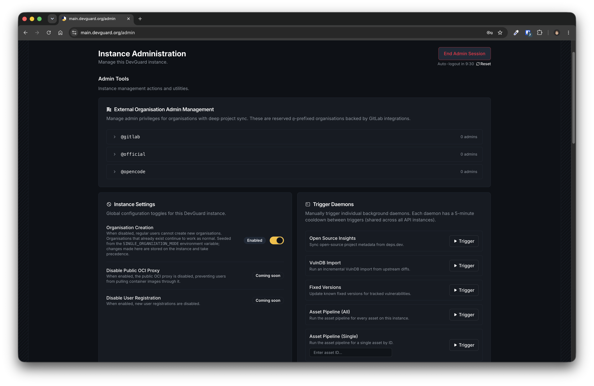

import { Callout, DocSteps as Steps } from '@document-writing-tools/kernux-theme'

# Instance Admin Dashboard

The instance admin dashboard gives operators of a self-hosted DevGuard a single place to manage the whole instance - independent of any organization. It is served by the web frontend at `/admin` and is protected by a cryptographic key rather than a normal user login.

<Callout type="info">
  The instance admin dashboard is available since **DevGuard v1.7.0** (Helm chart `1.7.0`, app version `v1.7.0`). On earlier versions the `/admin` route does not exist.
</Callout>



## What You Can Do

Once authenticated, the dashboard exposes three sections:

- **Admin Tools** - instance-wide management actions: manage instance admins of external-entity organisations (the GitLab-backed `@`-prefixed orgs), toggle global instance settings such as organisation creation (with user-registration and public OCI proxy toggles rolling out), and manually trigger background daemons - Open Source Insights, VulnDB import, fixed-version detection, and the asset pipeline (all assets or a single asset).
- **Instance Technical Info** - build version, Go runtime and memory statistics, and database status.
- **Instance Usage Statistics** - users, organisations, projects, the overall security posture across the instance, and the top vulnerable projects.

## How Authentication Works

The dashboard does **not** use accounts, passwords, or OIDC. Access is granted with an ECDSA P-256 keypair:

- The **public key** is configured on the server. DevGuard loads it at startup and uses it to verify incoming admin requests.
- The **private key** is held by you. You paste it into the `/admin` page, where the browser uses it to sign each request to the admin API (HTTP message signatures, RFC 9421).

<Callout type="info">
  The private key is **never sent to the server**. It is imported into a in-memory key for the current browser tab, used only to sign requests locally, and is cleared on page reload, logout, or after 10 minutes of inactivity.
</Callout>

Because verification depends entirely on the configured public key, **leaving the public key unset disables all admin endpoints** - `/admin` requests are rejected with `401 Unauthorized`.

## Prerequisites

- A self-hosted DevGuard installation on **v1.7.0 or newer** (Kubernetes via Helm, or Docker Compose)
- Access to modify the Helm chart `values.yaml` (or the Docker Compose environment)
- Either Docker or a Go toolchain to run the `devguard-cli`

## Set Up the Admin Dashboard

<Steps>

### Generate an admin keypair

Use the [`gen-admin-key`](https://github.com/l3montree-dev/devguard/blob/main/cmd/devguard-cli/commands/gen_admin_key.go) command of the `devguard-cli`. The CLI is bundled in the same container image as the API, so no extra download is required:

```bash
docker run --rm --entrypoint devguard-cli \
  ghcr.io/l3montree-dev/devguard:v1.7.0 gen-admin-key
```

Alternatively, run it from source with a Go toolchain:

```bash
go run github.com/l3montree-dev/devguard/cmd/devguard-cli@latest gen-admin-key
```

The command prints a freshly generated keypair:

```text
Private key (keep secret, use for signing):
3a7f9c1e... (64 hex chars)

Public key (write to file, set INSTANCE_ADMIN_PUB_KEY_PATH):
a1b2c3d4... (128 hex chars)
```

<Callout type="warning">
  Store the **private key** in a secret manager and treat it like a root credential - anyone holding it has full instance admin access. The public key is the only part that goes onto the server.
</Callout>

### Configure the public key in the Helm chart

Add the **public** key to the `api` block of your `values.yaml`:

```yaml
api:
  # Only the PUBLIC key belongs here. Keep the private key secret.
  # Leave empty / commented out to disable admin endpoint access.
  adminPublicKey: "a1b2c3d4...your-128-char-public-key-hex..."
```

When `api.adminPublicKey` is set, the chart automatically:

1. creates the `devguard-instance-admin-pub-key` secret holding the key,
2. mounts it into the API pod at `/instance_admin_pub_key.pem`, and
3. sets `INSTANCE_ADMIN_PUB_KEY_PATH` so DevGuard loads it on startup.

Apply the change with a `helm upgrade`:

```bash
helm upgrade devguard oci://ghcr.io/l3montree-dev/devguard-helm-chart/devguard \
  --version 1.7.0 \
  --namespace devguard \
  -f values.yaml
```

### Access the dashboard

Open `/admin` on your DevGuard web frontend (for example `https://devguard.example.com/admin`). Paste your **private key** (hex) into the *Private Key* field and select **Authenticate**.

<Callout type="warning">
  Only ever enter your private key on a DevGuard instance you own and trust. The login screen shows the current host for exactly this reason - never paste an admin key on a site you do not recognise.
</Callout>

</Steps>

## Docker Compose Configuration

For a Docker Compose deployment, write the public key to a file and mount it into the API service, then point `INSTANCE_ADMIN_PUB_KEY_PATH` at it:

```yaml
services:
  devguard-api:
    environment:
      - INSTANCE_ADMIN_PUB_KEY_PATH=/instance_admin_pub_key.pem
    volumes:
      - ./instance_admin_pub_key.pem:/instance_admin_pub_key.pem:ro
```

The mounted file must contain the hex-encoded public key (the second value printed by `gen-admin-key`). Restart the API container to load it.

## Disabling Admin Access

To turn the admin dashboard off again, remove or empty the public key:

- **Helm**: comment out or clear `api.adminPublicKey` and run `helm upgrade`. The secret, volume mount, and environment variable are no longer rendered.
- **Docker Compose**: remove the `INSTANCE_ADMIN_PUB_KEY_PATH` environment variable (or the mounted key) and restart.

With no public key loaded, every `/admin` API request returns `401 Unauthorized`.

## Security Best Practices

- **Keep the private key offline.** Generate it on a trusted machine and store it in a secret manager or hardware token, not in the repository that holds your `values.yaml`.
- **Rotate by regenerating.** To revoke access, generate a new keypair, update `api.adminPublicKey`, and roll out the change - the old private key stops working immediately.
- **Use one key per operator** where practical, so access can be revoked individually.
- **Serve the frontend over HTTPS** so the key you paste cannot be intercepted, and confirm the host shown on the login screen before authenticating.

## Related Documentation

- [Deploy DevGuard with Helm](/how-to-guides/administration/deploy-with-helm) - base installation and `values.yaml`
- [Deploy with Docker Compose](/how-to-guides/administration/deploy-with-docker) - non-Kubernetes setup
- [OIDC & Restricting Access](/how-to-guides/administration/restricting-access) - user authentication and SSO
- [Monitoring & Metrics](/how-to-guides/administration/monitoring-metrics) - observability for your instance
