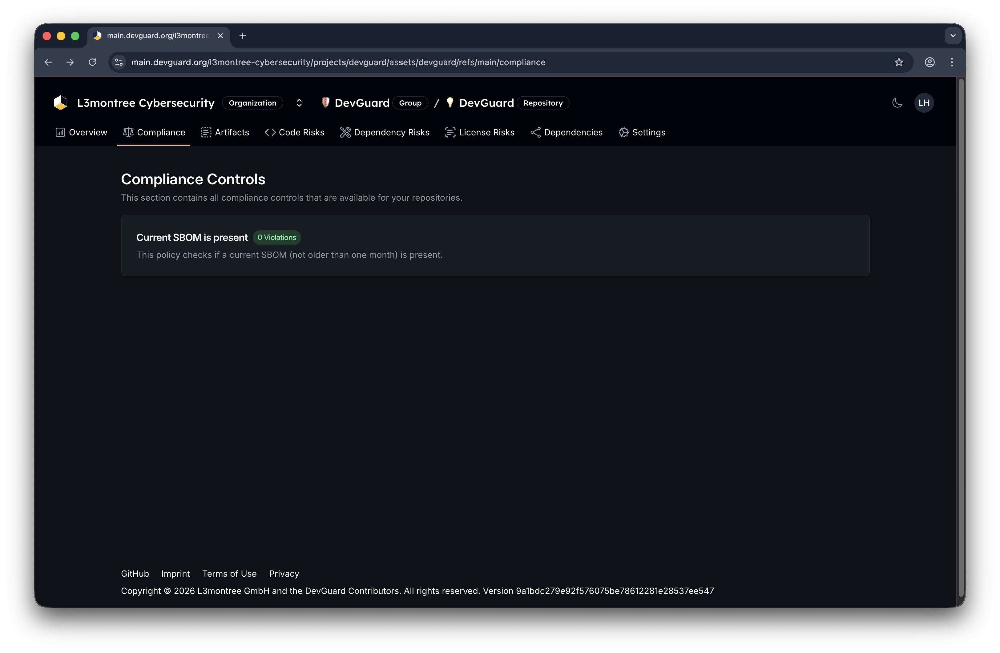

import { Callout, Tabs } from 'nextra/components'
import { Badge } from 'src/components/ui/badge'

# Manage Compliance & Attestation Policies

Create and manage attestation policies that automatically evaluate compliance requirements across your repositories using compliance-as-code. Monitor compliance status at organization, project, and repository levels.

## Prerequisites

Before you begin, ensure you have:

- Access to a DevGuard organization
- Admin or owner permissions (for policy creation)
- Understanding of compliance frameworks (ISO 27001, CRA, etc.)
- At least one repository with attestations

## What Are Attestation Policies?

Attestation policies are:

- **Compliance-as-code** - Policies written in Rego language
- **Framework-mapped** - Link to ISO 27001, CRA, SLSA, etc.
- **Reusable** - Share across organization and projects
- **Auditable** - Track evaluation results over time

<Callout type="info">
  Attestation policies use the Rego policy language. They evaluate metadata from attestations (SBOM, VEX, in-toto, etc.) during your CI/CD process to determine compliance.

</Callout>

## View Compliance Dashboards

### Organization-Level Compliance View

Navigate to **Organization** → **Compliance**

### Project-Level Compliance View

Navigate to **Organization** → **Project** → **Compliance**

<Callout type="info">
    Enabling a policy at the project level tells DevGuard to evaluate that
    policy against this project's repositories. Only organization admins can
    manage project-level policies.
</Callout>

### Repository-Level Compliance View

Inspect detailed compliance control evaluations for a specific repository version:

Navigate to **Organization** → **Project** → **Repository** → **Compliance**

## Navigate to Attestation Policies

Access policy management at organization level:

### Create and Enable Policy

1. Navigate to **Organization** → **Compliance** → **Policies**
2. Click **Create Policy**
3. Enter policy details:
    - **Policy name** - Descriptive title
    - **Description** - What it checks
    - **Rego code** - Policy logic
    - **Framework mapping** - Link to ISO 27001, CRA, etc.
    - **Tags** - For organization (security, license, etc.)

[Create Attestation Policy](https://play.openpolicyagent.org/p/DKToCnw0DL)

## Inspect Policy Violations

Understand why a policy failed:

Navigate to **Organization** → **Compliance** → **Policies**

## Next Steps

- [View Compliance Dashboards](./compliance-dashboards.mdx) - Monitor all policy results
- [Generate VEX Documents](./generate-vex-documents.mdx) - Document vulnerability assessments
- [Understand Compliance Frameworks](../../explanations/compliance-frameworks/iso.mdx) - Learn ISO 27001 requirements
  Generate CSAF Reports](./generate-csaf-reports.mdx) - Create compliance-focused security advisories
- [Generate VEX Documents](./generate-vex-documents.mdx) - Document vulnerability assessments
- [Export SBOMs](./export-sbom.mdx) - Download component inventories for audit purposes
- [Manage Attestations](../security/supply-chain/manage-attestations.mdx) - Ensure required attestations exist
