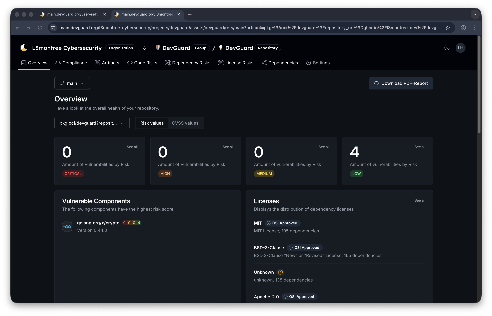

import { Callout } from 'nextra/components'

# View Vulnerability Event History

DevGuard automatically records every action taken on vulnerabilities, creating an audit trail of decisions and justifications. Access this event history on each vulnerability's detail page.

<Callout type="info">
  Event timelines provide comprehensive audit trails for compliance frameworks like ISO 27001, SOC 2, and CRA. Every vulnerability decision includes timestamps, user attribution, and justification.
</Callout>

## Prerequisites

Before you begin, ensure you have:

- Access to a DevGuard organization and project
- An asset with scanned vulnerabilities
- Read access to vulnerability details

## View Event Details Across Assets

For organization-wide compliance tracking, see [Compliance Dashboards](./compliance-dashboards.mdx) for vulnerability metrics and trends that reflect the cumulative impact of these vulnerability events.

### Generate PDF Reports for audits

1. Navigate to **Organization** → **Overview** 
2. Select Artifact on the left side.

[PDF Example]("https://main.devguard.org/l3montree-cybersecurity/projects/devguard/assets/devguard/refs/main/vulnerability-report.pdf?artifact=pkg%3Aoci%2Fdevguard%3Frepository_url%3Dghcr.io%2Fl3montree-dev%2Fdevguard")

### Exporting for Audits

To include vulnerability event history in compliance documentation:

1. Generate [CSAF Reports](./generate-csaf-reports.mdx) that include event justifications
2. Generate [VEX Documents](./generate-vex-documents.mdx) that document vulnerability status decisions

These reports can be downloaded and provided to auditors as evidence of your vulnerability management process.

## Related Documentation

- [Create Vulnerability Events](../vulnerability-management/create-vuln-events.mdx) - Add and manage events
- [Compliance Audit Trails](../../explanations/compliance/audit-trails.mdx) - Understand audit logging concepts
- [Generate CSAF Reports](./generate-csaf-reports.mdx) - Export event justifications
- [Vulnerability Lifecycle](../../explanations/compliance/vulnerability-lifecycle.mdx) - Understand decision workflows
