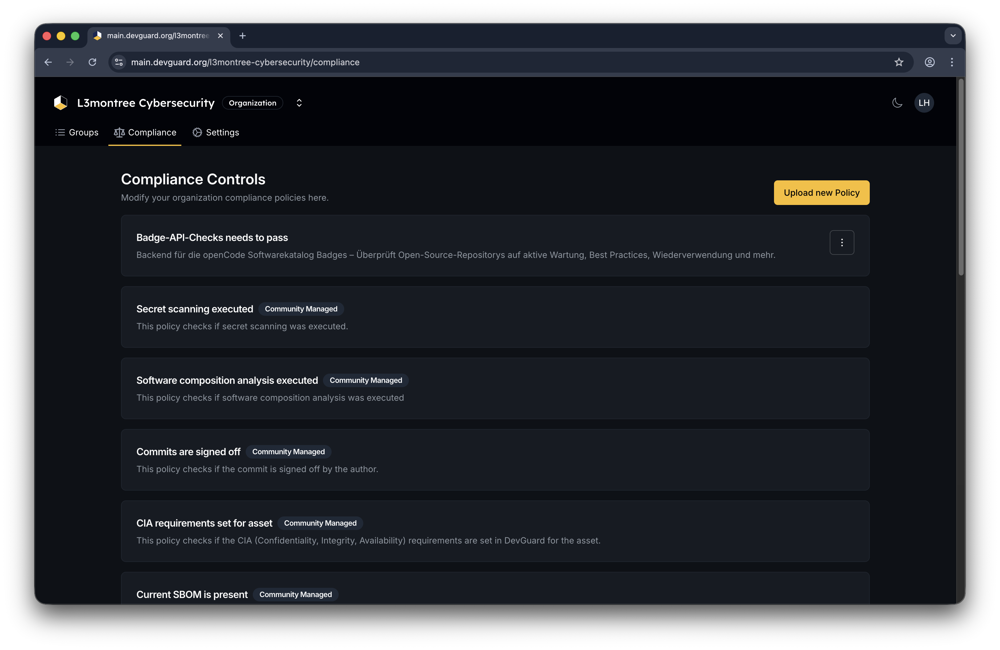
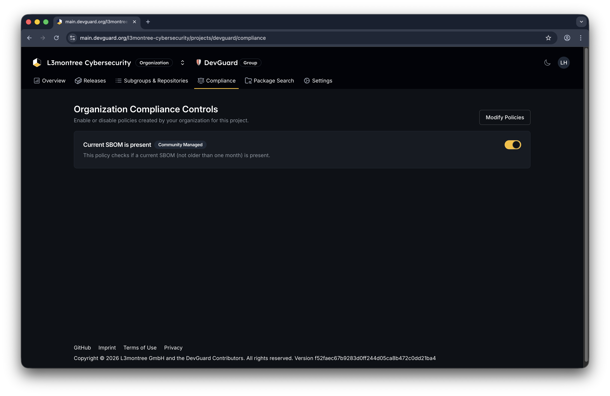
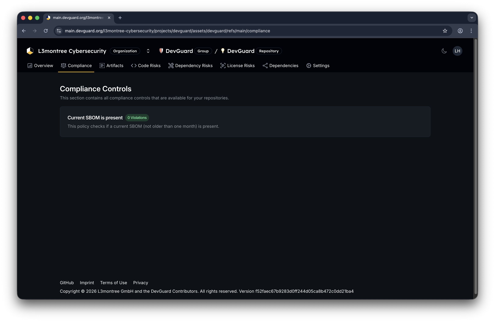

import { Callout, Tabs } from 'nextra/components'
import { Badge } from "src/components/ui/badge"

# View Compliance Dashboards

Monitor compliance control evaluations and policy violations at the organization, project, and repository levels.

## Prerequisites

Before you begin, ensure you have:

- Access to a DevGuard organization
- Compliance policies created and enabled for your organization
- At least one repository with attestations evaluated against compliance policies

## Organization-Level Compliance View

Access the organization-wide compliance dashboard to see all policies created by your organization or select premade polices:

Navigate to **Organization** → **Compliance**

## Project-Level Compliance View

Track compliance for all repositories within a specific project:

Navigate to **Organization** → **Project** → **Compliance**

<Callout type="info">
  Enabling a policy at the project level tells DevGuard to evaluate that policy against this project's repositories. Only organization admins can manage project-level policies.
</Callout>

## Repository-Level Compliance View

Inspect detailed compliance control evaluations for a specific repository version:
Navigate to **Organization** → **Project** → **Repository** → **Compliance**

	<a href="https://github.com/l3montree-dev/devguard/issues?q=is%3Aissue%20state%3Aopen%20CSAF" target="_blank" rel="noreferrer noopener">
		<Badge variant="upcoming">Upcoming Feature 🎉</Badge>
	</a>

[Enforcing Repo Policy into CI/CD Pipelines!](https://github.com/l3montree-dev/compliance-as-code-attestors)

## Meta Data for Compliance Controls

To improve the Compliance Rego Ecosystem, we highly recommend adding metadata to your compliance controls.

 Review the policy metadata:
   - **Title** - Control name
   - **Description** - What the control verifies
   - **Compliance frameworks** - Which standards it supports (ISO 27001, CRA, etc.)
   - **Related resources** - Documentation links
   - **Tags** - Classification tags

More information on how to write your own compliance policies with metadata can be found in the [Official Open Policy Agent Documentation](https://www.openpolicyagent.org/docs/policy-language).

## Next Steps

- [Generate CSAF Reports](./generate-csaf-reports.mdx) - Create compliance-focused security advisories
- [Export SBOMs](./export-sbom.mdx) - Download component inventories for audit purposes
- [Manage Attestations](../security/supply-chain/manage-attestations.mdx) - Ensure required attestations exist
- [Create Attestation Policies](./attestation-policies.mdx) - Learn how policies evaluate your repositories
