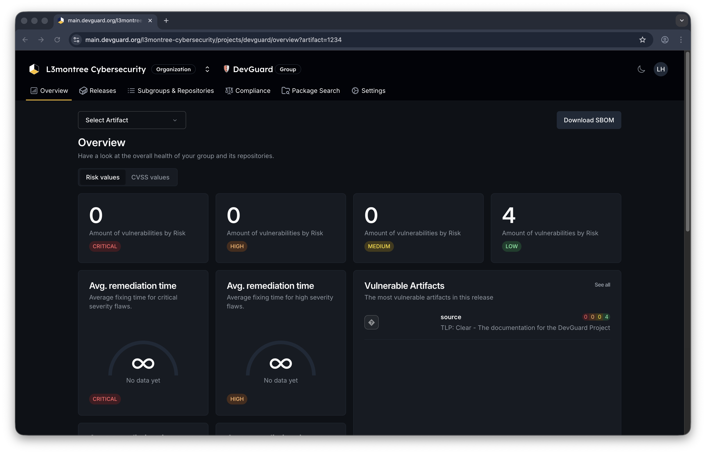
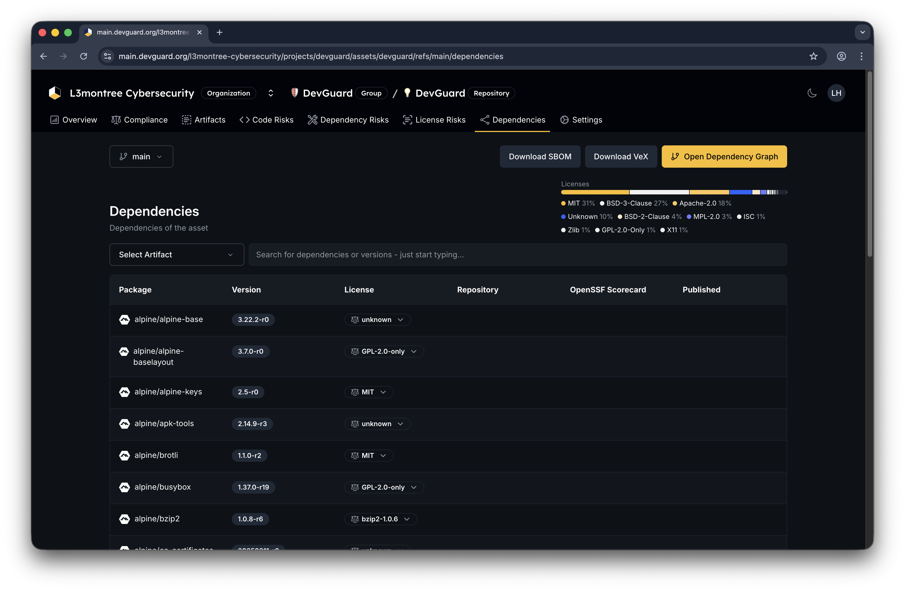
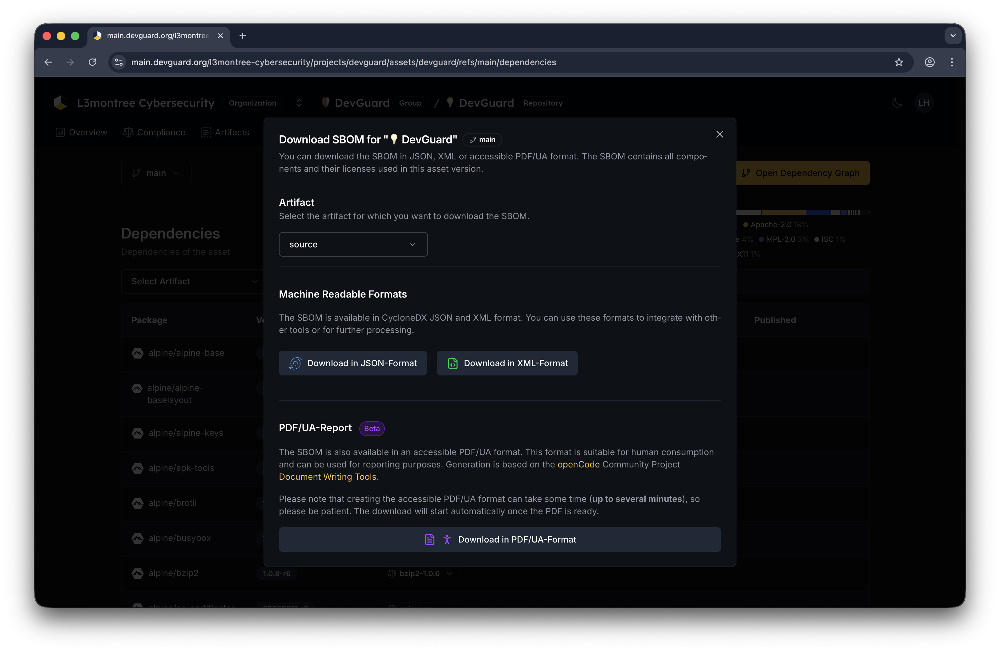

import { Callout, Tabs } from 'nextra/components'

# Export SBOM Documents

Export Software Bill of Materials (SBOM) documents to document component inventory and share with stakeholders.

## Prerequisites

Before you begin, ensure you have:

- Access to a DevGuard repository
- At least one completed scan (container, dependency, or source scan)
- Permission to download artifacts (any user level)

## Navigate to SBOM Export

Access SBOM download interface:

**Method 1: From Project Overview**

1. Navigate to **Repository** → **Dependencies**
2. Click **Download SBOM** button
   

**Method 2: From Dependency View**

1. Navigate to **Repository** → **Dependencies**
2. Click **Download SBOM** button
   

## Download SBOM Document

Export your component inventory:

for more information on what an SBOM contains, see the [Explaining SBOMs](../../explanations/explaining-sboms.mdx) section.

- [Generate VEX Documents](./generate-vex-documents.mdx) - Add vulnerability assessments to SBOM
- [Generate CSAF Reports](./generate-csaf-reports.mdx) - Create security advisories
- [View Compliance Dashboards](./compliance-dashboards.mdx) - Monitor overall compliance
