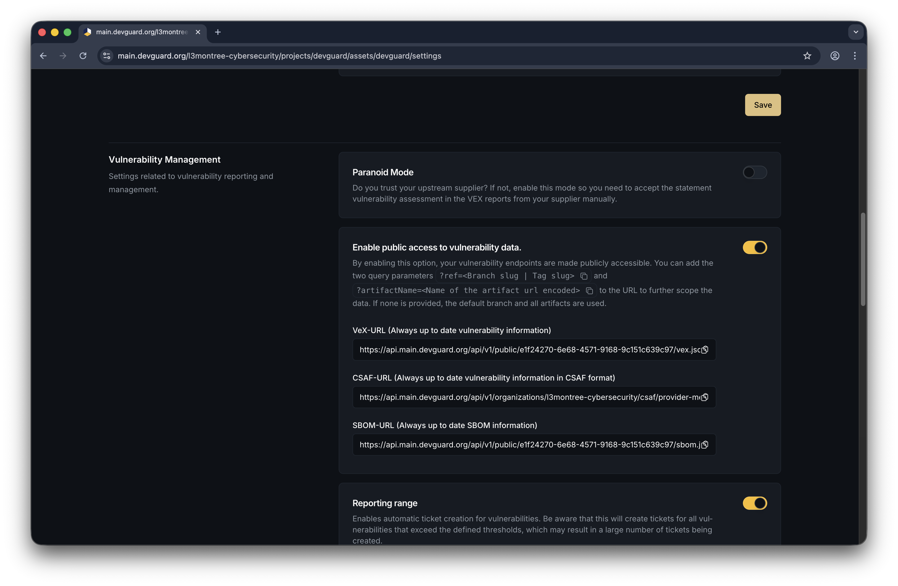

import { Callout } from '@document-writing-tools/kernux-theme'
import { DocTabs as Tabs } from '@document-writing-tools/kernux-theme'

# Generate CSAF Reports

Generate CSAF (Common Security Advisory Framework) reports to document and distribute vulnerability information in a standardized format.

## Prerequisites

Before you begin, ensure you have:

- Access to a DevGuard repository with detected vulnerabilities
- Project admin or owner permissions
- At least one vulnerability to report on
- Knowledge about CSAF format

## Access CSAF Reports

CSAF reports are automatically generated on-demand by DevGuard:

### Enable Public Access

Navigate to **Organization** → **Project** → **Repository** → **Settings** 

**Enable the toggle for public access to vulnerability data:**

This will allow external parties to access vulnerability data for this repository and how vulnerabilities are assessed, improving transparency in your supply chain.

## Next Steps

- [Generate VEX Documents](/how-to-guides/compliance/generate-vex-documents) - Export vulnerability exceptions
- [Export SBOM](/how-to-guides/compliance/export-sbom) - Download component inventory
- [View Compliance Dashboards](/how-to-guides/compliance/attestation-policies#view-compliance-dashboards) - Monitor policy violations

## Related Documentation

- [Getting Started with DevGuard](/getting-started)
- [DevGuard How-To Guides](/how-to-guides)
- [DevGuard Explanations](/explanations)
