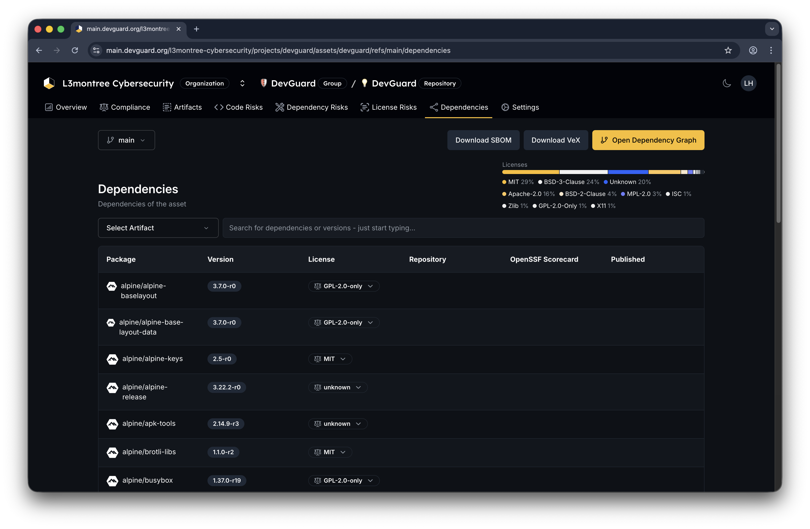

import { Callout, Tabs } from 'nextra/components'

## Prerequisites

Before you begin, ensure you have:

- Access to a DevGuard repository with detected dependencies
- At least one scan completed (SBOM or dependency scan)
- Project admin or owner permissions
- Knowledge about VEX format

## Navigate to VEX Generation

Access VEX document generation:

Navigate to **Organization** → **Project** → **Repository** → **Dependency Risks** or **Dependencies**.

## Generate VEX Document

Create a VEX document for your repository:

## Share VEX Documents

Navigate to **Organization** → **Project** → **Repository** → **Settings** 

Share VEX documents with your direct Supply Chain partners:

This URL always reflects the latest VEX assessment.

## VEX for Compliance

Use VEX documents for regulatory compliance:

- **ISO 27001** - Document vulnerability management decisions
- **CRA** - Show security assessment process
- **SBOM requirements** - Include VEX alongside SBOM
- **Audit trail** - Record why decisions were made

Create events for all significant vulnerabilities to establish audit trail.

## OpenVEX Format

DevGuard also supports OpenVEX (separate format):

<Tabs items={['CycloneDX VEX', 'OpenVEX']}>
  <Tabs.Tab>
    CycloneDX VEX is integrated into SBOM format. Best for:
    - Coupling vulnerability data with component data
    - SBOM-centric workflows
    - Standard CycloneDX tooling
  </Tabs.Tab>
  
  <Tabs.Tab>
    OpenVEX is standalone format. Best for:
    - Distributed vulnerability statements
    - Multiple SBOM sources
    - Lightweight vulnerability feeds
  </Tabs.Tab>
</Tabs>

## Next Steps

- [Manage License Compliance](../dependency-management/license-compliance.mdx) - Expand compliance beyond vulnerabilities
- [Generate CSAF Reports](./generate-csaf-reports.mdx) - Create security advisories
- [Track Fix Progress](../vulnerability-management/track-fix-progress.mdx) - Monitor remediation
