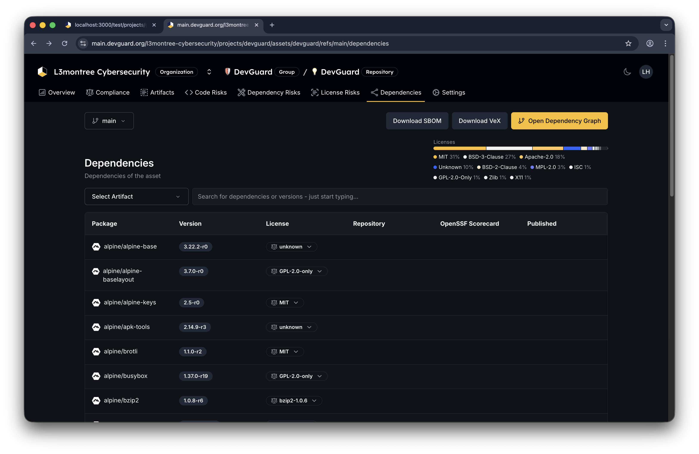
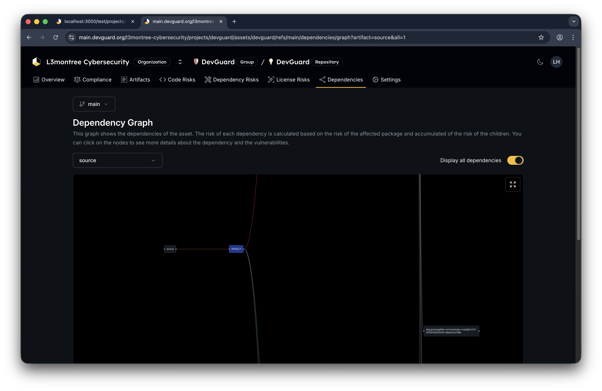

import { Callout } from 'nextra/components'

# View Dependency Tree

Explore your application's complete dependency tree in an interactive graph. Understand which components depend on which, identify vulnerable transitive dependencies, and trace the path from your application to any component.

## Prerequisites

Before you begin, ensure you have:

- Access to a DevGuard organization, project, and asset
- At least one scan completed (SBOM uploaded or auto-scanned)
- Read access to view dependency information
- An asset version to analyze

## Access the Dependency Graph

1. Navigate to **Organization** → **Project** → **Repository**
2. Select an **Asset Version** (branch or tag)
3. Click **Dependencies** → **Graph** in the left navigation

The interactive dependency graph displays:
- **Nodes**: Each dependency (component) in your tree
- **Edges**: Relationships showing which components depend on which
- **Color Coding**: Risk levels (green: low, yellow: medium, orange: high, red: critical)
- **Size**: Risk proportional to severity

## Filter by Artifact

If your asset has multiple build artifacts (different container images, JARs, etc.):

1. In the **Artifact Selector** at the top, choose a specific artifact
 2. The graph updates to show dependencies for only that artifact
3. Leave empty to view across all artifacts

This helps identify which artifacts use risky dependencies.

## Display All Dependencies

By default, the graph shows only vulnerable dependencies:

Click on Organization → Project → Repository → Dependencies → Graph

1. Toggle **Display all dependencies** switch in the top-right
2. The graph expands to show every dependency, including safe ones
3. This is useful for:
   - Understanding complete supply chain
   - Identifying transitive dependency chains
   - Finding dependency conflicts or redundancies

<Callout type="info">
  Displaying all dependencies can create large graphs. For projects with hundreds of dependencies, consider filtering by artifact first.
</Callout>

<Callout type="info">
  Transitive dependencies (dependencies of dependencies) are shown with dotted lines in some views. They're often harder to remediate because they're pulled in by other libraries.
</Callout>

## Identify Risk Hotspots

Use the graph to find:

1. **High-Risk Dependencies**: Orange and red nodes indicate critical vulnerabilities
2. **Bottleneck Components**: Nodes with many incoming edges (heavily depended on)
3. **Outdated Packages**: Check the version numbers against latest releases
4. **Duplicates**: The same component at different versions (version conflicts)

## Understand Node Colors

Dependency graph node colors represent vulnerability risk:

- **Green**: Safe (no vulnerabilities)
- **Yellow**: Low/Medium risk
- **Orange**: High risk
- **Red**: Critical risk
- **Blue/Green**: Base image components (if using VEX/SBOM data)

The color is calculated from the highest severity vulnerability in that component and inherited risk from its dependencies.

