import { Callout } from '@document-writing-tools/kernux-theme'

# DevGuard for VS Code

<Callout type="warning">
    **Proof of Concept** This extension is a proof of concept. It is built
    for feedback, validation, and experimentation rather than production use.
    Share your thoughts in the [GitHub
    discussion](https://github.com/l3montree-dev/devguard/discussions/2207).
</Callout>

DevGuard for VS Code brings a focused DevGuard workflow straight into your editor. It helps you inspect dependency risk, connect the workspace to a DevGuard asset, export SBOMs, and run a few common security actions without switching tools.

---

## Features

### Inline dependency intelligence

When you open `package.json` or `go.mod`, the extension adds inline badges and hover cards for dependencies. You can see malicious flags, known vulnerabilities, release age, transitive dependency counts, and OpenSSF Scorecard data at a glance.

The inline data comes from DevGuard's public package-inspection endpoint. If you connect VS Code to your DevGuard instance with a personal access token and select an asset, the hover content is enriched with that asset's open risk data for the same package.

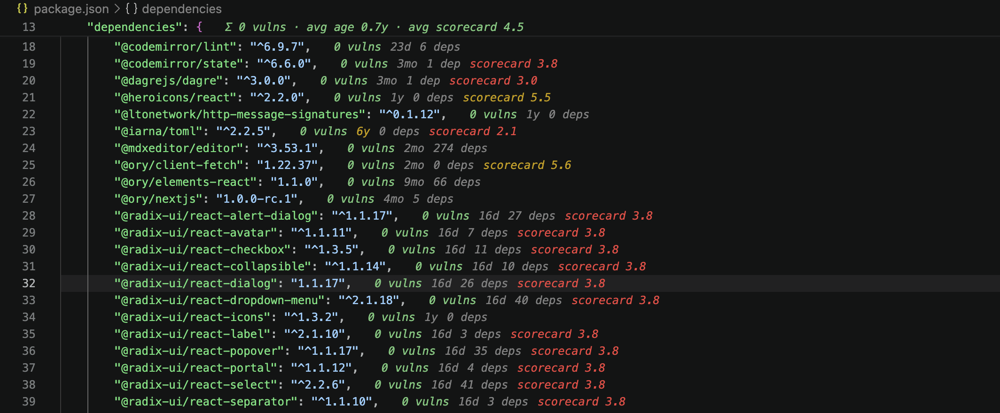

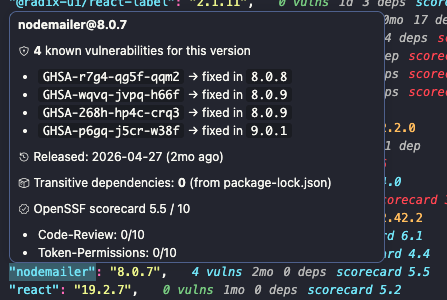

### Asset-aware workspace context

Connect to DevGuard using a personal access token and choose an organization, project, asset, and ref.

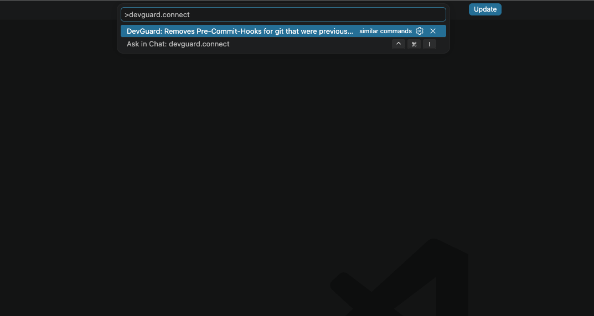

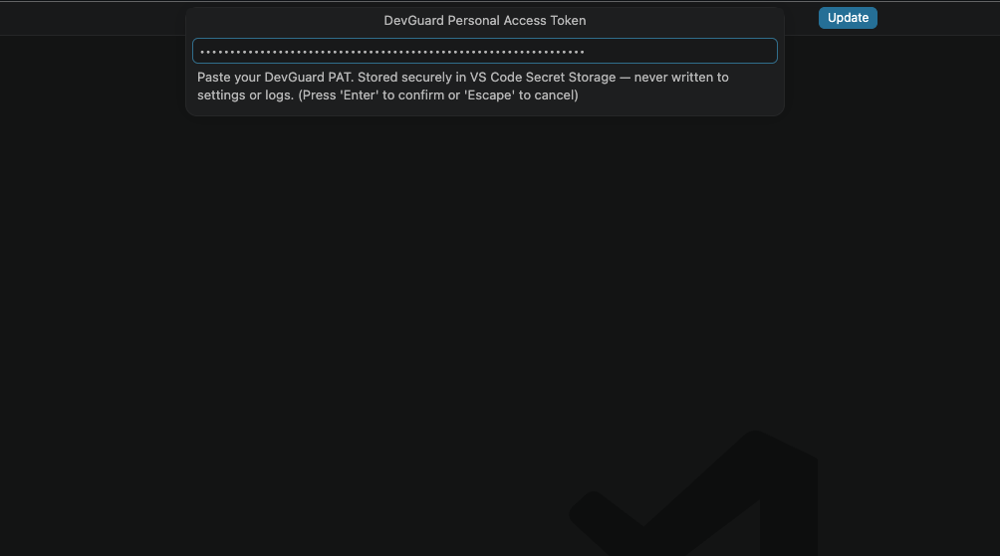

After VS Code connects to your DevGuard-Instance successfully you should see:

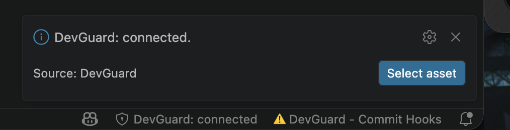

After connecting with a personal access token, you can pick an organization, project, and asset. That lets the extension overlay real DevGuard findings for the selected asset instead of only showing public package data.

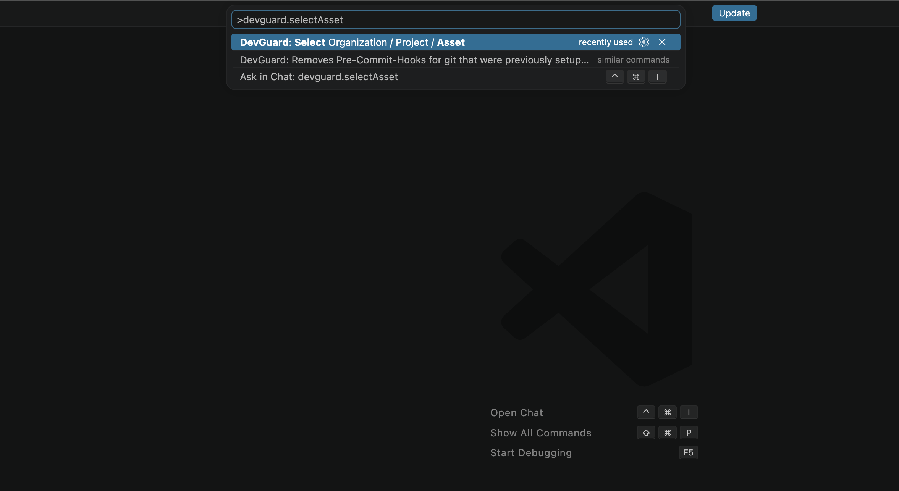

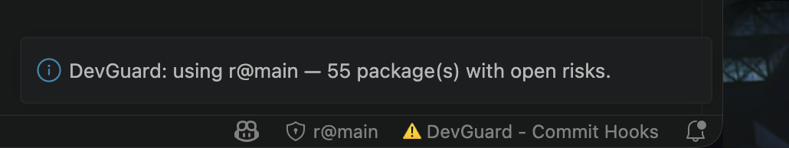

**Hint:** You can also click on the statusbar to connect to or select an asset from your DevGuard instance instead of using the command palette.

### SBOM Generation

After connecting to your DevGuard instance you can run a SCA scan to generate an SBOM for your project.

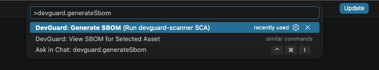

It will be uploaded to your DevGuard instance, but you can also view it directly in VS Code.

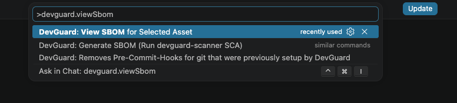

### Dependency proxy setup

If you want npm installs to go through DevGuard's proxy, the extension can setup your `.npmrc` for you in one step. Optionally, you can provide a dependency proxy secret when you are prompted, if your organization uses one.

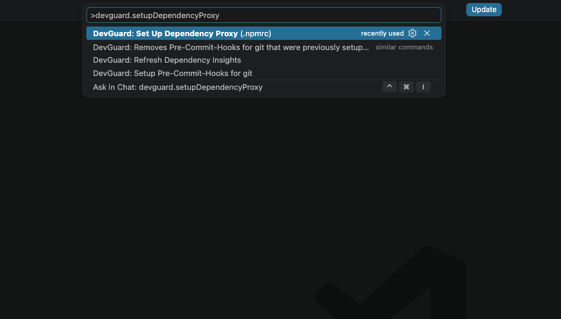

Your `.nmprc` will then contain:

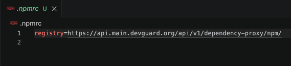

### Git hooks

The DevGuard VS Code extension provides you with commands that will bootstrap or remove DevGuard git hooks for local commit-time checks. The hooks call the DevGuard scanner from Docker, so you get a lightweight local safety net before commits land.

So far, DevGuard provides you with a secret-scan setup as a pre-commit hook to prevent secrets from ending up in your commits permanently.

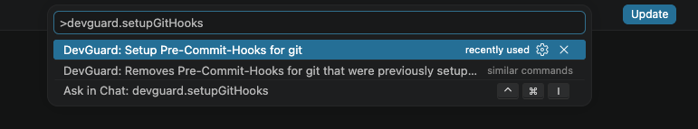

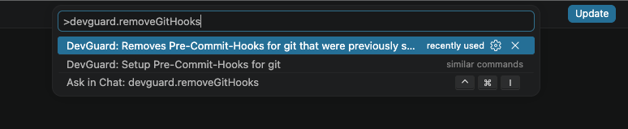

The statusbar will reflect if the DevGuard git hooks are present in your `.git/hooks/<hook-file>`:

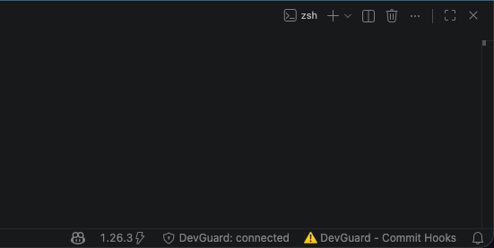

**Hint:** You can also click on the statusbar to setup or remove the git hooks instead of using the command palette.

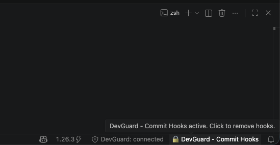

### SAST scanning on save

When enabled through the `{devguard.sast.enabled}` setting (`default` is `true`), the extension runs a Docker-based DevGuard SAST scan on save for supported files, so issues surface as you work instead of only after a manual scan. Resulting issues will be displayed in the `PROBLEMS` Tab of VS Code.

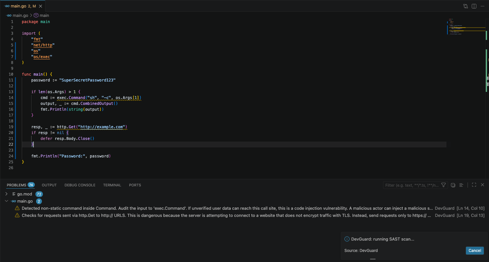

## Getting Started

### Requirements

- Docker (required to run devguard-scanner commands, e.g. sast scanning)
- **Optional:** A DevGuard backend, if you want to use a local DevGuard instance
- **Optional:** A Personal Access Token, if you want to connect to a DevGuard instance

### Installation

1. Download the latest `DevGuard-VS-Code-Companion.vsix` from the [extension release notes](https://github.com/l3montree-dev/devguard-vs-code-extension/releases).
2. Open VS Code and choose **Extensions** > **...** > **Install from VSIX**, or drag and drop the `.vsix` file into the Extensions view.

### Using the extension

1. Open `package.json` or `go.mod` and look for inline dependency badges before connecting.
2. Connect a token, select an asset, and then refresh dependency insights to see the asset-aware overlay.
3. Open the SBOM for the selected asset to confirm the workspace is linked correctly.
4. If you use npm, try the dependency proxy command so future installs route through DevGuard.
5. If you want local safety checks, try the git hook setup command and save a file to see the background scanning workflow.

## Command Overview

| VS Code Command Palette                                                             | What it does                                                                                                                                                                        |
| ----------------------------------------------------------------------------------- | ----------------------------------------------------------------------------------------------------------------------------------------------------------------------------------- |
| `DevGuard: Connect (Personal Access Token)`                                         | Save and validate a DevGuard PAT in VS Code Secret Storage. Change the `{devguard.apiUrl}` setting in your VS-Code Settings to choose the DevGuard instance you want to connect to. |
| `DevGuard: Disconnect`                                                              | Remove the stored token and clear the selected asset.                                                                                                                               |
| `DevGuard: Select Organization / Project / Asset`                                   | Choose the DevGuard asset that should be overlaid in the current workspace.                                                                                                         |
| `DevGuard: Refresh Dependency Insights`                                             | Clear the cache and reload the visible dependency data.                                                                                                                             |
| `DevGuard: Set Up Dependency Proxy (.npmrc)`                                        | Write or update the workspace `.npmrc` so npm uses the DevGuard dependency proxy.                                                                                                   |
| `DevGuard: View SBOM for Selected Asset`                                            | Open the selected asset's SBOM as a read-only document.                                                                                                                             |
| `DevGuard: Generate SBOM (Run devguard-scanner SCA)`                                | Run `devguard-scanner sca` for the current workspace and upload the result.                                                                                                         |
| `DevGuard: Setup Pre-Commit-Hooks for git`                                          | Install DevGuard-managed pre-commit hooks in the local repository.                                                                                                                  |
| `DevGuard: Removes Pre-Commit-Hooks for git that were previously setup by DevGuard` | Remove the DevGuard-managed pre-commit hooks from the repository.                                                                                                                   |

## Discussion

If you try the extension, please join the discussion on GitHub and tell us what worked, what was confusing, and what you would want in a production-ready version: [DevGuard discussion thread](https://github.com/l3montree-dev/devguard/discussions/2207).

Your feedback will help us decide what to polish next, so please install it, test it in a real workspace, and share the results.
