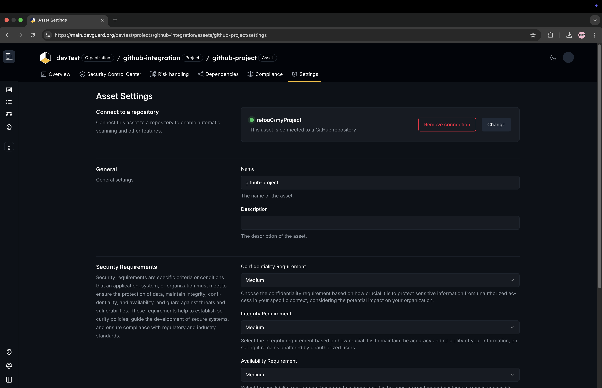

import { Steps } from 'nextra/components'

# Set Up GitHub Integration

DevGuard integrates with GitHub to provide a seamless experience for developers. This guide will walk you through the steps to set up the integration.

## Steps

<Steps>

### Go to Organization Settings & Click on `Add a GitHub App`

### Click on `Install GitHub App`, Then Authorize Your GitHub Account

### Choose the Organization or User You Want to Integrate with DevGuard

### Select Repositories to Integrate with DevGuard

You can choose all repositories or specific repositories. Then, click on `Install`.

If the integration is successful, you will see your chosen user or organization in the organization settings. You can change the settings at any time by clicking on `Manage GitHub App`. You can also add more repositories by clicking on `Add a GitHub App`.

### Navigate to an Asset Within One of Your Projects and Select Your Corresponding GitHub Project

If the integration is successful, you will see your chosen GitHub project in the asset settings. You can change the settings at any time by clicking on `Change`. You can remove the integration by clicking on `Remove Connection`.

### Create a Personal Access Token

Go to the `security control center` of the asset and click on `Create Personal Access Token`. Then copy the token.

You can find more information about the DevGuard Personal Access Token [here](/how-to-guides/security/access-control/api-tokens).

### Store the Token in Your GitHub Repository Secrets

For instructions on storing the token in your GitHub repository secrets, refer to the [GitHub documentation](https://docs.github.com/en/actions/security-for-github-actions/security-guides/using-secrets-in-github-actions#creating-secrets-for-a-repository).

### Add a Pipeline Configuration File

You can now copy the code snippet and add it to your pipeline configuration file.

If you don't have a pipeline configuration file, create one by adding a new file in the root directory of your repository. The file should be located in the `.github/workflows/` directory and have a `.yml` extension. Refer to the [GitHub documentation](https://docs.github.com/en/actions/writing-workflows/quickstart#creating-your-first-workflow) for more details on creating a pipeline configuration file.

Finally, push the changes to your repository.

You can find more information about the pipeline configuration file [here](/reference/github-workflows/full).

You have successfully integrated your GitHub repository with DevGuard. You can now start using DevGuard to secure your codebase.

</Steps>
