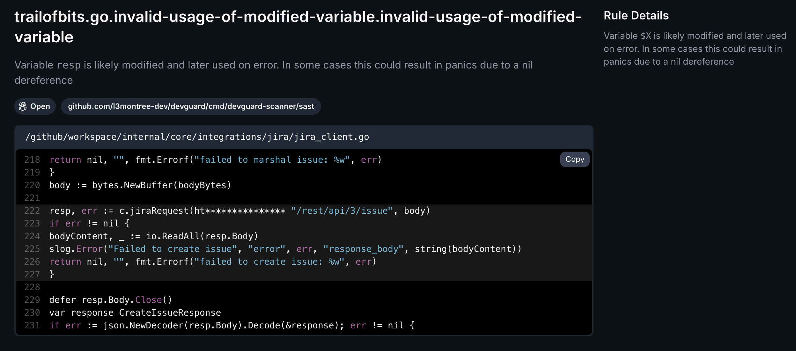

import { Steps, Tabs, Callout } from 'nextra/components'

# Static Application Security Testing (SAST)

<Callout type="info" emoji="ℹ️">
  DevGuard performs static application security testing (SAST) to analyze your code for bad practices. This helps identify potential security issues early in the development process (based on SARIF) - [Background Information](/concepts/devsecops/sast)
</Callout>

## Handling Found Vulnerabilities: Practical Steps for Mitigation

When DevGuard's **SAST** (based on [Semgrep](https://github.com/semgrep/semgrep)) detects potential security issues, such as the example provided below, it’s crucial to address these findings to prevent vulnerabilities in your application.

### Steps to Fix

<Steps>

### Analyze and Fix the Code

1. **Review the Finding:** Understand the nature of the issue reported by DevGuard. The tool will provide details about the vulnerability, including the file and line number.

2. **Modify the Code:** Make the necessary changes to the code to fix the identified issue. This may involve refactoring code, or developing security patches.

3. **Test the Changes:** After making modifications, thoroughly test the code to ensure that the issue is resolved and no new vulnerabilities are introduced.

### Alternative Measures

If none of the above fixes are feasible:
- **Risk Acceptance**: Temporarily accept the risk using DevGuard’s risk management feature. Document the accepted risk by providing a justification. Use the UI or slash commands in the issue.
- **Avoidance**: Limit exposure by sandboxing or disabling affected functionality.

</Steps>