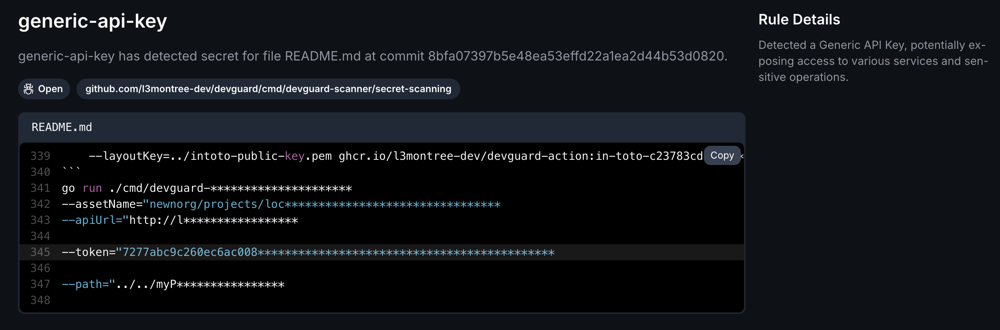

import { Steps, Tabs, Callout } from 'nextra/components'

# Secret Scanning

<Callout type="info" emoji="ℹ️">
  DevGuard performs secret scanning to identify sensitive information in your codebase, such as API keys, passwords,
  and other credentials (based on SARIF) - [Background Information](../../explanations/devsecops/secret-scanning)
</Callout>

## Handling Found Vulnerabilitys: Practical Steps for Mitigation

When DevGuard's **secret scanning** (based on [gitleaks](https://github.com/gitleaks/gitleaks)) detects sensitive information, such as the example provided below, it’s crucial to address these findings immediately to prevent unauthorized access and maintain security.

### Steps to Fix

<Steps>

### Analyze and Remove Sensitive Information

1. **Locate the Sensitive Information:** Identify the specific secret and its location in your codebase. DevGuard will highlight the file and line number where the secret was found.

2. **Remove or Rotate the Secret:** Depending on the nature of the secret, you may need to remove it from the codebase or rotate it (e.g., change API keys or passwords).

3. **Update Configuration:** If the secret is used in configuration files, ensure that these files are updated accordingly.

4. **Implement Secret Management:** Consider using a secret management tool or service to securely store and manage sensitive information.

### Alternative Measures

If none of the above fixes are feasible:
- **Risk Acceptance**: Temporarily accept the risk using DevGuard’s risk management feature. Document the accepted risk by providing a justification. Use the UI or slash commands in the issue.
- **Avoidance**: Limit exposure by sandboxing or disabling affected functionality.

</Steps>