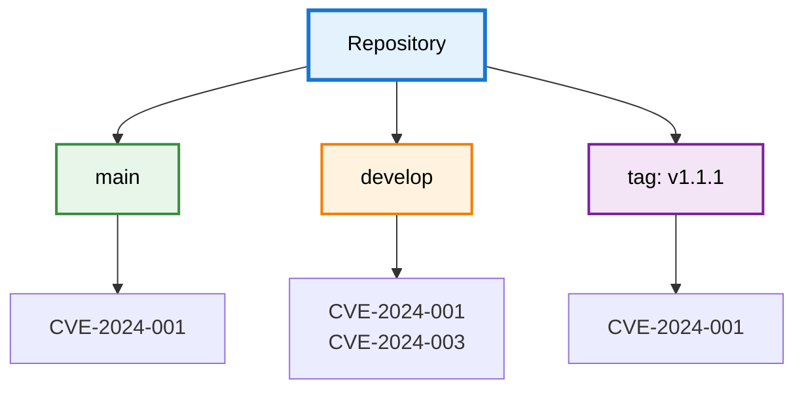

import { Callout } from '@document-writing-tools/kernux-theme'
import { DocTabs as Tabs } from '@document-writing-tools/kernux-theme'

# How the DevGuard CI Scanner Handles Branches, Tags & Artifacts

The `devguard-scanner` tool generates an SBOM (or SARIF report) for your project, signs it, and uploads it to DevGuard, where it is matched against the vulnerability database. Every scan is filed under three coordinates: **which repository**, **which branch or tag**, and **which artifact**.

Getting these three coordinates right is what lets DevGuard track vulnerabilities independently per branch and per build target. This guide explains how the scanner determines them, a common pitfall when naming artifacts, and why scanning every branch and tag is useful.

## The Three Coordinates of a Scan

Every scan the scanner sends is addressed by three values:

| Flag | DevGuard concept | Purpose |
|---|---|---|
| `--assetName` | Repository (asset) | The repository the scan belongs to, e.g. `myorg/projects/myproject/assets/myrepo`. |
| `--ref` | Asset version (branch **or** tag) | The Git reference being scanned. Internally DevGuard stores this as the **asset version name**. |
| `--artifactName` | Artifact | The specific build target inside that branch (an image, an architecture, a distribution variant). |

<Callout type="info">
  The `--ref` flag is what DevGuard persists as the **asset version name**. When you read "asset version name" in the UI or API, that value comes from `--ref` (or is auto-detected from your Git checkout). The scanner sends it in the `X-Asset-Ref` HTTP header.
</Callout>

### How the ref is determined

If you do not pass `--ref`, the scanner tries to auto-detect it:

1. If the current directory is a Git repository, it uses the current branch or tag name.
2. If no Git repository is found, it falls back to `main`.

```bash copy
--ref="feature/login"    # Git reference (branch, tag, or commit). Auto-detected if omitted.
--defaultRef="main"      # The repository's default branch.
--isTag=true             # Set when the ref is a tag rather than a branch.
```

New branches and tags are created automatically the first time you scan them — you never have to pre-register them in DevGuard.

## Do Not Put `@branch` or `@version` in the Artifact Name

This is the most common mistake when configuring the scanner.

DevGuard **automatically appends the asset version (the ref) to the artifact name** when it stores and exports the artifact. You do **not** need to — and should not — encode the branch or version into `--artifactName` yourself.

If you do, the version gets attached twice and you end up with a broken, duplicated reference:

<Tabs items={["✅ Correct", "❌ Wrong"]}>
  <Tabs.Tab>
    Pass a clean artifact name. DevGuard appends the ref for you.

    ```bash copy
    devguard-scanner sca \
      --assetName="myorg/projects/myproject/assets/myrepo" \
      --ref="main" \
      --artifactName="pkg:oci/myapp" \
      --token="YOUR_TOKEN"
    ```

    DevGuard resolves this to `pkg:oci/myapp@main` — the ref is applied exactly once.
  </Tabs.Tab>
  <Tabs.Tab>
    Do **not** hardcode the branch or version into the artifact name.

    ```bash copy
    devguard-scanner sca \
      --assetName="myorg/projects/myproject/assets/myrepo" \
      --ref="main" \
      --artifactName="myapp@main" \
      --token="YOUR_TOKEN"
    ```

    Because the ref (`main`) is appended on top of the name you already suffixed, this becomes `myapp@main@main`. The same happens with a version tag: `myapp@1.1.1` combined with `--ref=1.1.1` becomes `myapp@1.1.1@1.1.1`.
  </Tabs.Tab>
</Tabs>

<Callout type="warning">
  A doubled reference such as `@main@main` or `@1.1.1@1.1.1` creates a separate, malformed artifact entry. Your findings get split across it and the correctly-named artifact, dashboards look inconsistent, and exported SBOM/VEX documents carry an invalid root component identifier.
</Callout>

### Why a plain name is enough

- **Valid PURLs** (recommended): if your artifact name is a Package URL like `pkg:oci/myapp`, DevGuard sets the *version* component of the PURL to the ref, producing `pkg:oci/myapp@main`. There is no place for you to add the version yourself — it is derived from `--ref`.
- **Plain strings**: if you use a plain string like `myapp`, DevGuard appends `@<ref>` to it, producing `myapp@main`.
- **Omitted entirely**: if you leave `--artifactName` empty, DevGuard generates a sensible default from the asset name (e.g. `pkg:devguard/myorg/myproject/myrepo`, or `pkg:oci/...` for container scans) and still appends the ref.

In every case, the branch or version comes from `--ref`. Keep the artifact name limited to *what* was built (the image, architecture, or variant) and let the ref describe *which version*.

<Callout type="info">
  Use the artifact name only to distinguish build targets that share the same source — for example `pkg:oci/myapp-amd64` vs `pkg:oci/myapp-arm64`, or a minimal vs full image. See the [Artifact Concept](/explanations/core-concepts/artifacts) for details.
</Callout>

## Why Every Branch and Tag Can Be Scanned

DevGuard treats each branch and each tag as its own **asset version**, with its own set of findings, risk assessment, and VEX/remediation state. This mirrors your Git workflow: `main`, `develop`, a release branch, and a `v1.1.1` tag are tracked independently.



This per-version tracking is useful because:

- **Branches contain different code and dependencies.** A feature branch may pull in a new, vulnerable dependency that `main` does not have. Scanning only `main` would miss it until merge.
- **Fixes propagate at different speeds.** A vulnerability patched in `main` is not automatically resolved in `develop`. Independent tracking shows you exactly which branches still need the backport.
- **Released versions must stay auditable.** Scanning tags (e.g. `v1.1.1`) preserves the security state of a shipped release. When a new CVE is published later, you can see whether an already-released version is affected — essential for issuing security advisories and VEX statements to your users.
- **Pull-request gating.** Scanning feature branches lets you catch issues *before* merge without permanently polluting your production branch's findings.

<Callout type="info">
  When a scan discovers a vulnerability that already exists on another branch or tag, DevGuard carries over that finding's triage and VEX state — including its event history — instead of making you re-assess it. From that point on, each branch evolves independently. Learn more in [Branching Models](/explanations/core-concepts/repository-versions).
</Callout>

## Putting It Together

A typical CI job scans the checked-out branch and lets the scanner auto-detect the ref:

```bash copy
docker run -v "$(PWD):/app" ghcr.io/l3montree-dev/devguard/scanner:main \
  devguard-scanner sca \
    --path=/app/ \
    --assetName="myorg/projects/myproject/assets/myrepo" \
    --artifactName="pkg:oci/myapp" \
    --apiUrl="https://api.devguard.org" \
    --token="YOUR_TOKEN"
```

- The **repository** comes from `--assetName`.
- The **branch/tag** is auto-detected from the Git checkout (override with `--ref` / `--isTag` when your CI system does a detached checkout).
- The **artifact** is `pkg:oci/myapp`; DevGuard appends the ref automatically — no `@` suffix needed from you.

## Next Steps

- [Scan Dependencies](/how-to-guides/scanning/scan-dependencies) — full SCA scanner reference and flags
- [Scan OCI Images](/how-to-guides/scanning/scan-docker-images) — scan container images per artifact
- [Artifact Concept](/explanations/core-concepts/artifacts) — tracking multiple build targets from one branch
- [Branching Models](/explanations/core-concepts/repository-versions) — independent tracking per branch and tag
