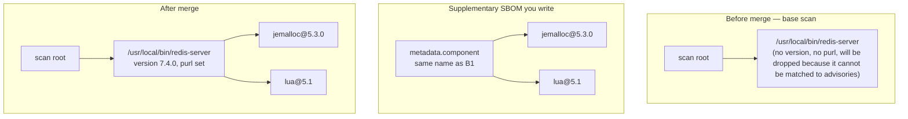

import { Callout } from '@document-writing-tools/kernux-theme'
import { DocTabs as Tabs } from '@document-writing-tools/kernux-theme'

# Provide Supplementary SBOMs for Unresolved Binaries

This guide describes how to write a supplementary SBOM and have `devguard-scanner` pick it up, so a binary it cannot resolve on its own — a statically linked Go tool, a vendored C library, `redis-server` itself — is assigned a real identity and dependency tree instead of appearing as an unresolved stub.

For the rationale behind this feature, see [Supplementary SBOMs — Filling the Gaps Trivy Can't](/explanations/supplementary-sboms). This page covers implementation.

## Prerequisites

- `devguard-scanner` (from the `ghcr.io/l3montree-dev/devguard/scanner` image, or built locally)
- Something to scan: a directory, or a container image / tarball
- Knowledge of the binary's actual dependencies — the build author has information the scanner cannot recover on its own

---

## Step 1 — Find out what needs describing

Run a normal scan first and watch the logs. Any `application`-type component with no package identity that isn't already covered gets a warning with a ready-to-use example printed to stderr:

```bash copy
devguard-scanner sca --path . \
  --assetName="myorg/projects/myproject/assets/myrepo" \
  --apiUrl="https://api.devguard.org" \
  --token="YOUR_TOKEN"
```

```text
level=WARN msg="found an application component with no package identity (purl); it and everything
it depends on will be dropped from the dependency graph and reparented to the nearest ancestor with
a valid identity, producing an incomplete SBOM - provide a supplementary SBOM describing it (metadata.component.name set to the exact path the binary was found) under --sbomPath to fix this"

save this as a .json file under --sbomPath (default /sboms) to describe "/usr/local/bin/redis-server":
{
  "bomFormat": "CycloneDX",
  "specVersion": "1.7",
  "metadata": {
    "component": {
      "type": "application",
      "bom-ref": "/usr/local/bin/redis-server",
      "name": "/usr/local/bin/redis-server"
    }
  }
}
```

<Callout type="info">
  This warning does not fire for components that already have a real, versioned dependency tree — a `Cargo.lock`-derived component, for example. It fires only for genuinely unresolved binaries.
</Callout>

The `name` in the printed JSON skeleton is the identity the base scan already assigned that component (its in-image filesystem path, for a container scan). This must match verbatim in the supplementary SBOM you write — it is the only signal `devguard-scanner` uses to associate the supplementary SBOM with that existing component, rather than treat it as an unrelated addition.

---

## Step 2 — Write the supplementary SBOM

Start from the printed skeleton and fill in what is known: version, `purl`, and the real dependency tree the scanner could not derive on its own.

```json copy
{
  "bomFormat": "CycloneDX",
  "specVersion": "1.7",
  "metadata": {
    "component": {
      "type": "application",
      "bom-ref": "/usr/local/bin/redis-server",
      "name": "/usr/local/bin/redis-server",
      "version": "7.4.0",
      "purl": "pkg:generic/redis@7.4.0"
    }
  },
  "components": [
    {
      "bom-ref": "pkg:generic/jemalloc@5.3.0",
      "name": "jemalloc",
      "version": "5.3.0",
      "purl": "pkg:generic/jemalloc@5.3.0"
    },
    {
      "bom-ref": "pkg:generic/lua@5.1",
      "name": "lua",
      "version": "5.1",
      "purl": "pkg:generic/lua@5.1"
    }
  ],
  "dependencies": [
    {
      "ref": "/usr/local/bin/redis-server",
      "dependsOn": ["pkg:generic/jemalloc@5.3.0", "pkg:generic/lua@5.1"]
    }
  ]
}
```

What each part is doing:



- `metadata.component` is the root of the supplementary SBOM. Its `name` anchors it to the existing unresolved component; its `version`/`purl` become that component's identity, which is what makes it eligible for vulnerability matching.
- `components` lists everything the binary depends on, each with a real `purl` so those components are matchable as well.
- `dependencies` connects them: the root `dependsOn` its direct children, giving `devguard-scanner` a real tree instead of a flat stub.

Exhaustively describing a binary's transitive tree is not required. Supplying only the root's `version`/`purl`, with no `components`/`dependencies`, is already an improvement, since it makes the binary itself matchable even if its own dependencies remain undescribed.

<Callout type="warning">
  A supplementary SBOM's root replaces the existing component's entire subtree, including replacement with zero children if that is what is declared. If the base scan already correctly found some of this binary's dependencies and only an addition is intended, include those dependencies explicitly in `components`/`dependencies` — they are not retained automatically.
</Callout>

---

## Step 3 — Place it under `--sbomPath`

`devguard-scanner` looks for supplementary SBOMs at `--sbomPath` (default `/sboms`), and merges every `*.json` file it finds there — one file per component, or one file bundling several components' subtrees at once.

<Tabs items={['Directory scan', 'Container image']}>
  <Tabs.Tab>
    For a directory/path scan, drop the file under `<scan-path>/sboms/`:

    ```bash copy
    mkdir -p ./sboms
    cp redis-server.json ./sboms/

    devguard-scanner sca \
      --assetName="myorg/projects/myproject/assets/myrepo" \
      --apiUrl="https://api.devguard.org" \
      --token="YOUR_TOKEN"
    ```

    Use a custom directory name instead of the default with `--sbomPath=./my-sboms`.
  </Tabs.Tab>

  <Tabs.Tab>
    For a container image, bake the file into the image itself at `/sboms/`, e.g. in your `Dockerfile`:

    ```dockerfile copy
    COPY redis-server.json /sboms/redis-server.json
    ```

    Then scan the image as usual:

    ```bash copy
    docker run ghcr.io/l3montree-dev/devguard/scanner:main \
      devguard-scanner container-scanning \
        --image myorg/redis-hardened:7.4.0 \
        --assetName="myorg/projects/myproject/assets/myrepo" \
        --apiUrl="https://api.devguard.org" \
        --token="YOUR_TOKEN"
    ```

    This works whether the image is pulled from a registry (`--image`) or scanned from a saved tarball (`--path image.tar`) — `devguard-scanner` extracts the image's filesystem either way and walks `/sboms/` inside it.
  </Tabs.Tab>
</Tabs>

---

## Step 4 — Verify it worked

Run the scan again and check the logs for one of two lines per supplementary SBOM:

```text
level=INFO msg="enrichment attached a new node under the scan root" path=/usr/local/bin/redis-server
level=INFO msg="enrichment replaced an existing component's subtree" path=/usr/local/bin/redis-server
```

- "attached a new node" — no existing component had that exact purl (it was listed as a binary); the supplementary SBOM's root was added as a new child of the scan root.
- "replaced an existing component's subtree" — the uncommon case: a purl was found, but it was enriched and the whole subtree was replaced.

Then confirm in the DevGuard UI: the component should show a real version and be checked against the vulnerability database, and any described dependencies should appear nested underneath it in the dependency graph rather than as flat siblings at the root.

<Callout type="info">
  The unresolved-component warning from Step 1 should no longer appear for this path on the next run. If it does, check that the supplementary SBOM's `metadata.component.name` matches exactly, byte for byte.
</Callout>

## Generating supplementary SBOMs at build time instead of by hand

A hand-written supplementary SBOM works, but goes stale as soon as the described binary's dependencies change and the file is not updated to match. If the build is under your control (a Nix derivation, a Bazel rule, a Dockerfile `RUN` step), generating the supplementary SBOM as part of the build is generally preferable:

1. Run a source-level scan (e.g. `trivy fs` against the vendored source / lockfile) — this resolves a real, versioned tree, because a source checkout has lockfile metadata the final compiled binary doesn't.
2. Retarget that scan's root component onto the binary's actual path inside the final image, tagged with the real version being built.
3. Drop the result at `/sboms/<name>.json` in the image.

This is exactly what DevGuard's own Nix build does for `gitleaks`, `trivy`, `crane`, and its own scanner binaries — see the "Where DevGuard's own supplementary SBOMs come from" section of [Supplementary SBOMs](/explanations/supplementary-sboms) for the concrete approach.

---

## Related Documentation

- [Supplementary SBOMs — Filling the Gaps Trivy Can't](/explanations/supplementary-sboms) — the underlying problem and merge design
- [Scan OCI Images](/how-to-guides/scanning/scan-docker-images)
- [Scan Source Code](/how-to-guides/scanning/scan-source-code)
- [SBOM Problem Statement](/explanations/sbom-problem-statement)
